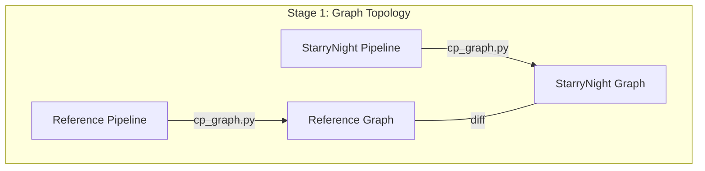

# Documentation Best Practices

This document captures lessons learned from organizing the StarryNight testing documentation. These principles can be applied to other parts of the documentation to maintain consistency and usability.

## Documentation Structure Principles

### 1. Progressive Disclosure

Organize documentation in layers of increasing detail:

- **Top Level**: Overview, purpose, and "start here" guidance
- **Middle Level**: Conceptual frameworks and process descriptions
- **Detailed Level**: Specific procedures, commands, and technical details

This allows users to navigate from general to specific based on their needs.

### 2. Clear Entry Points

- Every major section should have a clear "Start Here" document
- Entry documents should explicitly tell users what to read next
- Navigation should follow a logical progression

Example from testing documentation:
```markdown
## Getting Started

**New to StarryNight Testing?** Follow these steps:

1. Read this document to understand the overall validation approach
2. Review the [Pipeline Validation Overview](pipeline-validations/pipeline-validation-overview.md)
3. Examine the [Pipeline 1 Validation](pipeline-validations/pipeline-1-validation-illum-calc.md) as a concrete example
```

### 3. Directory Organization

Match directory structure to conceptual organization:

- Group related documents together in subdirectories
- Use directory names that reflect content purpose
- Keep directory structure shallow when possible (aim for max 2-3 levels)

Example:
```
docs/tester/
├── README.md                              # Entry point (including testing strategy and tools reference)
└── pipeline-validations/                  # Detailed procedures
    ├── pipeline-validation-overview.md    # Subdirectory overview
    └── pipeline-1-validation-illum-calc.md # Specific example
```

### 4. Visual Communication

- Use diagrams for complex workflows or relationships
- Keep visuals simple and focused on key concepts
- Use Mermaid diagrams for maintainability
- Ensure diagrams complement rather than replace text explanations

Example:


## Content Creation Guidelines

### 1. Reference, Don't Duplicate

- Link to existing documentation instead of duplicating content
- Create overview documents that reference detailed sources
- Point to external repositories or tools when appropriate

Example:
```markdown
**Source**: [cp_graph.py](https://github.com/shntnu/cp_graph) (external repository)

**Key Features**:
- Extracts pipeline structural information to DOT graph format
- Provides visualization of module connections and data flow
```

### 2. Concrete Examples

- Provide concrete examples for abstract concepts
- Use real file paths, commands, and outputs
- Include complete, runnable command sequences

Example:
```sh
# Generate LoadData files
starrynight illum calc loaddata \
    -i ${WKDIR}/index/index.parquet \
    -o ${WKDIR}/cellprofiler/loaddata/cp/illum_calc
```

### 3. Consistent Formatting

- Use consistent header levels for similar content
- Apply standard formatting for code blocks, commands, and file paths
- Maintain consistent structure across similar documents

Example:
```markdown
## Stage 1: Graph Topology
**Objective**: Verify StarryNight pipeline structure matches reference

**StarryNight Command**:
```sh
# Command details
```

## MkDocs Configuration

### 1. Navigation Structure

- Match the navigation structure to the conceptual organization
- Group related items under meaningful section headers
- Limit navigation depth to preserve usability
- **Important**: MkDocs only supports 2 levels of nesting (parent and child)
- Use descriptive item names to indicate hierarchy when nesting limits apply

Example of MkDocs nesting limitation:
```yaml
# INCORRECT - Exceeds MkDocs nesting limit:
nav:
  - Testing:                        # Level 1
    - Testing Framework: tester/README.md
    - Pipeline Validations:         # Level 2
      - Overview: pipeline-validation-overview.md  # Level 3 - won't display correctly!
      - Pipeline 1: pipeline-1-validation-illum-calc.md

# CORRECT - Flattens structure with naming conventions:
nav:
  - Testing:                        # Level 1
    - Testing Framework: tester/README.md
    - Pipeline Validations Overview: tester/pipeline-validations/pipeline-validation-overview.md  # Level 2
    - Pipeline 1 - illum_calc: tester/pipeline-validations/pipeline-1-validation-illum-calc.md   # Level 2
```

### 2. File Naming Conventions

- Use descriptive, hyphenated names
- Include category or sequence information when applicable
- Match filename to document title when possible
- Use consistent patterns for related documents

Example:
```
pipeline-1-validation-illum-calc.md
pipeline-2-validation-illum-apply.md
```

## User Experience Considerations

### 1. Know Your Audience

Consider different user types:

- **New Users**: Need orientation and "start here" guidance
- **Occasional Users**: Need quick reminders and task-oriented documentation
- **Expert Users**: Need complete reference material and technical details

### 2. Minimize Cognitive Load

- Break complex processes into numbered steps
- Use clear section headers to aid scanning
- Provide summaries at the beginning of long documents
- Use consistent terminology throughout

### 3. Test Documentation Usability

Periodically review documentation for:

- **Clarity**: Is information presented in an understandable way?
- **Completeness**: Are there any gaps in the information?
- **Consistency**: Are similar topics handled in similar ways?
- **Navigation**: Can users find what they need quickly?

## Lessons from Testing Documentation Project

1. **Start with structure first**, then fill in content
2. **Create concrete examples** before generalizing
3. **Use visual diagrams** for complex workflows
4. **Consolidate reference material** rather than fragmenting it - integrate tools, concepts, and strategies into a single comprehensive document
5. **Consider the new user experience** at every level
6. **Create clear entry points** with explicit "next steps"
7. **Review from the perspective of different user types**

These principles helped create testing documentation that balances thoroughness with usability and should guide future documentation efforts.
