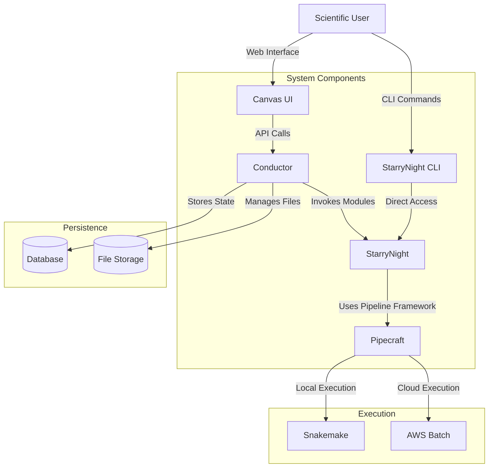

# StarryNight Technical Architecture

This document provides a high-level overview of the StarryNight project architecture, including its three main packages: starrynight, pipecraft, and conductor.

## System Architecture

StarryNight consists of three interrelated Python packages organized in a hierarchical manner:

1. **Pipecraft**: The foundation layer providing pipeline abstraction
2. **StarryNight**: The scientific algorithm layer implementing image processing modules
3. **Conductor**: The orchestration layer managing execution and user interface integration

The system can be used in two main ways:
- As a complete orchestrated platform with UI via the Conductor service
- As direct command-line tools using the StarryNight CLI for individual processing steps



## Package Roles

### Pipecraft

Pipecraft is a domain-agnostic pipeline framework that:
- Defines pipeline as directed acyclic graphs (DAGs) of computational nodes
- Provides abstractions for different execution backends (Snakemake, AWS Batch)
- Handles pipeline compilation and execution
- Implements sequential and parallel execution strategies

Key components:
- `Pipeline`: Base class for defining computational workflows
- `Node`: Represents individual computational units
- `Backend`: Abstraction for execution environments (e.g., SnakeMakeBackend)

### StarryNight

StarryNight implements scientific algorithms for cell painting image processing:
- Contains domain-specific logic for image processing and analysis
- Implements modules that conform to Pipecraft's Node interface
- Provides CLI tools for direct algorithm invocation
- Defines parsers for processing data paths and structures

Key components:
- `Algorithms`: Core scientific implementations (align.py, illum_calc.py, etc.)
- `Modules`: Reusable components implementing Pipecraft's Node interface
- `Experiments`: Configuration of workflows for specific scientific use cases
- `Pipelines`: Compositions of modules using Pipecraft's Pipeline class
- `CLI`: Command-line interface for direct invocation of algorithms and modules

The StarryNight CLI (`starrynight` command) provides direct access to all functionality for scientific users who prefer command-line workflows and want to execute individual processing steps manually. This allows running specific algorithms (e.g., illumination correction, index generation) without requiring the full Conductor infrastructure.

### Conductor

Conductor orchestrates the execution of StarryNight pipelines:
- Provides REST API for project, job, and run management
- Handles database persistence for tracking state
- Integrates with UI components (Canvas)
- Manages file storage and retrieval

Key components:
- `Handlers`: Business logic for operations
- `Models`: Database models (Project, Job, Run)
- `Deploy`: API endpoints and server configurations
- `Routes`: API endpoint implementations

## Data Flow

This section describes how data flows through the StarryNight system in both usage modes.

### Through Orchestrated Platform (Conductor)

1. **Project Creation & Configuration**
   - User creates project with dataset parameters via Canvas UI
   - Project configuration is stored in Conductor's database
   - Inventory and index are generated from the dataset

2. **Pipeline Definition**
   - User configures experiment parameters
   - StarryNight modules are configured with project parameters
   - Pipecraft pipeline is constructed from configured modules

3. **Execution**
   - Conductor initiates execution using appropriate Pipecraft backend
   - Backend compiles and executes the pipeline
   - Results are stored in project workspace
   - Run status and metadata are tracked in database

4. **Results & Analysis**
   - Users can inspect outputs through Canvas UI
   - Multiple runs can be compared
   - Results can feed into subsequent analyses

### Through Direct CLI Usage (StarryNight)

1. **Dataset Setup**
   - User organizes data files in a compatible structure
   - User runs `starrynight inventory gen` to create inventory
   - User runs `starrynight index gen` to generate structured index

2. **Processing Steps**
   - User runs specific algorithm commands (e.g., `starrynight illum calc`)
   - Each command performs a distinct processing step
   - Intermediate files are generated in specified directories

3. **Pipeline Execution**
   - User can run CellProfiler integration via `starrynight cp`
   - Results are written to specified output directories
   - Each step can be executed independently

### User Roles and Interactions

The system supports different types of users with distinct workflows:

1. **Scientific Users**
   - Create and configure projects
   - Generate inventory and index
   - Configure experiments
   - Execute pipelines
   - Inspect and analyze results

2. **Module Authors**
   - Write scientific algorithms
   - Wrap algorithms in Node objects
   - Write specifications for algorithms
   - Configure modules using experiments and data parameters
   - Define parallel execution strategies

3. **Infrastructure Maintainers**
   - Develop Pipecraft backends
   - Implement security models
   - Handle deployment strategies
   - Manage CI/CD for components
   - Configure compute worker scaling
   - Manage data storage and movement

## Dependency Graph

```
Canvas UI → Conductor → StarryNight → Pipecraft
```

- Canvas depends on Conductor's API
- Conductor imports StarryNight for module initialization
- StarryNight implements Pipecraft interfaces
- Pipecraft has no dependencies on other packages

This architecture ensures:
- Separation of scientific logic from infrastructure concerns
- Flexibility in execution environments
- Extensibility for new algorithms and processing modules
- Clear boundaries between user interaction and scientific processing
