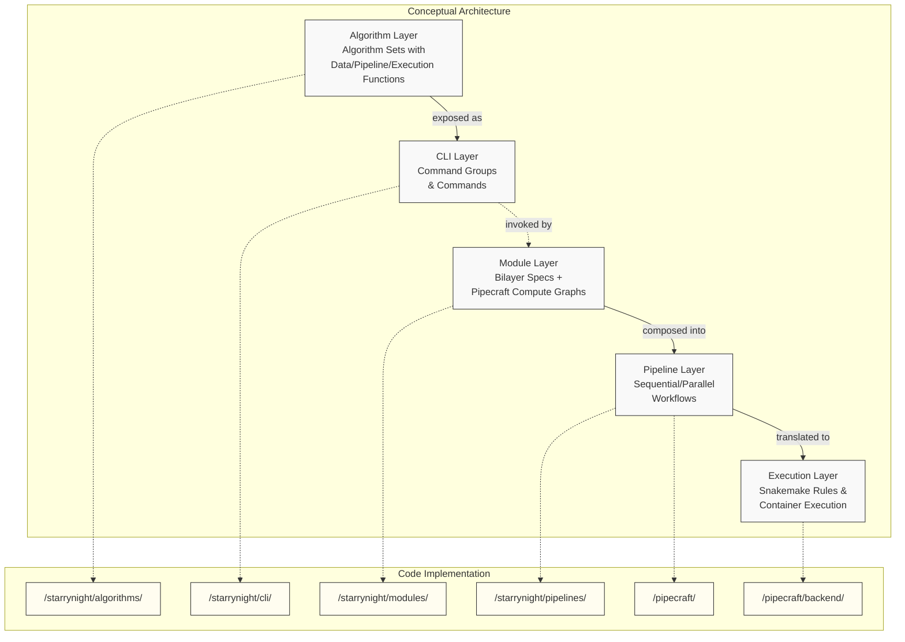
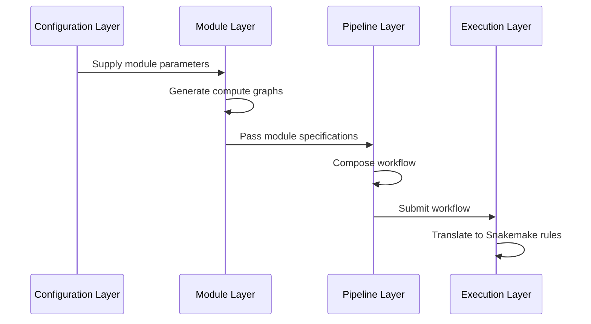
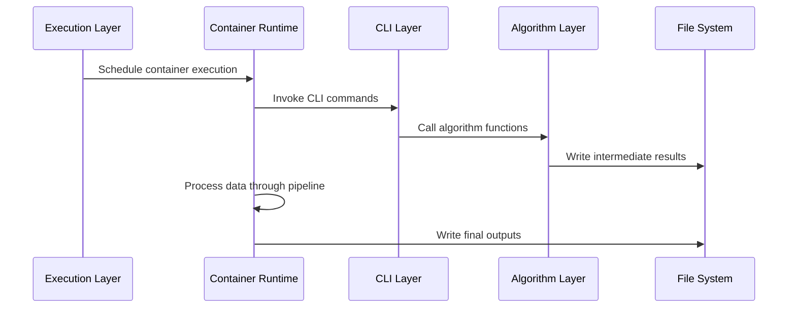

# StarryNight Architecture Overview

## Navigating the Architecture Documentation

This document provides a high-level structural map of the StarryNight system and serves as your main guide to the architecture documentation. Below is a recommended reading path based on your role and interests; the layer terminology is explained and defined next:

| If you are a...              | Start here                                                           | Then explore                                                      |
| ---------------------------- | -------------------------------------------------------------------- | ----------------------------------------------------------------- |
| New developer                | This overview + [Practical Integration](08_practical_integration.md) | Layer-specific docs based on your focus                           |
| Algorithm developer          | [Algorithm Layer](01_algorithm_layer.md)                             | [CLI Layer](02_cli_layer.md) → [Module Layer](03_module_layer.md) |
| Module developer             | [Module Layer](03_module_layer.md)                                   | [Pipeline Layer](04_pipeline_layer.md)                            |
| Pipeline developer           | [Pipeline Layer](04_pipeline_layer.md)                               | [Execution Layer](05_execution_layer.md)                          |
| Configuration developer      | [Configuration Layer](06_configuration_layer.md)                     | Relevant layer docs                                               |
| Biologist/Non-technical user | [Architecture for Biologists](07_architecture_for_biologists.md)     | [Practical Integration](08_practical_integration.md)              |

!!!note "Pipeline Terminology"
    Throughout this documentation, "pipeline" refers to **StarryNight pipelines** - complete scientific workflows composed of multiple processing modules. This is distinct from:

    - **CellProfiler pipelines** (`.cppipe` files) - single-tool image analysis workflows
    - **Snakemake pipelines** - the underlying execution engine's rule-based workflows

    When we discuss CellProfiler or Snakemake pipelines specifically, we use those full terms. Otherwise, "pipeline" means StarryNight's higher-level workflow composition system.

## Architecture at a Glance

The architecture consists of conceptual layers and their implementation:

Note: The Configuration Layer (in `/starrynight/experiments/`) provides parameters across all layers but is not shown in this diagram for clarity.

### Core Design Principles

- **Separation of concerns**: Each layer has distinct responsibilities
- **Progressive composition**: Build complex pipelines from simple components
- **Containerized execution**: Run code in reproducible environments
- **Configuration inference**: The Configuration Layer provides adaptive parameters across all other layers through smart defaults and data-driven inference

## Layer Overview

StarryNight consists of six interconnected layers:

| Layer                                      | Primary Responsibility             | Key Components                                                                             |
| ------------------------------------------ | ---------------------------------- | ------------------------------------------------------------------------------------------ |
| [Algorithm](01_algorithm_layer.md)         | Core computational operations      | Python functions for LoadData generation, CellProfiler pipeline creation, image processing |
| [CLI](02_cli_layer.md)                     | Command-line interface             | Click-based command groups (`illum`, `analysis`, `segcheck`, `cp`), parameter parsing      |
| [Module](03_module_layer.md)               | Standardized processing steps      | Bilayers specifications, Pipecraft compute graphs, container configurations                |
| [Pipeline](04_pipeline_layer.md)           | Complete workflow orchestration    | Module composition, sequential/parallel execution paths                                    |
| [Execution](05_execution_layer.md)         | Backend runtime infrastructure     | Snakemake DAG generation, Docker/AWS Batch backends, resource management                   |
| [Configuration](06_configuration_layer.md) | Parameter inference and management | Experiment definitions, adaptive parameter inference                                       |

## Data and Control Flow

The StarryNight architecture transforms data through two primary phases: pipeline composition and runtime execution. While shown as linear flows for clarity, the architecture supports iterative scientific workflows where researchers can adjust parameters and re-run specific steps based on results.

### Pipeline Composition Phase

This phase focuses on how configurations become executable workflows:

### Runtime Execution Phase

This phase shows how workflows execute and process data:

### Key Architecture Steps

The complete flow can be summarized in these key steps:

1. **Configuration Layer** defines parameters for all layers
2. **Module Layer** generates compute graphs from configuration
3. **Pipeline Layer** composes modules into workflows
4. **Execution Layer** translates workflows to backend-specific formats
5. **Container runtime** executes the workflows
6. **CLI Layer** processes commands and invokes algorithms
7. **Algorithm Layer** performs core processing functions
8. **Results** are stored in configured locations

## Implementation Organization

StarryNight is organized as a monorepo with four main packages:

### StarryNight Core (`/starrynight/src/starrynight/`)

The foundation of the platform providing specialized algorithms for microscopy image analysis:

- **CLI Tools**: Command-line interfaces for each algorithm
- **Algorithms**: Image processing algorithms for microscopy data
- **Modules System**: Standardized module structure for algorithm implementation
- **Parsers**: File path parsing and metadata extraction
- **Utilities**: Common functions for file handling, data transformation, etc.

### PipeCraft (`/pipecraft/src/pipecraft/`)

The pipeline compiler and execution framework:

- **Pipeline Definition**: Python API for defining computational workflows
- **Node System**: Individual processing steps as configurable nodes
- **Backend Abstraction**: Support for local, Docker, and AWS Batch execution
- **Template System**: Pre-defined templates for common backends

### Conductor (Job orchestration and API)

Manages the execution environment:

- **REST API**: API for job management and monitoring
- **Database**: Storage for project configurations and job results
- **Job Management**: Scheduling, execution, and monitoring of jobs
- **WebSockets**: Real-time updates on job status

### Canvas (Web UI for pipeline configuration)

The web-based user interface handles:

- **Job Configuration**: Interface for setting up and parameterizing workflows
- **Run Monitoring**: Real-time status updates and logs
- **Results Visualization**: Interactive exploration of outputs
- **File Management**: Interface for managing input and output files

## Extension Points

StarryNight provides these key extension points:

- **New algorithms**: `/starrynight/algorithms/`
- **New CLI commands**: `/starrynight/cli/`
- **New modules**: `/starrynight/modules/`
- **New experiment types**: `/starrynight/experiments/`
- **New backends**: `/pipecraft/backend/`

For examples of how to extend these components, see the [Practical Integration](08_practical_integration.md) document.

## Key Terms

- **Algorithm Set**: Group of related processing functions
- **Module**: Standardized component with inputs/outputs
- **Pipeline**: Composed workflow of modules
- **Execution Backend**: System that runs pipelines
- **Experiment**: Configuration for a specific workflow
- **[Bilayers](https://github.com/bilayer-containers/bilayers)**: External schema system used by the Module Layer to standardize input/output specifications and enable UI generation
- **Compute Graph**: Definition of operations and connections

For practical examples showing how these concepts work together, see [Practical Integration](08_practical_integration.md)
