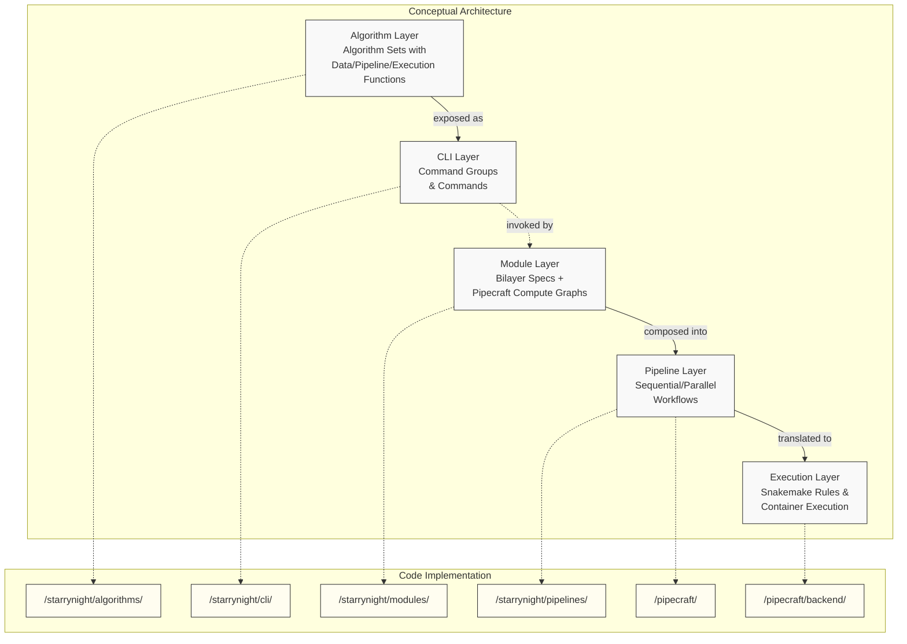
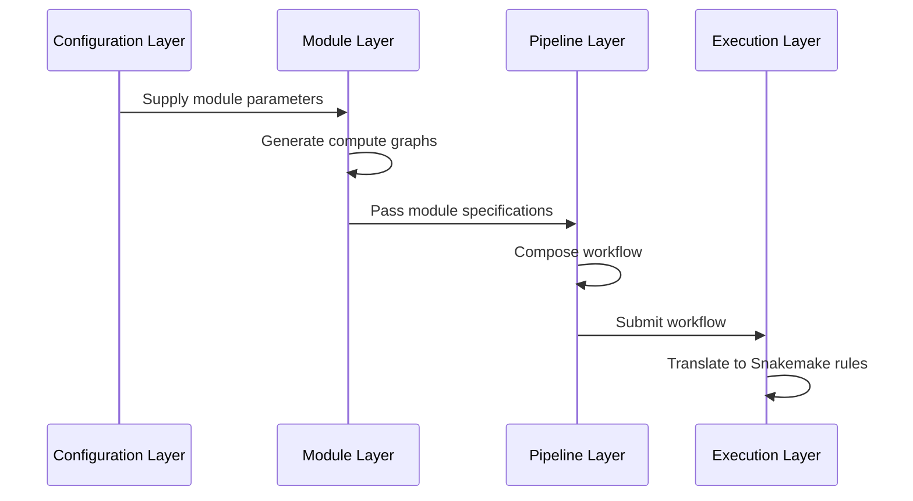
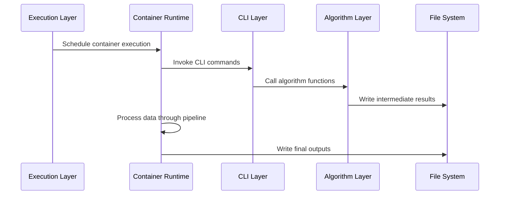

# StarryNight Architecture Overview

!!!note "Documentation Navigation"
    This document provides a high-level structural map of the StarryNight system. For different perspectives:

    - **For biological analogies**: See [Architecture for Biologists](07_architecture_for_biologists.md)
    - **For concrete examples**: See [Practical Integration Walkthrough](08_practical_integration.md)
    - **For detailed layer explanations**: Follow links in the [Layer Overview](#layer-overview) section

## How to Use This Documentation

This overview serves as your map to the StarryNight architecture. Based on your role:

| If you are a... | Start here | Then explore |
|-----------------|------------|--------------|
| New developer | This overview + [Practical Integration](08_practical_integration.md) | Layer-specific docs based on your focus |
| Algorithm developer | [Algorithm Layer](01_algorithm_layer.md) | [CLI Layer](02_cli_layer.md) → [Module Layer](03_module_layer.md) |
| Module developer | [Module Layer](03_module_layer.md) | [Pipeline Layer](04_pipeline_layer.md) |
| Pipeline developer | [Pipeline Layer](04_pipeline_layer.md) | [Execution Layer](05_execution_layer.md) |
| Configuration developer | [Configuration Layer](06_configuration_layer.md) | Relevant layer docs |
| Biologist/Non-technical user | [Architecture for Biologists](07_architecture_for_biologists.md) | [Practical Integration](08_practical_integration.md) |

## Architecture at a Glance

The architecture consists of conceptual layers and their implementation:

Note: The Configuration Layer (in `/starrynight/experiments/`) provides parameters across all layers but is not shown in this diagram for clarity.

### Core Design Principles

- **Separation of concerns**: Each layer has distinct responsibilities
- **Progressive composition**: Build complex pipelines from simple components
- **Containerized execution**: Run code in reproducible environments
- **Configuration inference**: Minimize manual configuration through smart defaults

## Layer Overview

StarryNight consists of six interconnected layers:

| Layer | Primary Responsibility | Key Components | Details |
|-------|------------------------|----------------|---------|
| Algorithm | Core image processing without dependencies | Functions for data prep, pipeline generation, execution | [Details →](01_algorithm_layer.md) |
| CLI | Command-line interface | Command groups, parameter parsing/validation | [Details →](02_cli_layer.md) |
| Module | Standardized components | Input/output specs, compute graph generation | [Details →](03_module_layer.md) |
| Pipeline | Workflow composition | Sequential/parallel execution paths | [Details →](04_pipeline_layer.md) |
| Execution | Backend runtime | Snakemake rules, container management | [Details →](05_execution_layer.md) |
| Configuration | Parameter inference | Experiment configs, adaptive settings | [Details →](06_configuration_layer.md) |

## Data and Control Flow

The StarryNight architecture transforms data through two primary phases: pipeline composition and runtime execution.

### Pipeline Composition Phase

This phase focuses on how configurations become executable workflows:

!!!note "Iterative Development"
    While this diagram shows a linear flow, real-world development is often iterative. Researchers frequently adjust configurations, refine module parameters, or modify pipeline composition based on results. The architecture supports this workflow by maintaining clear boundaries between layers, allowing changes at any level to flow through the system without requiring complete rewrites.

### Runtime Execution Phase

This phase shows how workflows execute and process data:

#### Pipeline Composition Key Steps
1. **Configuration** defines parameters for all layers
2. **Modules** generate compute graphs from configuration
3. **Pipeline** composes modules into workflows
4. **Execution** translates workflows to backend-specific formats

#### Runtime Execution Key Steps
5. **Container runtime** executes the workflows
6. **CLI layer** processes commands and invokes algorithms
7. **Algorithm layer** performs core processing functions
8. **Results** are stored in configured locations

## Implementation Organization

StarryNight is organized as a monorepo with four main packages:

- **StarryNight**: Core algorithms, CLI, modules and pipelines (`/starrynight/src/starrynight/`)
- **PipeCraft**: Pipeline composition and execution (`/pipecraft/src/pipecraft/`)
- **Conductor**: Job orchestration and API (not detailed in this documentation)
- **Canvas**: Web UI for pipeline configuration (not detailed in this documentation)

## Extension Points

StarryNight provides these key extension points:

- **New algorithms**: `/starrynight/algorithms/`
- **New CLI commands**: `/starrynight/cli/`
- **New modules**: `/starrynight/modules/`
- **New experiment types**: `/starrynight/experiments/`
- **New backends**: `/pipecraft/backend/`

For examples of how to extend these components, see the [Practical Integration](08_practical_integration.md) document.

## Key Terms

- **Algorithm Set**: Group of related processing functions
- **Module**: Standardized component with inputs/outputs
- **Pipeline**: Composed workflow of modules
- **Execution Backend**: System that runs pipelines
- **Experiment**: Configuration for a specific workflow
- **Bilayers**: Schema system for module specifications
- **Compute Graph**: Definition of operations and connections

For practical examples showing how these concepts work together, see [Practical Integration](08_practical_integration.md)
