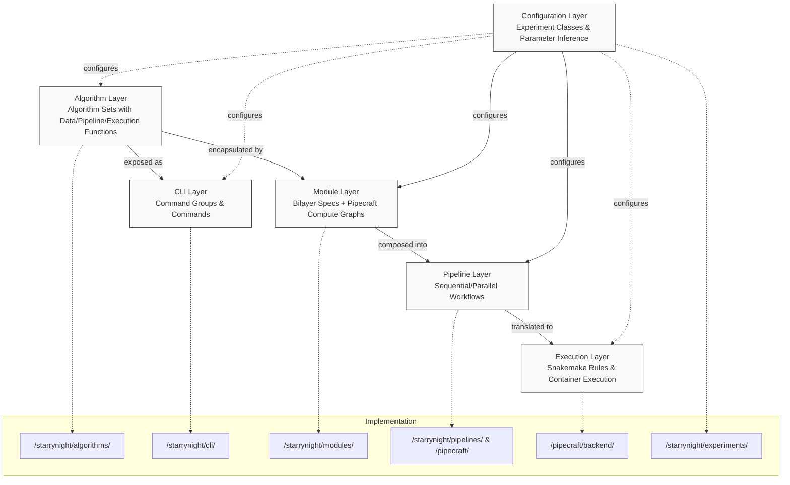

# StarryNight Architecture Overview

!!!warning "Documentation Scope"
     This architecture documentation primarily focuses on the StarryNight core and PipeCraft packages. The Conductor (job orchestration) and Canvas (user interface) packages are mentioned for completeness but not covered in detail in the current documentation.

## The Big Picture: What You Need to Know

StarryNight is a modular framework for processing high-throughput microscopy data. Before diving into details, here's what you need to understand:

### Architecture at a Glance



### Core Design Principles

StarryNight follows these key architectural principles:

1. **Separation of concerns**: Each layer has a specific responsibility
2. **Progressive composition**: Build complex pipelines from simple components
3. **Containerized execution**: Run code in consistent, reproducible environments
4. **Configuration inference**: Minimize manual configuration through smart defaults

### Developer Quick Start

Here's where to focus based on your task:

| If you need to... | Start here |
|-------------------|------------|
| Add a new image processing algorithm | `/starrynight/src/starrynight/algorithms/` |
| Create a command-line tool | `/starrynight/src/starrynight/cli/` |
| Define a module with inputs/outputs | `/starrynight/src/starrynight/modules/` |
| Compose a pipeline workflow | `/starrynight/src/starrynight/pipelines/` and `/pipecraft/src/pipecraft/` |
| Define or modify execution behavior | `/pipecraft/src/pipecraft/backend/` |
| Configure experiment parameters | `/starrynight/src/starrynight/experiments/` |

For in-depth examples:

  - The [Practical Integration](08_practical_integration.md) document walks through a complete pipeline implementation
  - The [Architecture for Biologists](07_architecture_for_biologists.md) provides analogies for those without a strong software background

## Architectural Layers Explained

StarryNight consists of six interconnected layers, each with a specific responsibility:

### 1. Algorithm Layer

**What it does**: Implements the core image processing functionality

  - Pure Python functions with no StarryNight-specific dependencies
  - Handles data preparation, pipeline generation, and execution
  - Examples: illumination correction, segmentation, preprocessing

**Developer relevance**: This is where you implement new data processing techniques.

### 2. CLI Layer

**What it does**: Wraps algorithms as command-line tools

  - Parameter parsing and validation
  - Command organization and help text
  - Path management for inputs/outputs

**Developer relevance**: This makes algorithms directly usable without programming.

### 3. Module Layer

**What it does**: Standardizes components for pipeline composition

  - Defines inputs/outputs via Bilayers schemas
  - Creates compute graphs without executing them
  - Provides configuration utilities

**Developer relevance**: Modules are the reusable building blocks of pipelines.

### 4. Pipeline Layer

**What it does**: Composes modules into executable workflows

  - Defines node relationships and data flow
  - Manages parallel and sequential execution
  - Integrates with PipeCraft for pipeline composition

**Developer relevance**: This is where you define complex processing workflows.

### 5. Execution Layer

**What it does**: Runs pipelines on specific backends

  - Currently uses Snakemake for workflow execution
  - Manages containers and dependencies
  - Handles parallelism and resource allocation

**Developer relevance**: This controls how your pipeline actually runs.

### 6. Configuration Layer

**What it does**: Manages pipeline parameters and settings

  - Infers parameters from minimal user input
  - Creates standardized configurations for modules
  - Handles experiment-specific workflow variations

**Developer relevance**: This makes pipelines adaptable to different datasets.

## Data and Control Flow

Here's how information flows through the system:

1. **Configuration** is used to instantiate **modules**
2. **Modules** generate their **compute graphs**
3. **Compute graphs** are composed into a **pipeline**
4. The **pipeline** is translated to an executable **workflow**
5. The **workflow** runs in **containers**
6. **Results** are stored in configured locations

## Implementation Organization

StarryNight is organized as a monorepo with four main packages:

### 1. StarryNight

  - **Purpose**: Core algorithms, CLI, modules, and experiments
  - **Key directories**:
    - `/algorithms/`: Processing implementations
    - `/cli/`: Command-line interfaces
    - `/modules/`: Standardized pipeline components
    - `/experiments/`: Configuration definitions
    - `/pipelines/`: Higher-level pipeline composition

### 2. PipeCraft

  - **Purpose**: Pipeline definition and execution
  - **Key directories**:
    - `/pipeline.py`: Pipeline composition tools
    - `/backend/`: Execution backends (Snakemake, AWS Batch)

### 3. Conductor

  - **Purpose**: Job orchestration and API
  - **Not covered in detail in this documentation**

### 4. Canvas

  - **Purpose**: Web UI for pipeline configuration
  - **Not covered in detail in this documentation**

## Common Development Tasks

Here are practical examples of common development workflows:

### Adding a New Algorithm

```python
# 1. Implement algorithm functions in /starrynight/src/starrynight/algorithms/new_algorithm.py
def gen_new_algorithm_load_data(index_path, output_path, options):
    """Generate load data files for input to the algorithm."""
    # Implementation...

def gen_new_algorithm_pipeline(load_data_path, output_path, options):
    """Generate pipeline specification for the algorithm."""
    # Implementation...

def run_new_algorithm(pipeline_path, load_data_path, output_path):
    """Execute the algorithm pipeline."""
    # Implementation...

# 2. Create CLI wrapper in /starrynight/src/starrynight/cli/new_algorithm.py
@click.group()
def new_algorithm():
    """Commands for the new algorithm."""
    pass

@new_algorithm.command()
@click.option("--index", required=True)
@click.option("--output", required=True)
def load_data(index, output):
    """Generate load data for the algorithm."""
    gen_new_algorithm_load_data(index, output, {})

# 3. Create module implementations in /starrynight/src/starrynight/modules/new_algorithm/
class NewAlgorithmLoadDataModule(StarrynightModule):
    """Module for generating load data."""

    @staticmethod
    def from_config(data_config, experiment=None):
        """Create the module from configuration."""
        # Implementation...
```

### Extending a Pipeline

```python
# In a pipeline definition file
def create_pipeline_with_new_component(data_config, experiment):
    """Create a pipeline that includes the new component."""

    # Create all required modules
    module_list = [
        existing_module := ExistingModule.from_config(data_config, experiment),
        new_module := NewModule.from_config(data_config, experiment),
    ]

    # Define the pipeline
    pipeline = pc.Pipeline()
    with pipeline.sequential() as seq:
        seq.add_pipeline(existing_module.pipe)
        seq.add_pipeline(new_module.pipe)

    return module_list, pipeline
```

### Adding Configuration Options

```python
# In an experiment configuration file
class ExtendedExperimentConfig(BaseModel):
    """Configuration for the extended experiment."""

    # Existing options
    existing_option: str

    # New options
    new_option: str
    new_flag: bool = False

    # Computed values
    @property
    def derived_value(self) -> str:
        """Compute a value based on other settings."""
        return f"{self.existing_option}_{self.new_option}"
```

## Extension Points

StarryNight provides these key extension points:

1. **New algorithms** in `/starrynight/src/starrynight/algorithms/`
2. **New CLI commands** in `/starrynight/src/starrynight/cli/`
3. **New modules** in `/starrynight/src/starrynight/modules/`
4. **New experiment types** in `/starrynight/src/starrynight/experiments/`
5. **New backends** in `/pipecraft/src/pipecraft/backend/`

## Recommended Reading Path

Depending on your role:

1. **Algorithm developer**: Start with [Algorithm Layer](01_algorithm_layer.md) → [CLI Layer](02_cli_layer.md) → [Module Layer](03_module_layer.md)

2. **Module developer**: First read [Module Layer](03_module_layer.md) → [Pipeline Layer](04_pipeline_layer.md)

3. **Pipeline developer**: Focus on [Pipeline Layer](04_pipeline_layer.md) → [Execution Layer](05_execution_layer.md)

4. **Configuration developer**: Concentrate on [Configuration Layer](06_configuration_layer.md)

5. **For understanding practical integration**: Read [Practical Integration](08_practical_integration.md)

## Reference

### Key Terms

  - **Algorithm Set**: Group of related processing functions (load data, pipeline generation, execution)
  - **Module**: Standardized component with inputs/outputs and compute graph
  - **Pipeline**: Composed workflow of modules
  - **Execution Backend**: System that runs pipelines (e.g., Snakemake)
  - **Experiment**: Configuration for a specific workflow type
  - **Bilayers**: Schema system for defining module specifications
  - **Compute Graph**: Definition of operations and their connections

### Layer-Specific Documents

Each architectural layer has a dedicated document explaining it in detail:

  - [Algorithm Layer](01_algorithm_layer.md)
  - [CLI Layer](02_cli_layer.md)
  - [Module Layer](03_module_layer.md)
  - [Pipeline Layer](04_pipeline_layer.md)
  - [Execution Layer](05_execution_layer.md)
  - [Configuration Layer](06_configuration_layer.md)
  - [Architecture for Biologists](07_architecture_for_biologists.md)
  - [Practical Integration](08_practical_integration.md)
