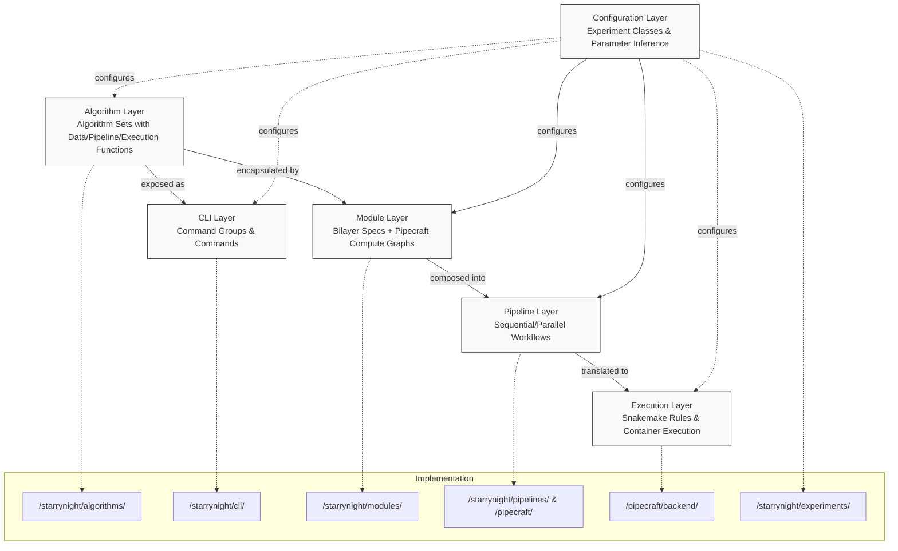

# StarryNight Architecture Overview

!!!warning "Documentation Scope"
     This architecture documentation primarily focuses on the StarryNight core and PipeCraft packages. The Conductor (job orchestration) and Canvas (user interface) packages are mentioned for completeness but not covered in detail in the current documentation.

## Introduction

StarryNight is a scientific image processing framework designed for processing high-throughput imaging data. It provides a flexible, composable pipeline system that handles complex image processing workflows while maintaining separation of concerns between algorithms, execution, and configuration.

This document provides a high-level overview of the StarryNight architecture, explaining how the different components interact to form a complete pipeline system.

## Developer Quick Start

This section helps new developers quickly navigate the codebase and understand where to focus based on specific tasks.

### Code Location Map

| Architecture Layer | Main Code Location |
|-------------------|-------------------|
| Algorithm Layer | `/starrynight/src/starrynight/algorithms/` |
| CLI Layer | `/starrynight/src/starrynight/cli/` |
| Module Layer | `/starrynight/src/starrynight/modules/` |
| Pipeline Layer | `/starrynight/src/starrynight/pipelines/` and `/pipecraft/src/pipecraft/` |
| Execution Layer | `/pipecraft/src/pipecraft/backend/` |
| Configuration Layer | `/starrynight/src/starrynight/experiments/` |

### Where to Start

Depending on your task, focus on these areas:

- **Adding a new algorithm set?** → Start with the Algorithm Layer, then add corresponding CLI and Module implementations
- **Extending an existing algorithm set?** → Examine the existing algorithm set pattern to understand the inputs/outputs/file structure
- **Building a reusable processing component?** → Explore the Module Layer, particularly the module registry and schema implementation
- **Composing a complete workflow?** → Look at the Pipeline Layer, especially the pipeline composition functions
- **Changing execution behavior?** → Check the Execution Layer, focusing on the Snakemake backend implementation
- **Modifying configuration options?** → Begin with the Configuration Layer and the Pydantic models

For a more accessible explanation of the architecture using biological analogies, see [Architecture for Biologists](07_architecture_for_biologists.md).

## Project Structure

The StarryNight framework is organized as a monorepo with four main packages:

1. **StarryNight** - Core package containing:
    - Algorithm Layer: Pure Python functions for image processing
    - CLI Layer: Command-line interfaces for algorithms
    - Module Layer: Standardized module abstractions

2. **PipeCraft** - Pipeline definition framework that powers:
    - Pipeline Layer: Composition of modules into workflows
    - Part of the Execution Layer: Backend abstractions

3. **Conductor** - Job orchestration service handling:
    - Execution management and monitoring
    - Configuration storage
    - REST API for job control

4. **Canvas** - Frontend UI providing:
    - Web interface for pipeline configuration
    - Visualization of results
    - Integration with Conductor

## Core Architectural Layers

!!!note "Focus"
     This documentation primarily focuses on the architectural layers rather than the package boundaries, as layers can span multiple packages.

StarryNight follows a layered architecture with distinct responsibilities:

1. **Algorithm Layer** - Core image processing functionality, completely independent of other layers
2. **CLI Layer** - Command-line interface wrappers
3. **Module Layer** - Standardized abstractions with specs and compute graphs
4. **Pipeline Layer** - Compositions of modules into executable workflows
5. **Execution Layer** - Backend systems that run the pipelines

Additionally, the **Configuration Layer** acts as a cross-cutting concern that interacts with the other layers by providing parameter management, inference, and standardization across the system.

In a typical workflow, the Module Layer consumes configuration to instantiate modules, then the Pipeline Layer composes these modules, and finally the Execution Layer runs the pipeline. The Configuration Layer acts as a bridge between user inputs and the detailed settings needed by each layer. This separation of concerns creates a flexible and maintainable architecture.

## Key Components

### Algorithm Sets

The foundation of StarryNight is the algorithm sets -- collections of related functions that implement specific image processing steps (1). While many examples use CellProfiler-focused algorithm sets (with data loading, pipeline generation, and execution functions), the architecture supports various other types like indexing, inventory management, quality control, and data visualization.
{ .annotate }

1. Algorithm sets are pure Python functions with no external dependencies on other StarryNight components, making them easily testable and completely independent.

### CLI Wrappers

CLI wrappers expose algorithms as command-line tools. This layer handles parameter parsing, path management, and command organization, making algorithms directly accessible to users without requiring Python programming.

### Modules

Modules are a key abstraction that standardize how pipeline components are defined and composed (1).
{ .annotate }

1. Modules have a dual focus - specs and compute graphs. They describe what should be done (through specifications) and how it should be structured (through compute graphs), but don't actually perform the computation.

A module:

- Encapsulates a spec that defines inputs and outputs (using [Bilayers](https://github.com/bilayer-containers/bilayers) schema)
- Contains a compute graph that defines what operations will be performed
- Provides `from_config` methods for automatic configuration from experiment settings
- Does not perform actual computation (delegated to execution backends)

Each algorithm set typically corresponds to a module set containing specific module implementations for load data generation, pipeline generation, and execution.

### Pipelines

Pipelines compose multiple modules into executable workflows. The pipeline layer:

- Uses Pipecraft to define compute graphs with nodes and connections
- Configures containers for execution
- Manages parallel and sequential execution paths
- Handles input/output relationships between modules

Pipelines represent the complete computation to be performed but are backend-agnostic.

### Execution

The execution layer takes pipelines and runs them on specific backends(1):
{ .annotate }

1. The execution is separated from pipeline definition, allowing the same pipeline to potentially run on different backends (local, cloud, etc.).

- Currently implemented with Snakemake
- Translates Pipecraft pipelines into Snakemake rules
- Manages container execution (Docker/Singularity)
- Handles parallelism, logging, and monitoring

### Configuration Layer

The configuration layer handles parameter inference and standardization:

- Infer parameters from data where possible
- Combine user-provided parameters with defaults
- Create consistent configurations for modules
- Support extension for different experimental types

## Data Flow

A typical data flow through the StarryNight system:

1. User configures an experiment with minimal required parameters
2. The configuration layer infers additional parameters
3. Modules are instantiated with the configuration
4. Modules generate their compute graphs (Pipecraft pipelines)
5. Pipelines are composed for complete workflow
6. Backend translates the pipeline to executable form (e.g., Snakefile)
7. Backend executes the workflow in containers
8. Results are stored in configured locations

## System Integration

### Execution Contexts

StarryNight can be used in multiple contexts:

1. **Direct CLI usage** - Running algorithms directly via the CLI layer in the StarryNight core package
2. **Notebook integration** - Creating and running pipelines in Jupyter notebooks using StarryNight and PipeCraft
3. **UI integration** - Using the Canvas (frontend package) and Conductor (orchestration package) which provide a web-based interface that ultimately utilizes the same core functionality

Each context has different state management requirements, with the CLI being stateless and the UI components (Canvas and Conductor) maintaining session state.

### Container Usage

StarryNight uses containers for consistent execution:

- Each module defines its container requirements
- Containers include necessary dependencies (CellProfiler, Python libraries, etc.)
- Execution is delegated to container runtimes (Docker, Singularity)
- Container-based execution ensures reproducibility

## Extension Points

StarryNight is designed for extensibility:

1. **New algorithms** - Add functions to implement new image processing techniques
2. **New CLI commands** - Expose new algorithms through command-line interfaces
3. **New modules** - Create modules with specs and compute graphs for new functionality
4. **New experiment types** - Define new experiment classes for different workflows
5. **New backends** - Implement new execution backends beyond Snakemake

## Key Concepts Reference

- **Algorithm Set**: Group of functions that implement a specific pipeline step
- **Module**: Standardized wrapper with spec and compute graph
- **Bilayers**: Schema system for defining module inputs/outputs
- **Pipecraft**: Library for creating composable pipeline graphs
- **Compute Graph**: Definition of operations and their relationships
- **Container**: Isolated execution environment with dependencies
- **Snakemake**: Workflow engine that executes the compiled pipeline

## The Central Architectural Achievement

The most important architectural achievement of StarryNight is the clear separation between what should be done (algorithms), how it should be configured (specs), how it should be structured (compute graphs), and how it should be executed (backends).

This separation enables the automatic generation of complex execution plans (like 500+ line Snakemake files) while maintaining the simplicity and clarity of the higher-level abstractions.

## Architecture Visual Guide



## Common Development Tasks

Here are examples of common development tasks with specific implementation guidance:

### Implementing a New Algorithm Set

Algorithm sets typically consist of three components that work together:

1. **Data preparation functions** that generate load data files
2. **Pipeline generation functions** that create processing definitions
3. **Execution functions** that run the generated pipelines

To implement a new algorithm set:

```python
# In /starrynight/src/starrynight/algorithms/new_algorithm_set.py

def gen_new_algorithm_load_data_by_batch_plate(
    index_path: Path | CloudPath,
    out_path: Path | CloudPath,
    path_mask: str | None,
    for_special_type: bool = False,
) -> None:
    """Generate LoadData CSV files for the new algorithm.

    This function reads image metadata from an index, organizes it by
    batch/plate structure, and writes LoadData CSV files.
    """
    # Read from index file
    df = pl.read_parquet(index_path.resolve().__str__())

    # Filter for relevant images
    images_df = df.filter(pl.col("is_image").eq(True))

    # Generate hierarchical organization
    images_hierarchy_dict = gen_image_hierarchy(images_df)

    # Write output files for each batch/plate combination
    for batch in images_hierarchy_dict.keys():
        for plate in images_hierarchy_dict[batch].keys():
            write_loaddata_csv_by_batch_plate(
                images_df, out_path, path_mask, batch, plate
            )

def gen_new_algorithm_pipeline_by_batch_plate(
    load_data_path: Path | CloudPath,
    out_dir: Path | CloudPath,
    workspace_path: Path | CloudPath,
    option_flag: bool = False,
) -> None:
    """Create a processing pipeline programmatically.

    This function reads a sample LoadData file and constructs a pipeline
    with appropriate modules and parameters.
    """
    # Implementation details

def run_new_algorithm_pipeline(
    pipeline_path: Path | CloudPath,
    load_data_path: Path | CloudPath,
    out_dir: Path | CloudPath,
) -> None:
    """Execute the generated pipeline on the prepared data.

    This function runs the pipeline with appropriate parallelism and
    resource allocation.
    """
    # Implementation details
```

Next, create the corresponding CLI wrapper:

```python
# In /starrynight/src/starrynight/cli/new_algorithm.py

import click
from cloudpathlib import AnyPath

from starrynight.algorithms.new_algorithm_set import (
    gen_new_algorithm_load_data_by_batch_plate,
    gen_new_algorithm_pipeline_by_batch_plate,
    run_new_algorithm_pipeline,
)

@click.group()
def new_algorithm():
    """Commands for the new algorithm set."""
    pass

@new_algorithm.command(name="loaddata")
@click.option("-i", "--index", required=True, help="Path to index file")
@click.option("-o", "--out", required=True, help="Output directory")
@click.option("-m", "--path-mask", default=None, help="Path mask for file resolution")
def gen_load_data(index, out, path_mask):
    """Generate load data files for the new algorithm."""
    gen_new_algorithm_load_data_by_batch_plate(
        AnyPath(index), AnyPath(out), path_mask
    )

# Add additional CLI commands here
```

Finally, create the module implementations:

```python
# In /starrynight/src/starrynight/modules/new_algorithm_set/loaddata.py

from starrynight.modules.common import StarrynightModule
from starrynight.modules.schema import SpecContainer, TypeInput, TypeOutput, TypeEnum
from starrynight.schema import DataConfig

class NewAlgorithmGenLoadDataModule(StarrynightModule):
    """New algorithm load data generation module."""

    @staticmethod
    def uid() -> str:
        """Return module unique id."""
        return "new_algorithm_gen_loaddata"

    @staticmethod
    def _spec() -> SpecContainer:
        """Return module default spec."""
        # Define inputs and outputs with appropriate specifications

    @staticmethod
    def from_config(
        data: DataConfig,
        experiment: Experiment | None = None,
        spec: SpecContainer | None = None,
    ) -> Self:
        """Create module from configuration."""
        # Generate appropriate paths and configurations
```

### Building a Pipeline with Your Algorithm Set

To incorporate your new algorithm set into a pipeline:

```python
def create_pipeline_with_new_algorithm(
    data: DataConfig,
    experiment: Experiment,
) -> tuple[list[StarrynightModule], Pipeline]:
    """Create a pipeline that includes the new algorithm set."""

    # Create modules for all required operations
    module_list = [
        # Existing modules
        index_module := IndexModule.from_config(data),
        inventory_module := InventoryModule.from_config(data),

        # Your new algorithm modules
        new_algo_loaddata := NewAlgorithmGenLoadDataModule.from_config(data, experiment),
        new_algo_pipeline := NewAlgorithmGenPipelineModule.from_config(data, experiment),
        new_algo_exec := NewAlgorithmExecModule.from_config(data, experiment),
    ]

    # Define the pipeline structure
    pipeline = pc.Pipeline()
    with pipeline.sequential() as seq:
        # Setup steps
        with seq.sequential() as setup:
            setup.add_pipeline(index_module.pipeline)
            setup.add_pipeline(inventory_module.pipeline)

        # Your algorithm steps
        with seq.sequential() as new_algo:
            new_algo.add_pipeline(new_algo_loaddata.pipeline)
            new_algo.add_pipeline(new_algo_pipeline.pipeline)
            new_algo.add_pipeline(new_algo_exec.pipeline)

    return module_list, pipeline
```

## Recommended Reading Path

Depending on your development focus:

1. **For algorithm developers**: First read the [Algorithm Layer](01_algorithm_layer.md) and [CLI Layer](02_cli_layer.md) documents, then explore the [Module Layer](03_module_layer.md) to understand how algorithms are integrated into the module system.

2. **For module developers**: Start with the [Module Layer](03_module_layer.md) document to understand the dual nature of modules (specs and compute graphs), then examine the [Pipeline Layer](04_pipeline_layer.md) to see how modules are composed.

3. **For pipeline developers**: Focus on the [Pipeline Layer](04_pipeline_layer.md) and [Execution Layer](05_execution_layer.md) documents to understand how pipelines are defined and executed.

4. **For configuration developers**: Concentrate on the [Configuration Layer](06_configuration_layer.md) document, which explains parameter inference and management.

## Conclusion

The StarryNight architecture provides a flexible system for high-throughput microscopy image processing that separates concerns between algorithms, specifications, and execution. This separation allows for reuse, composition, and extension while maintaining reproducibility through containerized execution.

The following documents provide detailed explanations of each component, their implementation, and how they work together in the complete system.
