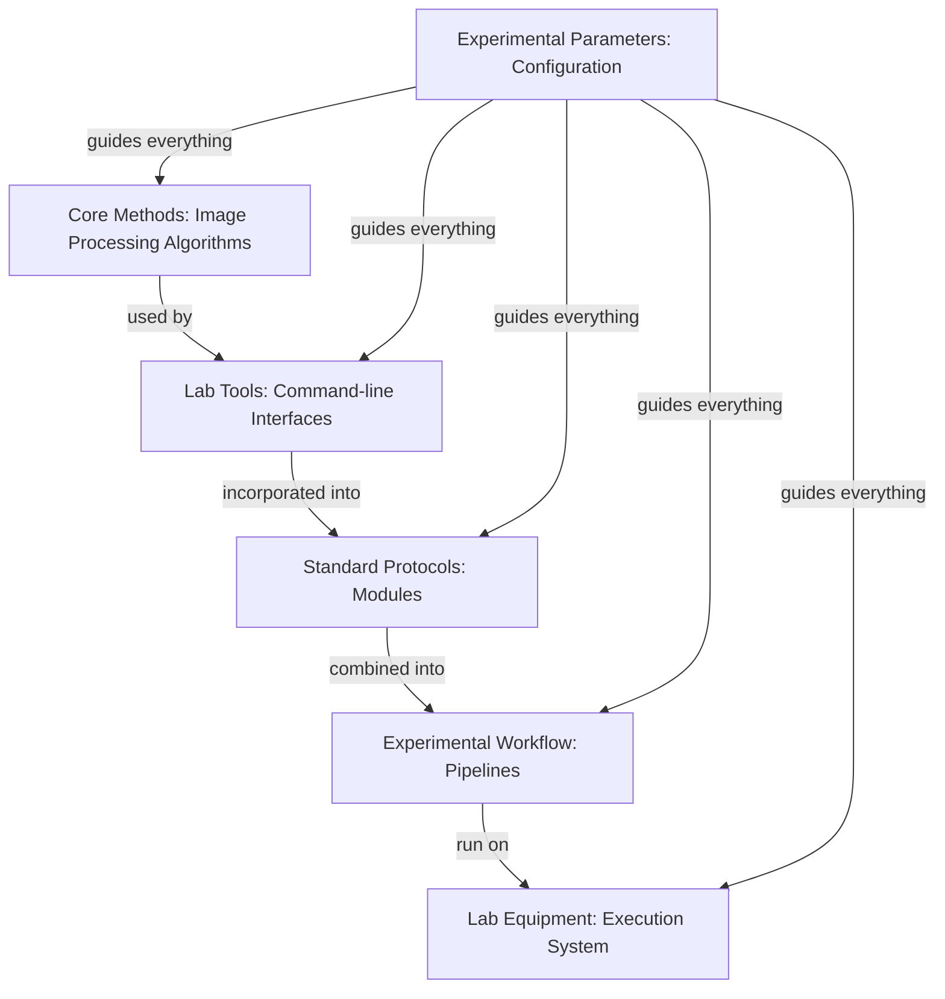

# StarryNight Architecture for Biologists

## Why This Architecture Was Built for Your Research Needs

StarryNight's architecture was designed to address the challenges faced by biologists working with high-throughput microscopy data. This document explains how the system's design directly supports your research workflow requirements.

## Core Challenges in High-Throughput Microscopy

High-throughput microscopy experiments present several key challenges:

* **Complex Multistage Processing** - Requiring multiple image processing steps that must be executed in specific sequences
* **Parallel Image Tracks** - Processing different types of images with varied requirements
* **Critical Quality Assessment** - Needing inspection points between processing stages
* **Diverse User Expertise Levels** - Supporting both computational experts and biologists with varying technical backgrounds

## Your Research Workflow in StarryNight

StarryNight's architecture enables a research workflow that addresses the requirements of advanced microscopy research:

1. **Configure your experiment** - Specify the parameters relevant to your specific research:
   - Experimental design settings
   - Image acquisition parameters
   - Processing configuration options

2. **StarryNight transforms these parameters** into complete processing pipelines with appropriate settings for each stage

3. **Review and intervene at critical checkpoints**:
   - Inspect intermediate results between processing stages
   - Validate quality through integrated visualization tools
   - Make informed decisions about parameter adjustments as needed

4. **Process multiple analysis paths efficiently**:
   - Run independent processing tracks in parallel when possible
   - Integrate results where workflows converge

5. **Scale processing across computing environments** with consistent results whether running locally or in the cloud

This workflow combines automation for efficiency with critical intervention points where biological expertise is essential, supporting various microscopy research applications.

## A Laboratory Research Analogy

To understand how StarryNight works, think of it like a modern research laboratory:

Just as your laboratory separates fundamental techniques, protocols, workflows, and execution, StarryNight organizes processing into layers:

* **Algorithms** are like your **fundamental laboratory methods** - basic image processing techniques
* **Modules** are like your **standard protocols** - organized procedures for specific tasks
* **Pipelines** are your **complete experimental workflows** - sequences of protocols that work together
* **Execution** is your **automated lab equipment** - running the workflows reliably
* **Configuration** is your **experimental parameters** - customizing everything for your specific research

## How StarryNight's Architecture Meets Your Requirements

The layered architecture directly addresses your high-priority research requirements:

### 1. Complex Image Processing Workflows

**Requirement**: Support for flexible, multistage image processing workflows with various analytical methods

**Architectural Solution**: The Pipeline Layer combines specialized modules into complete workflows, while the Execution Layer handles the complex interdependencies between steps. This allows you to define complete end-to-end processing pipelines while maintaining checkpoints for quality control, regardless of which specific image processing techniques you need to use.

### 2. Parallel Processing Capabilities

**Requirement**: Process multiple image analysis tracks simultaneously with different parameters

**Architectural Solution**: The Pipeline Layer can define parallel execution paths with different configurations, while the Execution Layer optimizes resource allocation for efficient processing. This lets you run independent analysis tracks simultaneously and integrate results where needed.

### 3. Manual Intervention Points

**Requirement**: Ability to inspect results and modify parameters between processing stages

**Architectural Solution**: The modular approach with clearly defined layer boundaries creates natural inspection points where you can evaluate results before proceeding. The Configuration Layer can be updated at these checkpoints to adjust parameters for subsequent stages.

### 4. Consistent Data Organization

**Requirement**: Standardized data structures that maintain compatibility with existing pipelines

**Architectural Solution**: The Module Layer defines consistent input/output specifications that enforce standardized data organization, while the Configuration Layer manages path structures and naming conventions for both inputs and outputs.

### 5. Multiple User Interfaces

**Requirement**: Support for both computational experts and biologists with varying technical backgrounds

**Architectural Solution**: The layered design enables multiple interaction points - from direct Algorithm Layer access for computational experts to simplified Canvas interfaces that abstract technical details for biologists while maintaining full functionality.

## Using StarryNight in Practice

The layered architecture translates to practical benefits for optical pooled screening experiments:

### Multiple Interface Options

* **Canvas Web Interface**: A graphical interface with both simplified views for non-experts and advanced options for experienced users
* **Jupyter Notebooks**: Interactive inspection environments for result visualization and quality control
* **Command-Line Interface**: Direct access to algorithms for computational experts and automation scripts

### Flexible Processing Control

* **End-to-End Automation**: Run complete workflows from raw images to results
* **Checkpoint Intervention**: Pause at critical points to assess quality and adjust parameters
* **Restart Capability**: Resume processing from checkpoints after parameter adjustments

### Consistent Data Organization

* **Standardized Structure**: Input and output data follow consistent organization patterns
* **Metadata Extraction**: Flexible path parsing to extract experimental information
* **Compatibility**: Maintains consistency with existing data structures and pipelines

## Key Terms for Understanding Discussions

When discussing StarryNight with computational colleagues, these terms may arise:

* **Container**: Isolated environment that ensures consistent software execution (like a tissue culture hood for computations)
* **Algorithm Set**: Collection of related image processing functions (like a set of related lab techniques)
* **Compute Graph**: Definition of processing steps and their relationships (like a detailed protocol flowchart)
* **CellProfiler**: Open-source cell image analysis software integrated with StarryNight
* **Module**: Standardized component that defines a specific image processing task

## The Bottom Line: Architecture That Serves Your Research

StarryNight's architecture was designed to address the requirements of advanced microscopy research:

1. **Process flexible, multistage workflows** adaptable to various imaging approaches
2. **Intervene at critical quality control points** where biological expertise is essential
3. **Configure complex experimental parameters** through interfaces matched to your technical comfort level
4. **Scale processing** from local workstations to cloud environments without changing your workflow
5. **Maintain data organization** that's compatible with existing tools and pipelines

This architectural approach addresses the fundamental challenges in high-throughput microscopy research. By separating the system into well-defined layers, StarryNight provides both the automation needed for efficiency and the control points required for quality assessment, giving you a flexible framework that can adapt to evolving research methodologies.
