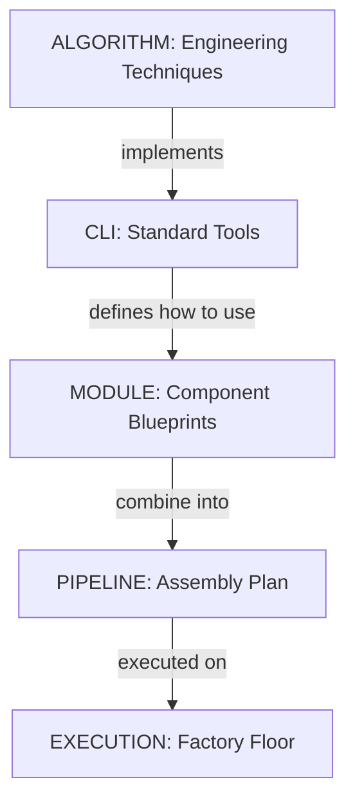

# StarryNight Architecture for Biologists

## Introduction

StarryNight is a scientific image processing framework designed specifically for high-throughput microscopy data. It tackles the complexity of processing thousands of images while maintaining reproducibility, flexibility, and scalability.

This document explains the StarryNight framework in terms accessible to biologists who may not have a software engineering background, focusing on why this complex architecture is necessary for modern microscopy workflows.

## Why Architecture Matters for Scientific Analysis

High-throughput microscopy requires a system that can handle:

1. **Scale** - Processing thousands of images across multiple experiments
2. **Complexity** - Managing multi-step analysis workflows with complex dependencies
3. **Flexibility** - Adapting to different experimental designs and imaging modalities
4. **Reproducibility** - Ensuring consistent results across computing environments

Rather than building a single large application, StarryNight takes an architectural approach that emphasizes modularity and separation of concerns. This design philosophy focuses on breaking down the system into well-defined components with clear boundaries and responsibilities.

## Framework Components

StarryNight is organized as a framework with four main components:

1. **StarryNight Core** - The foundation containing algorithms and abstractions for image processing
2. **PipeCraft** - System for composing and executing computational workflows
3. **Conductor** - Service for managing and monitoring processing jobs
4. **Canvas** - User-friendly interface for configuring and running experiments

As a biologist, you'll typically interact with the Canvas web interface, which provides an accessible way to configure experiments and visualize results. Behind the scenes, these components work together to process your data efficiently and reproducibly.

## Architectural Layers

StarryNight organizes functionality into layers that build upon each other:

**Algorithm Layer** → **CLI Layer** → **Module Layer** → **Pipeline Layer** → **Execution Layer**

Each layer builds upon the previous one, adding structure and capabilities while maintaining separation of concerns:

1. **Algorithm Layer** - Pure Python functions implementing image processing operations
2. **CLI Layer** - Command-line interfaces that make algorithms accessible without programming
3. **Module Layer** - Standardized components with formal specifications and compute graphs
4. **Pipeline Layer** - Composed workflows that connect modules into complete processing pipelines
5. **Execution Layer** - Backend systems that compile and execute the defined workflows

This layered approach allows each component to focus on a specific responsibility, making the overall system more maintainable and adaptable.

## Key Components Explained

### Algorithm Sets

At the foundation are **algorithm sets** - collections of Python functions that perform specific image processing tasks. Each algorithm set typically contains specialized functions for:

- Identifying and organizing images for processing (load data generation)
- Creating appropriate CellProfiler pipelines with the correct parameters
- Executing these pipelines on batches of images

A key characteristic is that these functions are pure Python with no dependencies on other StarryNight components. This independence makes them individually testable and allows them to be used directly when needed.

### Modules

**Modules** are standardized components that provide an abstraction layer above the algorithms. Each module:

- Defines a formal specification of inputs, outputs, and parameters
- Contains a compute graph that defines processing steps and their organization
- Provides automatic configuration methods to set up processing for experiments
- Separates definition from execution (modules define what should be done but don't perform computation)

This abstraction is powerful because it separates the specification of operations (inputs/outputs/parameters) from the structure of computation (the processing graph). This separation allows the same module to be configured differently for various experiments and executed on different computing systems.

### Pipelines

**Pipelines** combine multiple modules into complete workflows. They define:

- Sequential relationships (which steps must run before others)
- Parallel operations (which steps can run simultaneously)
- Data flow between processing stages
- Dependencies between operations

Pipelines represent the complete processing workflow in an abstract form that is not tied to any specific execution environment. They are built using Pipecraft, a library specifically designed for creating composable pipeline graphs.

### Execution Layer

The **execution layer** is responsible for actually running the pipelines:

- Converting abstract pipelines into concrete execution steps (currently using Snakemake)
- Managing containerized execution (Docker/Singularity)
- Coordinating parallel processing across available computing resources
- Handling dependencies between processing steps
- Managing file transfers and storage

The current implementation uses Snakemake as a workflow engine, generating Snakemake files from the pipeline definitions. This approach allows the same pipeline to be executed on different computing infrastructures without changes to the pipeline definition.

### Experiment Configuration

**Experiment configuration** classes provide a systematic way to handle experimental parameters:

- Inferring parameters automatically from input data where possible
- Combining user-specified parameters with appropriate defaults
- Maintaining parameter consistency across different processing steps
- Supporting different experimental designs through specific configuration classes

This approach allows complex processing pipelines to be configured with minimal manual parameter specification, reducing the potential for errors and inconsistencies in experimental setup.

## From Simple Configuration to Complex Workflow

StarryNight transforms simple experiment configurations into sophisticated processing workflows:

1. **User Configuration** - Specify basic parameters (channels, experimental design)
2. **Automated Setup** - The system generates and configures all necessary processing components
3. **Workflow Assembly** - Components are connected into a complete processing pipeline
4. **Execution** - The workflow is executed in a parallelized, containerized environment

This transformation - from a simple configuration to a complex, optimized workflow - is the key to making high-throughput analysis accessible while maintaining the necessary sophistication to handle large-scale data.

## Ways of Using StarryNight

StarryNight offers multiple ways to interact with the system, depending on your technical comfort level:

### Different User Interfaces

1. **Web Interface (Canvas)** - User-friendly graphical interface for configuring and monitoring experiments
2. **Jupyter Notebooks** - Interactive Python environment for more custom workflows
3. **Command Line** - Direct access to algorithms for advanced users or scripting

Most biologists will prefer the Canvas web interface, while computational biologists might use notebooks for more flexibility.

### Reproducibility Through Containers

A key feature of StarryNight is its use of containerized execution:

- Each processing step runs in an isolated container environment
- Containers package all required software (CellProfiler, analysis libraries)
- The same container runs identically on any compatible system
- This approach ensures your results are reproducible across different computers

You can think of containers as standardized reaction vessels that ensure consistent conditions for every experimental step, regardless of where they're run.

## Extending and Customizing StarryNight

StarryNight is designed to grow with your research needs:

### Adding New Capabilities

1. **New Image Processing Techniques** - Incorporate additional algorithms
2. **New Experimental Designs** - Configure for different microscopy approaches
3. **Custom Workflows** - Create specialized processing pipelines for your research
4. **Integration with Other Systems** - Connect to your lab's existing data infrastructure

This extensibility means the system can evolve as your research methods change, without requiring a complete redesign.

## Glossary of Terms

For reference, here are explanations of key terms used in StarryNight:

- **Algorithm Set**: Collection of related functions that perform a specific imaging task
- **Module**: Standardized component that packages an algorithm with a clear interface
- **Pipeline**: Connected sequence of modules that forms a complete workflow
- **Compute Graph**: Structured representation of processing steps and their connections
- **Container**: Isolated environment that ensures consistent software execution
- **CellProfiler**: Open-source cell image analysis software used by StarryNight
- **Snakemake**: Workflow management system that coordinates execution

## The Power of Separation

The core architectural principle of StarryNight is separation of concerns - breaking the system into distinct parts that each handle a specific aspect of the problem. At a high level, StarryNight separates:

1. **What is computed** (Algorithms) - The actual image processing operations
2. **How it's defined** (Specifications) - The formal description of inputs, outputs, and parameters
3. **How it's structured** (Compute Graphs) - The organization of processing steps and their dependencies
4. **How it's executed** (Runtime) - The actual execution in containerized environments

### A Manufacturing Analogy

To understand why this architecture matters, think of StarryNight like a modern manufacturing system:

Think of it this way:

- The **Algorithm Layer** provides the fundamental operations - like basic engineering techniques such as metal cutting, welding, or molding. These are the essential capabilities that everything else builds upon.

- The **CLI Layer** creates standard tools that implement those techniques - like the specific machines in a factory. They make the techniques accessible but don't determine how they're used together.

- The **Module Layer** creates standardized component blueprints. Here's the key insight: Just as a car's transmission blueprint specifies exactly which cutting techniques to use on which materials - without actually cutting anything itself - a StarryNight module specifies which algorithms to use with which parameters, without actually running them.

- The **Pipeline Layer** combines these blueprints into a complete assembly plan that shows how all components connect together - like the master plan for building an entire vehicle.

- The **Execution Layer** is the factory floor where the plan becomes reality - the machines, robots and processes that actually manufacture according to the plans.

This separation is powerful because automotive engineers can design vehicles without operating cutting machines, while production engineers can optimize manufacturing without redesigning the car.

This separation in StarryNight creates powerful abstractions that enable:

1. **Scalability** - The same high-level workflow definition can process one image or thousands
2. **Simplified Configuration** - Complex workflows can be defined with minimal parameters
3. **Consistent Execution** - The same workflow runs identically across different environments
4. **Automatic Workflow Generation** - Complex execution plans are generated automatically from simple definitions

Instead of writing thousands of lines of custom code for each experiment, scientists can define what they want at a high level, and the system handles the complexity of implementing and scaling the analysis. The result is a framework that can grow with the increasing demands of modern microscopy while keeping the user interface straightforward.
