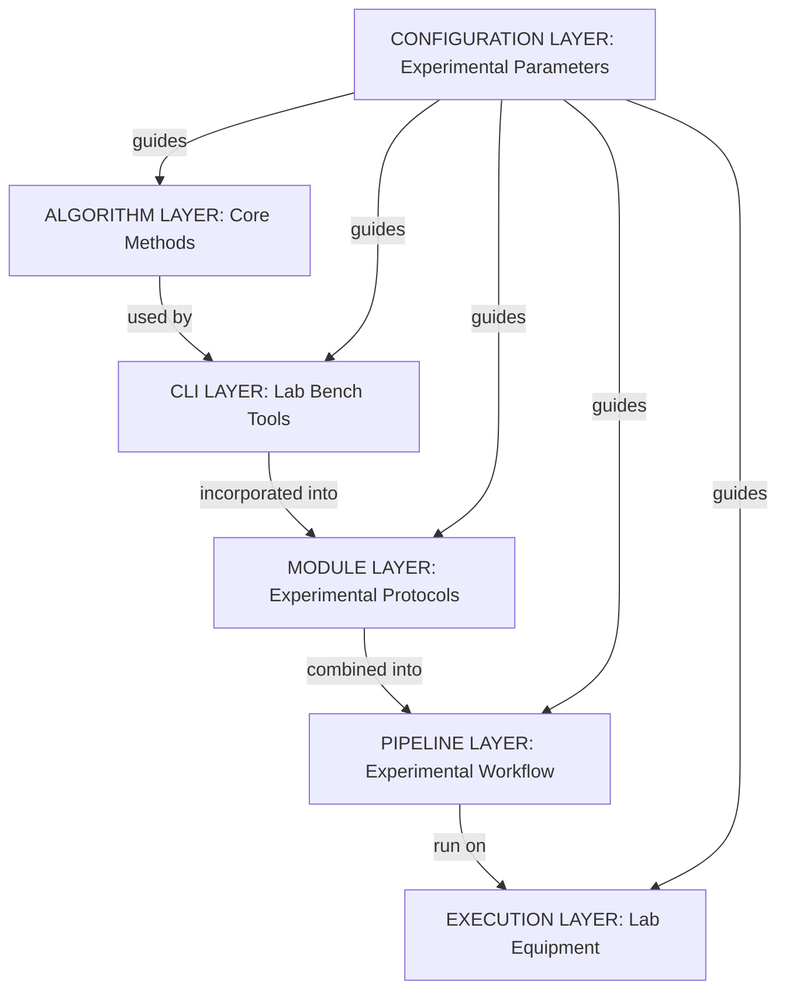

# StarryNight Architecture for Biologists

## Introduction

StarryNight is a scientific image processing framework designed specifically for high-throughput microscopy data. It tackles the complexity of processing thousands of images while maintaining reproducibility, flexibility, and scalability.

This document explains the StarryNight framework in terms accessible to biologists who may not have a software engineering background, focusing on why this complex architecture is necessary for modern microscopy workflows.

## Why Architecture Matters for Scientific Analysis

High-throughput microscopy requires a framework that can handle:

1. **Scale** - Processing thousands of images across multiple experiments
2. **Complexity** - Managing multi-step analysis workflows with complex dependencies
3. **Flexibility** - Adapting to different experimental designs and imaging modalities
4. **Reproducibility** - Ensuring consistent results across computing environments

Rather than building a single large application, StarryNight takes an architectural approach that emphasizes modularity and separation of concerns. This design philosophy focuses on breaking down the system into well-defined components with clear boundaries and responsibilities.

## Framework Components

StarryNight is organized as a framework with four main components:

1. **StarryNight Core** - The foundation containing algorithms and abstractions for image processing
2. **PipeCraft** - Framework for composing and executing computational workflows
3. **Conductor** - Service for managing and monitoring processing jobs
4. **Canvas** - User-friendly interface for configuring and running experiments

As a biologist, you'll typically interact with the Canvas web interface, which provides an accessible way to configure experiments and visualize results. Behind the scenes, these components work together to process your data efficiently and reproducibly.

## Architectural Layers

StarryNight organizes functionality into layers with distinct responsibilities:

**Core Processing Flow**:
**Algorithm Layer** → **CLI Layer** → **Module Layer** → **Pipeline Layer** → **Execution Layer**

**Configuration Layer** (cross-cutting concern providing parameters to all layers)

The core processing layers form a sequence where each builds upon the previous, while the Configuration Layer acts as a bridge between user inputs and the detailed settings needed throughout the system:

1. **Algorithm Layer** - Pure Python functions implementing image processing operations
2. **CLI Layer** - Command-line interfaces that make algorithms accessible without programming
3. **Module Layer** - Standardized components with formal specifications and compute graphs
4. **Pipeline Layer** - Composed workflows that connect modules into complete processing pipelines
5. **Execution Layer** - Backend layer that compiles and executes the defined workflows
6. **Configuration Layer** - Parameter inference and experiment configuration system

This layered approach allows each component to focus on a specific responsibility, making the overall system more maintainable and adaptable.

## Key Components Explained

### Algorithm Layer

At the foundation is the **Algorithm Layer** - collections of Python functions organized into algorithm sets that perform specific image processing tasks. Each algorithm set typically contains specialized functions for:

- Identifying and organizing images for processing (load data generation)
- Creating appropriate CellProfiler pipelines with the correct parameters
- Executing these pipelines on batches of images

A key characteristic is that these functions are pure Python with no dependencies on other StarryNight components. This independence makes them individually testable and allows them to be used directly when needed.

### Module Layer

The **Module Layer** provides standardized components that create an abstraction above the algorithms. Each module:

- Defines a formal specification of inputs, outputs, and parameters
- Contains a compute graph that defines processing steps and their organization
- Provides automatic configuration methods to set up processing for experiments
- Separates definition from execution (modules define what should be done but don't perform computation)

This abstraction is powerful because it separates the specification of operations (inputs/outputs/parameters) from the structure of computation (the processing graph). This separation allows the same module to be configured differently for various experiments and executed on different computing systems.

### Pipeline Layer

The **Pipeline Layer** combines multiple modules into complete workflows. It defines:

- Sequential relationships (which steps must run before others)
- Parallel operations (which steps can run simultaneously)
- Data flow between processing stages
- Dependencies between operations

The Pipeline Layer represents the complete processing workflow in an abstract form that is not tied to any specific execution environment. It is built using Pipecraft, a library specifically designed for creating composable pipeline graphs.

### Execution Layer

The **Execution Layer** is responsible for actually running the pipelines:

- Converting abstract pipelines into concrete execution steps (currently using Snakemake)
- Managing containerized execution (using technologies like Docker or Singularity to ensure reproducible environments)
- Coordinating parallel processing across available computing resources
- Handling dependencies between processing steps
- Managing file transfers and storage

The current implementation uses Snakemake as a workflow engine, generating Snakemake files from the pipeline definitions. This approach allows the same pipeline to be executed on different computing infrastructures without changes to the pipeline definition.

### Configuration Layer

The **Configuration Layer** provides a systematic way to handle experimental parameters:

- Inferring parameters automatically from input data where possible
- Combining user-specified parameters with appropriate defaults
- Maintaining parameter consistency across different processing steps
- Supporting different experimental designs through specific configuration classes

This approach allows complex processing pipelines to be configured with minimal manual parameter specification, reducing the potential for errors and inconsistencies in experimental setup.

## From Simple Configuration to Complex Workflow

StarryNight transforms simple experiment configurations into sophisticated processing workflows:

1. **User Configuration** - Specify basic parameters (channels, experimental design)
2. **Automated Setup** - The system generates and configures all necessary processing components
3. **Workflow Assembly** - Components are connected into a complete processing pipeline
4. **Execution** - The workflow is executed in a parallelized, containerized environment

This transformation - from a simple configuration to a complex, optimized workflow - is the key to making high-throughput analysis accessible while maintaining the necessary sophistication to handle large-scale data.

## Ways of Using StarryNight

StarryNight offers multiple ways to interact with the system, depending on your technical comfort level:

### Different User Interfaces

1. **Web Interface (Canvas)** - User-friendly graphical interface for configuring and monitoring experiments
2. **Jupyter Notebooks** - Interactive Python environment for more custom workflows
3. **Command Line** - Direct access to algorithms for advanced users or scripting

Most biologists will prefer the Canvas web interface, while computational biologists might use notebooks for more flexibility.

### Reproducibility Through Containers

A key feature of StarryNight is its use of containerized execution:

- Each processing step runs in an isolated container environment
- Containers package all required software (CellProfiler, analysis libraries)
- The same container runs identically on any compatible system
- This approach ensures your results are reproducible across different computers

You can think of containers as standardized reaction vessels that ensure consistent conditions for every experimental step, regardless of where they're run.

## Extending and Customizing StarryNight

StarryNight is designed to grow with your research needs:

### Adding New Capabilities

1. **New Image Processing Techniques** - Incorporate additional algorithms
2. **New Experimental Designs** - Configure for different microscopy approaches
3. **Custom Workflows** - Create specialized processing pipelines for your research
4. **Integration with Other Systems** - Connect to your lab's existing data infrastructure

This extensibility means the system can evolve as your research methods change, without requiring a complete redesign.

## Glossary of Terms

For reference, here are explanations of key terms used in StarryNight:

- **Algorithm Layer**: Core foundation of pure Python functions organized into algorithm sets
- **CLI Layer**: Command-line interfaces that make algorithms directly accessible
- **Module Layer**: Standardized components that package algorithms with consistent interfaces
- **Pipeline Layer**: Connected sequence of modules that forms a complete workflow
- **Execution Layer**: Backend system that runs pipelines on computing infrastructure
- **Configuration Layer**: Parameter management and inference system that simplifies setup
- **Compute Graph**: Structured representation of processing steps and their relationships
- **Container**: Isolated computing environment that packages all necessary software and dependencies, ensuring consistent and reproducible execution regardless of the computing system (similar to how a tissue culture hood provides a controlled environment for biological experiments)
- **CellProfiler**: Open-source cell image analysis software used by StarryNight
- **Snakemake**: Workflow management system that coordinates execution

## The Power of Separation

The core architectural principle of StarryNight is separation of concerns - breaking the system into distinct parts that each handle a specific aspect of the problem. At a high level, StarryNight separates:

1. **What is computed** (Algorithm Layer) - The actual image processing operations
2. **How it's configured** (Configuration Layer) - The parameters and settings for experiments
3. **How it's defined** (Module Layer) - The formal description of inputs, outputs, and specifications
4. **How it's structured** (Pipeline Layer) - The organization of processing steps and their dependencies
5. **How it's executed** (Execution Layer) - The actual execution in containerized environments

### A Laboratory Research Analogy

To understand why this architecture matters, think of StarryNight like a modern biological research laboratory:

This laboratory analogy directly maps to how StarryNight works:

- The **Algorithm Layer** is like your **fundamental laboratory methods** - the basic techniques a researcher knows (cell culture, PCR, microscopy techniques). These methods are well-defined, tested, and reusable across many experiments.

- The **CLI Layer** is like your **lab bench tools** - specialized instruments and reagent kits that implement the fundamental methods in a directly usable form. These tools provide immediate access to perform individual techniques but don't organize them into complete experimental plans.

- The **Module Layer** is like your **standard protocols** - complete experimental procedures (e.g., "Immunofluorescence Staining Protocol") that incorporate specific lab bench tools and organize them into structured procedures. Protocols specify which tools to use, in what order, with what parameters, but don't perform the actual work.

- The **Pipeline Layer** is your **complete experimental workflow** - the full sequence of protocols needed for a research project, showing how the outputs of one protocol feed into another (tissue preparation → staining → imaging → analysis).

- The **Execution Layer** is your **automated lab equipment and personnel** that actually perform the experiments according to the protocols and workflow plan.

- The **Configuration Layer** is your **experimental parameters and conditions** - cell types, antibody dilutions, incubation times, and other variables that customize experiments for specific research questions. These parameters influence everything from the basic methods to the tools, protocols, workflows, and execution.

This separation is powerful because it allows specialization: protocol designers can create standardized procedures without running the actual experiments, workflow planners can organize complete research projects without detailing each technical step, and lab managers can optimize execution without changing the scientific approach.

This laboratory-like architecture in StarryNight creates powerful advantages:

1. **Scalability** - Just as a laboratory protocol can be run once or thousands of times, StarryNight workflows can process one image or thousands
2. **Reproducibility** - Like standardized lab protocols ensure consistent results, StarryNight ensures identical processing across different computing environments
3. **Simplified Setup** - Rather than specifying every technical detail, researchers can define high-level parameters (like experimental conditions) and let the system handle implementation details
4. **Automation** - Complex experimental workflows are automatically translated into detailed execution steps, similar to how automated lab equipment follows protocols without manual intervention

Instead of writing thousands of lines of custom code for each experiment, scientists can define what they want at a high level (just as they would specify experimental conditions), and the system handles the complexity of implementing and scaling the analysis. The result is a framework that can grow with the increasing demands of modern microscopy while keeping the user experience intuitive for biologists.
