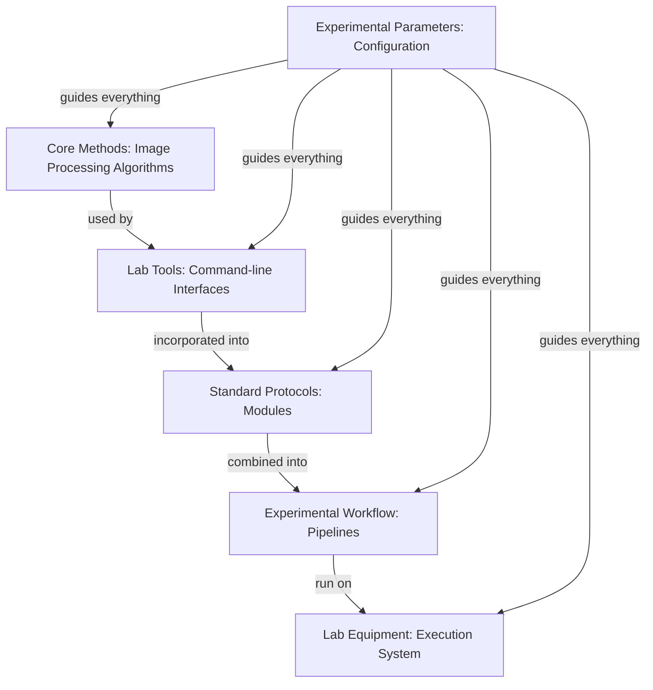

# StarryNight Architecture for Biologists

## Why This Architecture Was Developed

StarryNight's architecture was designed to address the challenges faced by biologists working with high-throughput microscopy data, and optical pooled screening in specific. This document explains how the system's design supports image analysis workflow requirements.

## Core Challenges in High-Throughput Microscopy

Analyzing images from optical pooled screening experiments present several key challenges:

* **Complex Multistage Processing** - Requiring multiple image processing steps that must be executed in specific sequences
* **Parallel Image Tracks** - Processing different types of images with varied requirements
* **Critical Quality Assessment** - Needing inspection points between processing stages
* **Diverse User Expertise Levels** - Supporting both computational experts and biologists with varying technical backgrounds

## Workflow in StarryNight

StarryNight's architecture enables a research workflow that addresses the requirements of analyzing optical pooled screening data:

1. **Experiment Configuration** - Specifying the parameters relevant to the research:
    - Experimental design settings
    - Image acquisition parameters
    - Processing configuration options
2. **Parameter Transformation** - Converting high-level parameters into complete processing pipelines with appropriate settings for each stage
3. **Critical Checkpoints** - Allowing review and intervention:
    - Inspection of intermediate results between processing stages
    - Quality validation through integrated visualization tools
    - Parameter adjustments based on observed results
4. **Parallel Processing** - Handling multiple analysis paths efficiently:
    - Running independent processing tracks in parallel when possible
    - Integrating results where workflows converge
5. **Scaling** - Processing across different computing environments with consistent results whether running locally or in the cloud

This workflow combines automation for efficiency with critical intervention points where biological expertise is essential, supporting various microscopy research applications.

## A Laboratory Research Analogy

To understand how StarryNight works, think of it like a modern research laboratory:

Just as biological laboratories separate fundamental techniques, protocols, workflows, and execution, StarryNight organizes processing into layers:

* **Algorithms** are like **fundamental laboratory methods** - basic image processing techniques
* **CLI Layer** is like **laboratory tools** - instruments that implement the fundamental methods
* **Modules** are like **standard protocols** - organized procedures for specific tasks
* **Pipelines** are like **complete experimental workflows** - sequences of protocols that work together
* **Execution** is like **automated lab equipment** - running the workflows reliably
* **Configuration** is like **experimental parameters** - customizing operations for specific research needs

## How StarryNight's Architecture Meets Research Requirements

The layered architecture directly addresses high-priority microscopy research requirements:

### 1. Complex Image Processing Workflows

**Requirement**: Support for flexible, multistage image processing workflows with various analytical methods

**Architectural Solution**: The Pipeline Layer combines specialized modules into complete workflows, while the Execution Layer handles the complex interdependencies between steps. This allows you to define complete end-to-end processing pipelines while maintaining checkpoints for quality control, regardless of which specific image processing techniques you need to use.

### 2. Parallel Processing Capabilities

**Requirement**: Process multiple image analysis tracks simultaneously with different parameters

**Architectural Solution**: The Pipeline Layer can define parallel execution paths with different configurations, while the Execution Layer optimizes resource allocation for efficient processing. This lets you run independent analysis tracks simultaneously and integrate results where needed.

### 3. Manual Intervention Points

**Requirement**: Ability to inspect results and modify parameters between processing stages

**Architectural Solution**: The modular approach with clearly defined layer boundaries creates natural inspection points where you can evaluate results before proceeding. The Configuration Layer can be updated at these checkpoints to adjust parameters for subsequent stages.

### 4. Consistent Data Organization

**Requirement**: Standardized data structures that maintain compatibility with existing pipelines

**Architectural Solution**: The Module Layer defines consistent input/output specifications that enforce standardized data organization, while the Configuration Layer manages path structures and naming conventions for both inputs and outputs.

### 5. Multiple User Interfaces

**Requirement**: Support for both computational experts and biologists with varying technical backgrounds

**Architectural Solution**: The layered design enables multiple interaction points - from direct Algorithm Layer access for computational experts to simplified Canvas interfaces that abstract technical details for biologists while maintaining full functionality.

## Practical Applications of the Architecture

The layered architecture translates to practical benefits for microscopy research:

### Interface Options

* **Canvas Web Interface**: A graphical interface with both simplified views for non-experts and advanced options for experienced users
* **Jupyter Notebooks**: Interactive inspection environments for result visualization and quality control
* **Command-Line Interface**: Direct access to algorithms for computational experts and automation scripts

### Processing Control

* **End-to-End Automation**: Complete workflows from raw images to results
* **Checkpoint Intervention**: Critical points for quality assessment and parameter adjustment
* **Restart Capability**: Processing resumption from checkpoints after adjustments

### Data Organization

* **Standardized Structure**: Consistent organization patterns for input and output data
* **Metadata Extraction**: Flexible path parsing for experimental information

## Key Technical Terms

Important concepts when discussing StarryNight's architecture:

* **Container**: Isolated environment ensuring consistent software execution (analogous to a tissue culture hood for computations)
* **Algorithm Set**: Collection of related image processing functions (similar to a set of related lab techniques)
* **Compute Graph**: Definition of processing steps and their relationships (comparable to a detailed protocol flowchart)
* **CellProfiler**: Open-source cell image analysis software integrated with StarryNight
* **Module**: Standardized component that defines a specific image processing task

## Conclusion: Architecture for Optical Pooled Screening

StarryNight's architecture addresses the requirements of optical pooled screening through:

1. **Flexible, multistage workflows** adaptable to various imaging approaches
2. **Critical quality control points** where biological expertise can be applied
3. **Parameter configuration interfaces** matched to different technical expertise levels
4. **Scalable processing** across computing environments without workflow changes

This architectural approach addresses fundamental challenges in high-throughput microscopy research. By separating the system into well-defined layers, StarryNight provides both automation for efficiency and control points for quality assessment, creating a flexible framework that can adapt to evolving research methodologies.
