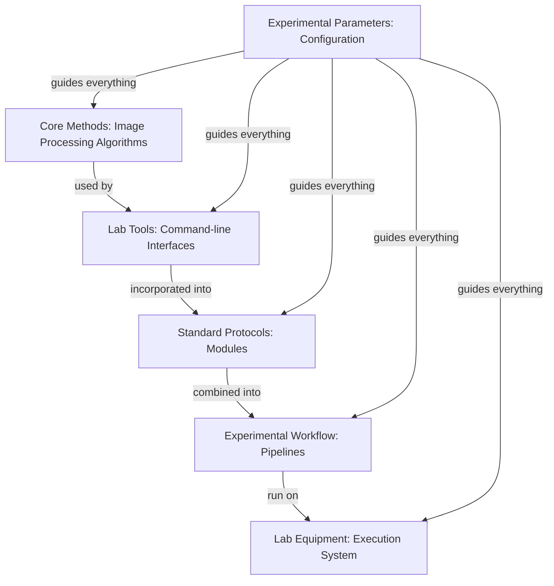

# StarryNight Architecture for Biologists

## Why This Matters to You

As a biologist working with microscopy data, your focus is on the science - not the computational details. StarryNight handles the complexities of image processing so you can concentrate on your research questions. This document explains the system architecture in biological terms, highlighting why it matters for your work.

## The Core Challenge: From Images to Insights

High-throughput microscopy generates thousands of images that need consistent processing while maintaining:

* **Reproducibility** - Ensuring someone else can get the same results from your data
* **Scalability** - Processing one image or thousands with the same approach
* **Adaptability** - Modifying analysis parameters without rebuilding everything

## Your Research Workflow in StarryNight

When you use StarryNight, your typical workflow looks like this:

1. **Plan your experiment** - Decide on channels, markers, and analysis goals
2. **Configure basic parameters** - Tell StarryNight what you're looking for
3. **StarryNight transforms these parameters** into complete processing instructions
4. **StarryNight executes the analysis** consistently and reproducibly
5. **You analyze results** rather than debugging processing steps

The system handles the complexity between your simple instructions and the sophisticated processing required - similar to how automated lab equipment executes complex protocols from simple inputs.

## A Laboratory Research Analogy

To understand how StarryNight works, think of it like a modern research laboratory:

Just as your laboratory separates fundamental techniques, protocols, workflows, and execution, StarryNight organizes processing into layers:

* **Algorithms** are like your **fundamental laboratory methods** - basic image processing techniques
* **Modules** are like your **standard protocols** - organized procedures for specific tasks
* **Pipelines** are your **complete experimental workflows** - sequences of protocols that work together
* **Execution** is your **automated lab equipment** - running the workflows reliably
* **Configuration** is your **experimental parameters** - customizing everything for your specific research

## Why This Layered Approach Benefits Your Research

This architecture directly addresses key challenges in microscopy research:

### 1. Reproducibility

**The Challenge**: Ensuring consistent analysis across different labs and systems

**StarryNight's Solution**: Containerized execution provides standardized environments (like tissue culture hoods ensure consistent conditions) so analysis runs identically everywhere.

### 2. Parameter Management

**The Challenge**: Keeping track of all settings for complex image processing

**StarryNight's Solution**: The configuration system infers many parameters automatically and maintains consistency across all processing steps.

### 3. Scaling Up

**The Challenge**: Moving from test images to full experiments with thousands of images

**StarryNight's Solution**: The same workflow definitions automatically scale to handle varying dataset sizes.

### 4. Adapting to Different Experiments

**The Challenge**: Modifying analysis for different experimental designs

**StarryNight's Solution**: Change high-level parameters without rebuilding entire workflows - the system regenerates the technical details.

## Using StarryNight in Practice

The layered architecture translates to practical benefits in your daily work:

* **Canvas Web Interface**: Configure experiments through a user-friendly interface
* **Automated Setup**: The system generates all necessary processing steps
* **Consistent Analysis**: Your data is processed with exactly the same steps every time
* **Focus on Results**: Spend time interpreting data, not debugging processing

## Key Terms for Understanding Discussions

When discussing StarryNight with computational colleagues, these terms may arise:

* **Container**: Isolated environment that ensures consistent software execution (like a tissue culture hood for computations)
* **Algorithm Set**: Collection of related image processing functions (like a set of related lab techniques)
* **Compute Graph**: Definition of processing steps and their relationships (like a detailed protocol flowchart)
* **CellProfiler**: Open-source cell image analysis software integrated with StarryNight
* **Module**: Standardized component that defines a specific image processing task

## The Bottom Line

StarryNight's architecture enables you to:

1. **Configure** your experiment with minimal parameters
2. **Let the system** generate the complex processing pipelines
3. **Run analysis** consistently across any computing environment
4. **Focus on interpreting results** rather than managing processing

This approach bridges the gap between sophisticated image processing and the practical needs of biological research, allowing you to concentrate on science rather than computation.
