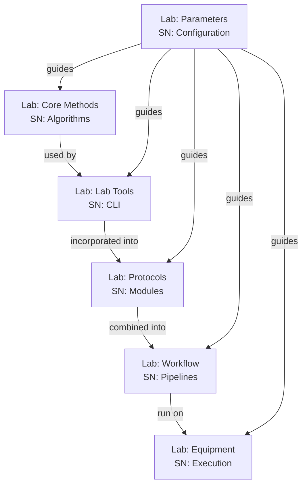

# StarryNight Architecture for Biologists

## Why This Architecture Was Developed

StarryNight's architecture was designed to address the challenges faced by biologists working with high-throughput microscopy data, and optical pooled screening in particular. This document explains how the system's design supports image analysis workflow requirements.

## Core Challenges in High-Throughput Microscopy

Analyzing images from optical pooled screening experiments present several key challenges:

* **Complex Multistage Processing** - Requiring multiple image processing steps that must be executed in specific sequences, often using multiple software packages
* **Parallel Image Tracks** - Processing different types of images with varied requirements
* **Critical Quality Assessment** - Needing inspection points between processing stages
* **Diverse User Expertise Levels** - Supporting both computational experts and biologists with varying technical backgrounds

## Workflow in StarryNight

StarryNight's architecture enables a research workflow that addresses the requirements of analyzing optical pooled screening data:

1. **Experiment Configuration** - Specifying the parameters relevant to the research:
    - Experimental design settings
    - Image acquisition parameters
    - Processing configuration options
2. **Parameter Transformation** - Converting high-level parameters into complete processing pipelines with appropriate settings for each stage
3. **Critical Checkpoints** - Allowing review and intervention:
    - Inspection of intermediate results between processing stages
    - Quality validation through integrated visualization tools
    - Parameter adjustments based on observed results
4. **Parallel Processing** - Handling multiple analysis paths efficiently:
    - Running independent processing tracks in parallel when possible
    - Integrating results where workflows converge
5. **Scaling** - Processing across different computing environments with consistent results whether running locally or in the cloud

This workflow combines automation for efficiency with critical intervention points where biological expertise is essential, supporting various microscopy research applications.

## A Laboratory Research Analogy

To understand how StarryNight works, think of it like a modern research laboratory:

The diagram shows how StarryNight's (SN) layers are analogous to a biological laboratory (Lab). Just as labs separate fundamental techniques from protocols, workflows, and execution, StarryNight organizes image processing into similar logical layers.

## Practical Applications of the Architecture

The layered architecture translates to practical benefits for microscopy research:

### Interface Options

* **Canvas Web Interface**: A point-and-click user interface with both simplified views for non-experts and advanced options for experienced users
* **Jupyter Notebooks**: Interactive inspection environments for result visualization and quality control
* **Command-Line Interface**: Direct access to algorithms for computational experts and automation scripts

### Processing Control

* **End-to-End Automation**: Complete workflows from raw images to results
* **Checkpoint Intervention**: Critical points for quality assessment and parameter adjustment
* **Restart Capability**: Processing resumption from checkpoints after adjustments

### Data Organization

* **Standardized Structure**: Consistent organization patterns for input and output data
* **Metadata Extraction**: Flexible path parsing for experimental information

## Conclusion: Architecture for Optical Pooled Screening

StarryNight's architecture addresses the requirements of optical pooled screening through:

1. **Flexible, multistage workflows** adaptable to various imaging approaches
2. **Critical quality control points** where biological expertise can be applied
3. **Parameter configuration interfaces** matched to different technical expertise levels
4. **Scalable processing** across computing environments without workflow changes

This architectural approach addresses fundamental challenges in high-throughput microscopy research. By separating the system into well-defined layers, StarryNight provides both automation for efficiency and control points for quality assessment, creating a flexible framework that can adapt to evolving research methodologies.
