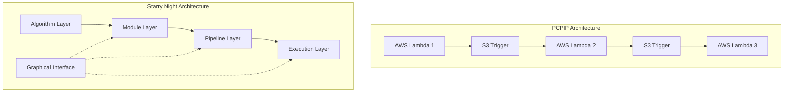
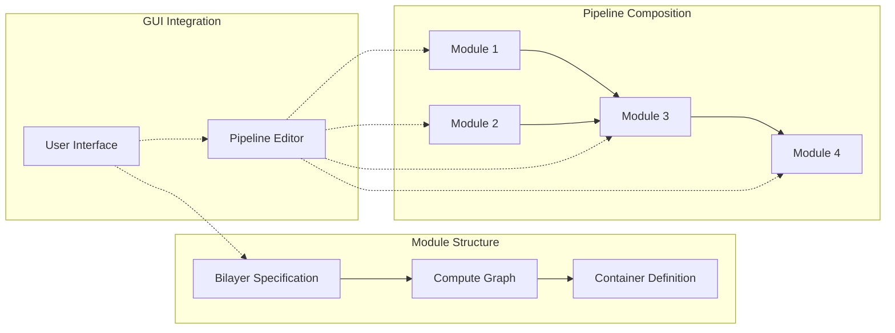
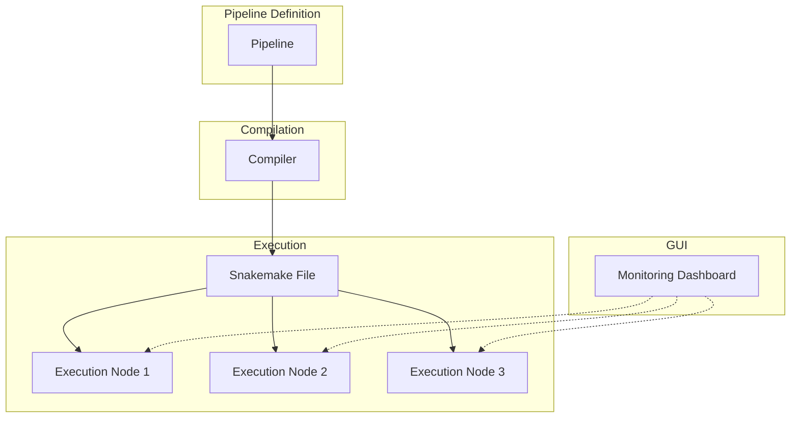
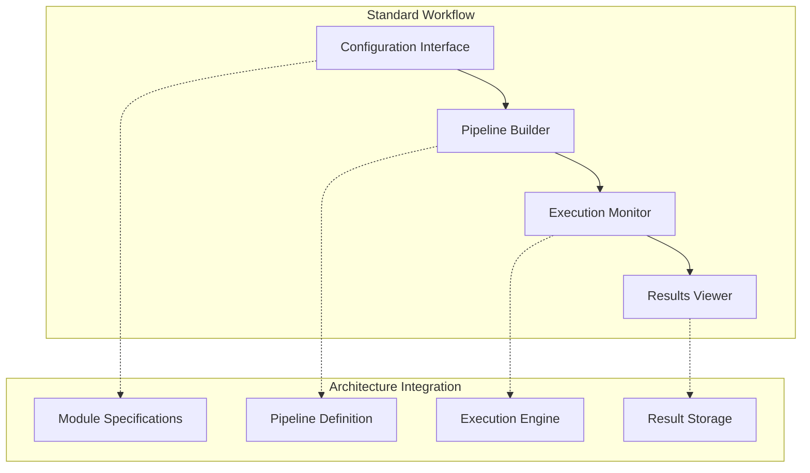

# Starry Night Architecture for Biologists

## Evolution from PCPIP

The architecture of Starry Night represents a deliberate evolution from the previous PCPIP system. While PCPIP effectively orchestrated CellProfiler pipelines through AWS Lambda functions, it faced inherent limitations in scalability and adaptability. Each Lambda function was tightly coupled to specific AWS services, making the system difficult to maintain and extend.

Starry Night addresses these challenges through a modular architecture that separates concerns between scientific operations, execution environments, and workflow orchestration. This separation maintains the same CellProfiler pipeline logic while freeing workflows from cloud-specific dependencies.

A critical benefit of this architecture is how it enables intuitive graphical interfaces. By formalizing the relationships between components, the system naturally supports GUI-driven workflow creation and monitoring without additional development effort.

## Core Components and Their Purpose

### Algorithm Layer

**What**: Functions that execute CellProfiler pipelines and other image processing operations.

**Why Needed**: Scientific operations must be separated from execution details to enable flexibility. This separation allows the same algorithms to be used in different contexts.

**Benefit**: Algorithms function identically regardless of execution environment, ensuring consistent scientific results.

**Capability**: Algorithms can be run directly through command-line interfaces or orchestrated through higher-level components.

**GUI Integration**: Clean functional boundaries with well-defined inputs and outputs enable automatic UI generation for algorithm parameters.

### Module Abstraction

**What**: Standardized wrappers that encapsulate algorithms with formal input/output specifications.

**Why Needed**: Consistent interfaces between processing steps are essential for reliable pipeline construction. Modules standardize how components interact.

**Benefit**: Pipeline components become interchangeable and reusable across different workflows.

**Capability**: Explicit definition of inputs and outputs prevents unintended dependencies between processing steps.

**GUI Integration**: Standardized specifications enable automatic form generation for configuration, with built-in validation of parameters.

### Pipeline Composition

**What**: Framework for connecting modules into complete workflows with explicit dependencies.

**Why Needed**: Formal representation of execution sequences allows workflows to be manipulated programmatically.

**Benefit**: The same workflow definition can be executed in different environments without modification.

**Capability**: Supports both parallel and sequential execution patterns required for complex image analysis.

**GUI Integration**: Formal workflow representation enables visual pipeline building through drag-and-drop interfaces.

## Execution Mechanism and Value

### Container-Based Approach

**What**: Each pipeline step runs in its own defined environment with all dependencies included.

**Why Needed**: Reproducibility requires eliminating "works on my machine" problems by packaging complete runtime environments.

**Benefit**: Execution produces consistent results regardless of the underlying infrastructure.

**Capability**: The same containers can run locally, on computing clusters, or in cloud environments.

**GUI Integration**: Containerized processes can be tracked and visualized in real-time through monitoring interfaces.

### Workflow Generation

**What**: Automatic creation of execution plans (e.g., Snakemake files) from module definitions.

**Why Needed**: Manual creation of complex workflow files is error-prone and difficult to maintain.

**Benefit**: Changes to workflow topology don't require rewriting execution scripts.

**Capability**: The system handles dependencies and resource allocation automatically based on the pipeline definition.

**GUI Integration**: Complex workflow files can be generated from visual pipeline builders without requiring manual coding.

### Multi-Level Parallelism

**What**: Support for parallelism both between independent pipeline steps and within individual operations.

**Why Needed**: Computational efficiency requires maximizing resource utilization through appropriate parallelism.

**Benefit**: The same parallelism patterns from PCPIP are supported but with more flexibility in resource allocation.

**Capability**: Execution can adapt to available computational resources in different environments.

**GUI Integration**: Parallel execution can be monitored through intuitive visual dashboards showing progress across multiple tasks.

## Practical Advantages

### Infrastructure Independence

Running analysis where it makes most sense - locally for development, on clusters for production, or in the cloud for scaling - without changing the workflow definition.

### Simplified Maintenance

Changing individual components without rebuilding everything. Each module can be updated independently as long as its interface remains consistent.

### Enhanced Reproducibility

Ensuring the same execution environment regardless of platform through containerization and explicit dependency management.

### Future Adaptability

Adding new pipeline components without disrupting existing workflows. The modular architecture allows for incremental enhancements.

### Transparent Processing

Providing clear documentation of what happens at each step through explicit module specifications and execution logs.

### GUI-Driven Workflows

Enabling intuitive graphical workflow creation and monitoring through standardized interfaces that map directly to underlying components.

## Current Status

### Working Prototype

Core components have been implemented and demonstrated, including the algorithm layer, module abstraction, pipeline composition, and Snakemake-based execution.

### Direct Mapping

Current PCPIP pipeline steps map directly to modules in the new architecture, maintaining the same scientific operations while enabling new capabilities.

### Transition Approach

The system provides a clear pathway for moving from the current AWS-based implementation to the more flexible architecture, with compatibility for existing data formats and processing steps.

### GUI Implementation

A functional graphical interface for pipeline configuration and monitoring has been developed, demonstrating how the architecture naturally supports visual workflow management.
