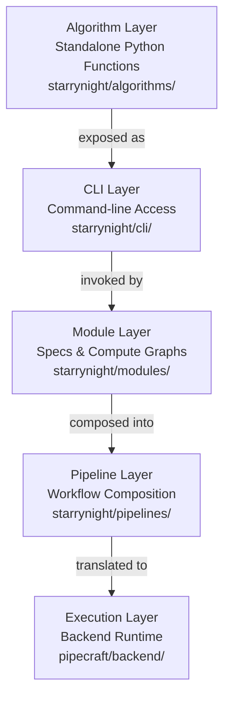

# StarryNight Architecture

!!! warning "Experimental - Not Reviewed"
    Content may be incomplete or inaccurate.

StarryNight is a layered framework for scientific image processing that transforms raw microscopy data into quantitative measurements. Its architecture separates concerns across six distinct layers, enabling scalable, reproducible analysis of Optical Pooled Screening experiments.

## System Overview

StarryNight processes terabytes of microscopy images through a pipeline that progresses from simple functions to complex workflows:

**Note**: The Configuration Layer (`starrynight/experiments/`) operates as a cross-cutting concern, providing experiment parameters and settings that influence behavior across all layers.

## Layer Summary

### Algorithm Layer (Foundation)

Standalone Python functions implementing core image processing logic. No dependencies on other StarryNight components. Organized into algorithm sets that handle specific pipeline stages.

**Key characteristics:**

- Complete independence from other layers
- Clear input/output contracts
- Support for both local and cloud storage via cloudpathlib

### CLI Layer (Direct Access)

Command-line interfaces wrapping algorithm functions. Uses Click to provide user-friendly access with parameter validation and path handling.

**Key characteristics:**

- Direct algorithm imports
- Consistent command structure
- Automatic path normalization

### Module Layer (Abstraction)

Standardized components combining specifications (via Bilayers) and compute graphs (via Pipecraft). Enables backend-agnostic execution and workflow composition.

**Key characteristics:**

- Dual nature: specs define "what", compute graphs define "how"
- Container-based execution
- Three-function pattern: LoadData → Pipeline → Execution

### Pipeline Layer (Composition)

Combines modules into complete workflows. Integrates with Pipecraft to create executable compute graphs with defined execution patterns.

**Key characteristics:**

- Sequential and parallel execution blocks
- Backend independence
- End-to-end workflow definition

### Execution Layer (Runtime)

Manages actual execution via backends like Snakemake. Handles resource allocation, dependency management, and parallel processing.

**Key characteristics:**

- Backend configuration
- Workflow translation
- Container orchestration

### Configuration Layer (Cross-cutting)

Provides experiment configuration and parameter inference. Unlike other layers, it operates orthogonally, influencing behavior across all layers.

**Key characteristics:**

- Parameter inference from data
- Experiment-specific settings
- Module configuration generation

## Key Design Principles

1. **Separation of Concerns**: Each layer has distinct responsibilities
2. **Backend Independence**: Define once, run anywhere
3. **Progressive Enhancement**: Each layer adds capabilities
4. **Explicit Over Implicit**: Clear contracts and dependencies
5. **Composability**: Components combine into larger workflows

## Common Patterns

### Three-Function Pattern (CellProfiler)

CellProfiler-based algorithm sets implement:

1. **LoadData Generation**: Create CSV files for image loading
2. **Pipeline Generation**: Generate .cppipe pipeline files
3. **Execution**: Run CellProfiler pipelines

Other algorithm types (indexing, inventory, quality control) follow different patterns suited to their purpose.

### Specification vs Implementation

- Specifications define interfaces and contracts
- Implementations provide concrete execution
- This separation enables multiple backends and inspection

### Container-Based Execution

All processing runs in containers for:

- Reproducibility across environments
- Dependency isolation
- Scalable cloud execution

## Usage Flow

A typical StarryNight workflow:

1. **Index Generation**: Scan and catalog available images
2. **Experiment Configuration**: Define experimental parameters
3. **Module Selection**: Choose appropriate processing modules
4. **Pipeline Composition**: Connect modules into workflows
5. **Execution**: Run pipelines on compute infrastructure
6. **Result Collection**: Gather and organize outputs

## Technology Stack

- **Core**: Python with type hints
- **CLI**: Click framework
- **Paths**: cloudpathlib for storage abstraction
- **Specs**: Bilayers for interface definition
- **Pipelines**: Pipecraft for compute graphs
- **Execution**: Snakemake for workflow orchestration
- **Containers**: Docker/Singularity for isolation

## Next Steps

- [Principles](00-1-principles.md) - Fundamental principles and patterns
- Layer Documentation - See individual layer files (01-algorithm.md through 06-configuration.md)
