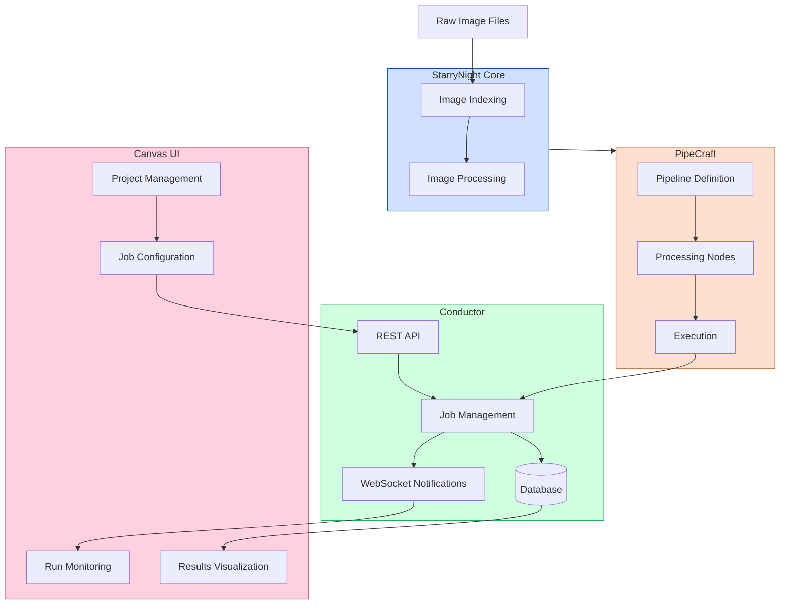

# Developer Guide

This guide provides information for developers who want to contribute to StarryNight.

!!! warning

    **This is a first draft of the document.**

    Several updates are pending

    Setup Steps

      - Remove Option 2 (manual setup) entirely.
      - Only include Option 1 (Nix) and clearly state that it is mandatory.

    Running Tests

    - Indicate that tests are not currently passing because of the refactor
    - Indicat that the tests are minimal

    Running Components Locally

    - Verify that the instructions accurately reflect what can be executed now.
    - For components like the Conductor Service and Canvas Frontend, note if their commands refer to features scheduled for a future release.

    Development Workflow

    - Consider dropping the Development Workflow section to reduce bloat, as it mainly outlines basic feature-branch practices.

    Coding Standards

    - Consider removing or relocating the Coding Standards section.
    - Optionally, add a brief note to follow existing standards and move detailed guidelines to a separate contributing document.

    Extending StarryNight

    - Ensure that instructions for extending StarryNight (e.g., creating algorithms, CLI commands, and module definitions) are accurate and reflect current capabilities.
    - For extending the Conductor and Canvas, clearly indicate if these features are fully implemented or are planned for future updates.

    Distributed Execution

    - Double-check that the distributed execution section (including AWS Batch support) is correct and up to date.


## System Architecture

StarryNight is a modular platform for high-throughput microscopy image processing with four main components. For an overview of each component and its purpose, please refer to the [over](../index.md#platform-overview).

The following diagram illustrates how these components interact:



### Key Design Principles

- **Modularity**: Each component has clear boundaries and interfaces
- **Extensibility**: The system can be extended with new algorithms and processing modules
- **Reproducibility**: Workflows are version-controlled and traceable
- **Scalability**: Processing can scale from local development to cloud execution

### Technical Implementations

From a developer perspective, each component has the following technical characteristics:

- **StarryNight Core**:
    - Python-based library with CellProfiler integration
    - Module system for algorithm registration and discovery
    - CLI interfaces for direct command-line usage
    - Standardized I/O interfaces for data flow between modules
- **PipeCraft**:
    - Python pipeline compiler and execution framework
    - Node-based directed acyclic graph (DAG) for workflow definition
    - Backend abstraction for executing on different compute environments
    - Containerization support for reproducible execution
- **Conductor**:
    - FastAPI-based REST service
    - SQLAlchemy ORM for database interactions
    - Async WebSocket implementation for real-time notifications
    - JWT-based authentication and role-based access control
- **Canvas**:
    - React-based frontend with Next.js framework
    - Zustand for state management
    - SWR for data fetching and caching
    - WebSocket integration for real-time updates

## Repository Structure

The StarryNight repository is organized as a monorepo with four main packages:

```
starrynight/
├── canvas/              # Frontend UI (Next.js/React)
├── conductor/           # Job orchestration service
├── pipecraft/           # Pipeline definition framework
├── starrynight/         # Core image processing algorithms
├── docs/                # Documentation
├── nix/                 # Nix configuration
└── workspace/           # Development workspace
```

## Development Environment Setup

### Prerequisites

- Git
- Python 3.10+
- Node.js 18+ (for Canvas frontend)
- Nix package manager (recommended)
- Docker (for containerized development)
- AWS CLI (for cloud integrations)

### Setup Steps

#### Option 1: Using Nix (Recommended)

```sh
# Clone the repository
git clone https://github.com/broadinstitute/starrynight.git
cd starrynight

# Set up the Nix environment
nix develop --extra-experimental-features nix-command --extra-experimental-features flakes .

# Synchronize Python dependencies
uv sync
```

#### Option 2: Manual Setup

```sh
# Clone the repository
git clone https://github.com/broadinstitute/starrynight.git
cd starrynight

# Create and activate a Python virtual environment
python -m venv venv
source venv/bin/activate  # On Windows: venv\Scripts\activate

# Install Python packages in development mode
pip install -e ".[dev]"
pip install -e starrynight/
pip install -e pipecraft/
pip install -e conductor/

# Set up the Canvas frontend
cd canvas
npm install
```

## Core Components and Design Patterns

### StarryNight Core

The foundation of the platform providing specialized algorithms for microscopy image analysis:

- **CLI Tools**: Command-line interfaces for each algorithm
- **Algorithms**: Image processing algorithms for microscopy data
- **Modules System**: Standardized module structure for algorithm implementation
- **Parsers**: File path parsing and metadata extraction
- **Utilities**: Common functions for file handling, data transformation, etc.

#### Data Flow Architecture

Data flows through the system following a standard pattern:

1. **Raw Data → Inventory**: Create catalog of all image files
2. **Inventory → Index**: Parse inventory to create structured index with metadata
3. **Index → Processing**: Run specific algorithms on indexed data
4. **Processing → Results**: Store and manage processing results

### PipeCraft

PipeCraft is the pipeline compiler, featuring:

- **Pipeline Definition**: Python API for defining computational workflows
- **Node System**: Individual processing steps as configurable nodes
- **Backend Abstraction**: Support for local, Docker, and AWS Batch execution
- **Template System**: Pre-defined templates for common backends

#### Workflow Design Patterns

PipeCraft implements:

- **Strategy Pattern**: Different execution strategies for different environments
- **Builder Pattern**: Constructing complex pipelines from simple building blocks
- **Composite Pattern**: Nested execution graphs for complex workflows

```python
# Pipeline construction example
from pipecraft.pipeline import Parallel, PyFunction, Seq
pipeline = Seq(
        [
            PyFunction("A", ["in path"], ["out path"]),
            Seq(
                [
                    PyFunction("B", ["in path"], ["out path"]),
                    PyFunction("C", ["in path"], ["out path"]),
                    Parallel(
                        [
                            Parallel(
                                [
                                    PyFunction("H", ["in path"], ["out path"]),
                                ]
                            ),
                            PyFunction("F", ["in path"], ["out path"]),
                            PyFunction("G", ["in path"], ["out path"]),
                        ]
                    ),
                ]
            ),
            PyFunction("D", ["in path"], ["out path"]),
        ]
    )
```

### Conductor

Conductor manages the execution environment:

- **REST API**: API for job management and monitoring
- **Database**: Storage for project configurations and job results
- **Job Management**: Scheduling, execution, and monitoring of jobs
- **WebSockets**: Real-time updates on job status

#### Service Architecture

Conductor implements:

- **Repository Pattern**: Data access abstraction for database operations
- **Service Layer Pattern**: Business logic encapsulation

### Canvas UI

The web-based user interface:

- **React Components**: Modular UI components
- **State Management**: Zustand for global state
- **API Integration**: SWR for data fetching
- **Responsive Design**: Mobile-friendly interfaces

#### Frontend Architecture

Canvas implements:

- **Atomic Design**: Component hierarchy from atoms to templates
- **Container-Presenter Pattern**: Separation of data and presentation
- **Hooks Pattern**: Reusable behavior implementations

## Running Tests

### Python Tests

```sh
# Run all tests
pytest

# Run tests for a specific package
pytest starrynight/tests/
pytest pipecraft/tests/
pytest conductor/tests/

# Run a specific test
pytest starrynight/tests/modules/test_gen_index.py::test_function_name
```

### Frontend Tests

```sh
cd canvas
npm run test
```

## Running Components Locally

### StarryNight Core

```sh
# Run StarryNight CLI directly
starrynight --help
```

### Conductor Service

```sh
# Start Conductor API service
cd conductor
fastapi dev ./src/conductor/main.py
```

### Canvas Frontend

```sh
cd canvas
npm run dev
# Access the UI at http://localhost:3000
```

## Development Workflow

1. **Create a feature branch**:
   ```sh
   git checkout -b feature/your-feature-name
   ```

2. **Make changes**: Implement your feature or fix

3. **Run tests**: Ensure functionality works as expected
   ```sh
   pytest
   ruff check .
   ```

4. **Commit changes**: Follow the project's commit conventions
   ```sh
   git add .
   git commit -m "feat: add new feature description"
   ```

5. **Push changes**: Share your work
   ```sh
   git push -u origin feature/your-feature-name
   ```

6. **Create a pull request**: Submit your changes for review

## Coding Standards

### Python

- **Style**: Follow PEP 8 with a line length of 88 characters
- **Formatting**: Use ruff for code formatting
- **Type Hints**: Use type annotations for all function parameters and returns
- **Docstrings**: Use NumPy style docstrings
- **Imports**: Group imports (standard library, third-party, local)
- **Naming**: Use snake_case for variables/functions, PascalCase for classes

### TypeScript (Canvas)

- **Style**: Follow the project's TypeScript/React conventions
- **Formatting**: Use ESLint and Prettier
- **Types**: Define interfaces/types for all components and functions
- **Naming**: Use camelCase for variables/functions, PascalCase for components/interfaces

## Extending StarryNight

### Adding a New Module

To add a new processing module:

1. Create a new algorithm implementation in `starrynight/algorithms/`
2. Add CLI commands in `starrynight/cli/`
3. Implement module definition files in `starrynight/modules/`
4. Add tests for all components
5. Update documentation

Here's an example of creating a new module:

#### 1. Create the Algorithm

```python
# starrynight/algorithms/new_algorithm.py
import numpy as np
from typing import Dict, List, Optional

def process_image(image: np.ndarray, params: Dict) -> np.ndarray:
    """Process an image with the new algorithm.

    Parameters
    ----------
    image : np.ndarray
        Input image
    params : Dict
        Processing parameters

    Returns
    -------
    np.ndarray
        Processed image
    """
    # Algorithm implementation
    return processed_image
```

#### 2. Create CLI Command

```python
# starrynight/cli/new_algorithm.py
import click
from pathlib import Path
from starrynight.algorithms import new_algorithm

@click.command("new-algorithm")
@click.option("-i", "--input", type=str, required=True, help="Input file path")
@click.option("-o", "--output", type=str, required=True, help="Output directory")
@click.option("--param", type=float, default=1.0, help="Algorithm parameter")
def new_algorithm_command(input: str, output: str, param: float) -> None:
    """Run the new algorithm on input images."""
    # Command implementation
    pass
```

#### 3. Create Module Definition

```python
# starrynight/modules/new_algorithm/
# new_algorithm_module.py
from starrynight.modules.common import StarrynightModule

class NewAlgorithmModule(StarrynightModule):
    """Module for new algorithm processing."""

    @classmethod
    def from_config(cls, config: dict) -> "NewAlgorithmModule":
        return cls(**config)

    def _spec(self) -> dict:
        return {
            "version": "1.0.0",
            "parameters": {
                "input": {"type": "string", "description": "Input path"},
                "output": {"type": "string", "description": "Output path"},
                "param": {"type": "number", "default": 1.0, "description": "Algorithm parameter"}
            }
        }

    def build_pipeline(self) -> "Pipeline":
        # Define pipeline for this module
        pass
```

### Creating a New Pipeline

To create a new pipeline using existing modules:

1. Define a pipeline configuration
2. Create a pipeline definition in PipeCraft
3. Register the pipeline with the system

Example pipeline creation:

```python
# pipecraft/pipelines/my_pipeline.py
from pipecraft.pipeline import Seq
from pipecraft.node import Node
from starrynight.modules.new_algorithm_module import NewAlgorithmModule

def create_my_pipeline(config: dict) -> Pipeline:
    """Create a custom pipeline for image processing.

    Parameters
    ----------
    config : dict
        Pipeline configuration

    Returns
    -------
    Pipeline
        Configured pipeline
    """

    # Build pipeline
    pipeline = Seq([NewAlgorithmModule.from_config(config).pipe])

    return pipeline
```

### Extending Conductor

To add a new API endpoint:

1. Create a new route file in `conductor/deploy/local/routes/`
2. Implement handler functions in `conductor/handlers/`
3. Add models if needed in `conductor/models/`

### Extending Canvas

To add new UI components:

1. Create component files in `canvas/components/`
2. Update state management if needed
3. Add new routes if creating new pages

## Configuration and Error Handling

### Configuration Management

StarryNight uses a structured approach to configuration:

#### Schema Validation

All configuration is validated using `pydantic` schemas:

```python
# Example schema validation
from starrynight.schema import validate_schema

config = {
    "input": "/path/to/input",
    "output": "/path/to/output",
    "parameters": {
        "channel": "DAPI",
        "sample_size": 100
    }
}

# Validate against schema
errors = validate_schema(config, "module_schema.json")
if errors:
    raise ValueError(f"Invalid configuration: {errors}")
```

## Performance Optimization

### Parallel Processing

StarryNight supports parallel processing in several ways:

#### Task Parallelism

Pipeline nodes can be executed in parallel when dependencies allow:

```python
# Parallel pipeline

from pipecraft.pipeline import Parallel, PyFunction, Seq
pipeline = Seq(
        [
            PyFunction("A", ["in path"], ["out path"]),
            Seq(
                [
                    PyFunction("B", ["in path"], ["out path"]),
                    PyFunction("C", ["in path"], ["out path"]),
                    Parallel(
                        [
                            Parallel(
                                [
                                    PyFunction("H", ["in path"], ["out path"]),
                                ]
                            ),
                            PyFunction("F", ["in path"], ["out path"]),
                            PyFunction("G", ["in path"], ["out path"]),
                        ]
                    ),
                ]
            ),
            PyFunction("D", ["in path"], ["out path"]),
        ]
    )
```

#### Distributed Execution

Pipecraft supports execution across multiple compute resources:

- Local execution for development
- AWS Batch for cloud-scale processing
- Custom execution backends for specific environments
