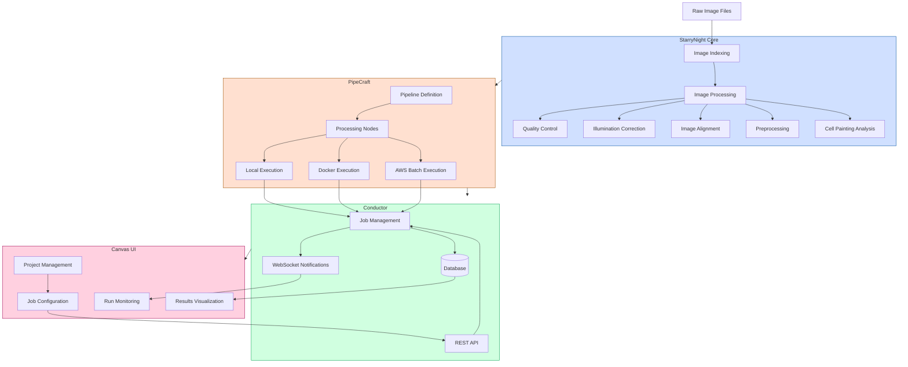

# Developer Guide

This guide provides information for developers who want to contribute to StarryNight.

## System Architecture

StarryNight is a modular platform for high-throughput microscopy image processing with four main components that work together to process, analyze, and manage microscopy image data.



### Component Overview

**StarryNight Core**: The foundation library that provides specialized algorithms for microscopy image analysis

   - Image indexing and inventory management
   - Illumination correction, alignment, and preprocessing
   - Cell Painting analysis algorithms
   - Quality control and validation

**PipeCraft**: A workflow engine for defining and executing computational pipelines

   - Pipeline definition framework
   - Node-based processing graph
   - Multiple execution backends (local, Docker, AWS)
   - Template-based workflow generation

**Conductor**: A service for job management, monitoring, and API access

   - RESTful API for job control
   - Database for configuration and results storage
   - Job scheduling and monitoring
   - Real-time updates via WebSockets

**Canvas**: A web-based user interface for interacting with the system

   - Project management interface
   - Job configuration and submission
   - Run monitoring and visualization
   - Results exploration

### Key Design Principles

- **Modularity**: Each component has clear boundaries and interfaces
- **Extensibility**: The system can be extended with new algorithms and processing modules
- **Reproducibility**: Workflows are version-controlled and traceable
- **Scalability**: Processing can scale from local development to cloud execution

## Repository Structure

The StarryNight repository is organized as a monorepo with four main packages:

```
starrynight/
├── canvas/              # Frontend UI (Next.js/React)
├── conductor/           # Job orchestration service
├── pipecraft/           # Pipeline definition framework
├── starrynight/         # Core image processing algorithms
├── docs/                # Documentation
├── nix/                 # Nix configuration
└── workspace/           # Development workspace
```

## Development Environment Setup

### Prerequisites

- Git
- Python 3.10+
- Node.js 18+ (for Canvas frontend)
- Nix package manager (recommended)
- Docker (for containerized development)
- AWS CLI (for cloud integrations)

### Setup Steps

#### Option 1: Using Nix (Recommended)

```bash
# Clone the repository
git clone https://github.com/broadinstitute/starrynight.git
cd starrynight

# Set up the Nix environment
nix develop --extra-experimental-features nix-command --extra-experimental-features flakes

# Synchronize Python dependencies
uv sync
```

#### Option 2: Manual Setup

```bash
# Clone the repository
git clone https://github.com/broadinstitute/starrynight.git
cd starrynight

# Create and activate a Python virtual environment
python -m venv venv
source venv/bin/activate  # On Windows: venv\Scripts\activate

# Install Python packages in development mode
pip install -e ".[dev]"
pip install -e starrynight/
pip install -e pipecraft/
pip install -e conductor/

# Set up the Canvas frontend
cd canvas
npm install
```

## Core Components and Design Patterns

### StarryNight Core

The foundation of the platform providing specialized algorithms for microscopy image analysis:

- **CLI Tools**: Command-line interfaces for each algorithm
- **Algorithms Module**: Image processing algorithms for microscopy data
- **Modules System**: Standardized module structure for algorithm implementation
- **Parsers**: File path parsing and metadata extraction
- **Utilities**: Common functions for file handling, data transformation, etc.

#### Module System Architecture

The module system is the primary extension mechanism and follows these patterns:

- **Registry Pattern**: Modules register themselves with a central registry
- **Abstract Factory Pattern**: Base abstract classes with concrete implementations
- **Template Method Pattern**: Common workflow with customizable steps

```python
# Example module registration
@register_module("illumination_correction")
class IlluminationCorrectionModule(StarrynightModule):
    """Module for calculating and applying illumination correction."""

    @classmethod
    def from_config(cls, config: dict) -> "IlluminationCorrectionModule":
        """Factory method to create module from configuration."""
        return cls(**config)

    def _spec(self) -> dict:
        """Define module specification."""
        return {
            "version": "1.0.0",
            "parameters": {
                # Parameter definitions...
            }
        }
```

#### Data Flow Architecture

Data flows through the system following a standard pattern:

1. **Raw Data → Inventory**: Create catalog of all image files
2. **Inventory → Index**: Parse inventory to create structured index with metadata
3. **Index → Processing**: Run specific algorithms on indexed data
4. **Processing → Results**: Store and manage processing results

### PipeCraft

PipeCraft is the workflow engine, featuring:

- **Pipeline Definition**: Python API for defining computational workflows
- **Node System**: Individual processing steps as configurable nodes
- **Backend Abstraction**: Support for local, Docker, and AWS Batch execution
- **Template System**: Pre-defined templates for common workflows

#### Workflow Design Patterns

PipeCraft implements:

- **Strategy Pattern**: Different execution strategies for different environments
- **Builder Pattern**: Constructing complex pipelines from simple building blocks
- **Composite Pattern**: Nested execution graphs for complex workflows

```python
# Pipeline construction example
pipeline = (
    Pipeline("illumination_correction")
    .add_node("load_data", load_data_module)
    .add_node("generate_pipeline", generate_cppipe_module)
    .add_node("execute", execute_cp_module)
    .link("load_data", "generate_pipeline")
    .link("generate_pipeline", "execute")
)
```

### Conductor

Conductor manages the execution environment:

- **REST API**: API for job management and monitoring
- **Database**: Storage for project configurations and job results
- **Job Management**: Scheduling, execution, and monitoring of jobs
- **WebSockets**: Real-time updates on job status

#### Service Architecture

Conductor implements:

- **Repository Pattern**: Data access abstraction for database operations
- **Service Layer Pattern**: Business logic encapsulation
- **Event-Driven Architecture**: Status updates and notifications

### Canvas UI

The web-based user interface:

- **React Components**: Modular UI components
- **State Management**: Zustand for global state
- **API Integration**: SWR for data fetching
- **Responsive Design**: Mobile-friendly interfaces

#### Frontend Architecture

Canvas implements:

- **Atomic Design**: Component hierarchy from atoms to templates
- **Container-Presenter Pattern**: Separation of data and presentation
- **Hooks Pattern**: Reusable behavior implementations

## Running Tests

### Python Tests

```bash
# Run all tests
pytest

# Run tests for a specific package
pytest starrynight/tests/
pytest pipecraft/tests/
pytest conductor/tests/

# Run a specific test
pytest starrynight/tests/modules/test_gen_index.py::test_function_name
```

### Frontend Tests

```bash
cd canvas
npm run test
```

## Running Components Locally

### StarryNight Core

```bash
# Run StarryNight CLI directly
python -m starrynight.cli.main --help
```

### Conductor Service

```bash
# Start Conductor API service
python -m conductor.cli.main start
```

### Canvas Frontend

```bash
cd canvas
npm run dev
# Access the UI at http://localhost:3000
```

## Development Workflow

1. **Create a feature branch**:
   ```bash
   git checkout -b feature/your-feature-name
   ```

2. **Make changes**: Implement your feature or fix

3. **Run tests**: Ensure functionality works as expected
   ```bash
   pytest
   ruff check .
   ```

4. **Commit changes**: Follow the project's commit conventions
   ```bash
   git add .
   git commit -m "feat: add new feature description"
   ```

5. **Push changes**: Share your work
   ```bash
   git push -u origin feature/your-feature-name
   ```

6. **Create a pull request**: Submit your changes for review

## Coding Standards

### Python

- **Style**: Follow PEP 8 with a line length of 88 characters
- **Formatting**: Use ruff for code formatting
- **Type Hints**: Use type annotations for all function parameters and returns
- **Docstrings**: Use NumPy style docstrings
- **Imports**: Group imports (standard library, third-party, local)
- **Naming**: Use snake_case for variables/functions, PascalCase for classes

### TypeScript (Canvas)

- **Style**: Follow the project's TypeScript/React conventions
- **Formatting**: Use ESLint and Prettier
- **Types**: Define interfaces/types for all components and functions
- **Naming**: Use camelCase for variables/functions, PascalCase for components/interfaces

## Extending StarryNight

### Adding a New Module

To add a new processing module:

1. Create a new algorithm implementation in `starrynight/algorithms/`
2. Add CLI commands in `starrynight/cli/`
3. Implement module definition files in `starrynight/modules/`
4. Add tests for all components
5. Update documentation

Here's an example of creating a new module:

#### 1. Create the Algorithm

```python
# starrynight/algorithms/new_algorithm.py
import numpy as np
from typing import Dict, List, Optional

def process_image(image: np.ndarray, params: Dict) -> np.ndarray:
    """Process an image with the new algorithm.

    Parameters
    ----------
    image : np.ndarray
        Input image
    params : Dict
        Processing parameters

    Returns
    -------
    np.ndarray
        Processed image
    """
    # Algorithm implementation
    return processed_image
```

#### 2. Create CLI Command

```python
# starrynight/cli/new_algorithm.py
import click
from pathlib import Path
from starrynight.algorithms import new_algorithm

@click.command("new-algorithm")
@click.option("-i", "--input", type=str, required=True, help="Input file path")
@click.option("-o", "--output", type=str, required=True, help="Output directory")
@click.option("--param", type=float, default=1.0, help="Algorithm parameter")
def new_algorithm_command(input: str, output: str, param: float) -> None:
    """Run the new algorithm on input images."""
    # Command implementation
    pass
```

#### 3. Create Module Definition

```python
# starrynight/modules/new_algorithm/
# __init__.py
from .new_algorithm_module import NewAlgorithmModule

# new_algorithm_module.py
from starrynight.modules.common import StarrynightModule
from starrynight.modules.registry import register_module

@register_module("new_algorithm")
class NewAlgorithmModule(StarrynightModule):
    """Module for new algorithm processing."""

    @classmethod
    def from_config(cls, config: dict) -> "NewAlgorithmModule":
        return cls(**config)

    def _spec(self) -> dict:
        return {
            "version": "1.0.0",
            "parameters": {
                "input": {"type": "string", "description": "Input path"},
                "output": {"type": "string", "description": "Output path"},
                "param": {"type": "number", "default": 1.0, "description": "Algorithm parameter"}
            }
        }

    def build_pipeline(self) -> "Pipeline":
        # Define pipeline for this module
        pass
```

### Creating a New Pipeline

To create a new pipeline using existing modules:

1. Define a pipeline configuration
2. Create a pipeline definition in PipeCraft
3. Register the pipeline with the system

Example pipeline creation:

```python
# pipecraft/pipelines/my_pipeline.py
from pipecraft.pipeline import Pipeline
from pipecraft.node import Node
from starrynight.modules import get_module

def create_my_pipeline(config: dict) -> Pipeline:
    """Create a custom pipeline for image processing.

    Parameters
    ----------
    config : dict
        Pipeline configuration

    Returns
    -------
    Pipeline
        Configured pipeline
    """
    # Get modules
    inventory_module = get_module("inventory")(config["inventory"])
    index_module = get_module("index")(config["index"])
    process_module = get_module("new_algorithm")(config["process"])

    # Build pipeline
    pipeline = Pipeline("my_pipeline")

    # Add nodes
    pipeline.add_node("inventory", inventory_module)
    pipeline.add_node("index", index_module)
    pipeline.add_node("process", process_module)

    # Link nodes
    pipeline.link("inventory", "index")
    pipeline.link("index", "process")

    return pipeline
```

### Extending Conductor

To add a new API endpoint:

1. Create a new route file in `conductor/deploy/local/routes/`
2. Implement handler functions in `conductor/handlers/`
3. Add models if needed in `conductor/models/`

### Extending Canvas

To add new UI components:

1. Create component files in `canvas/components/`
2. Update state management if needed
3. Add new routes if creating new pages

## Configuration and Error Handling

### Configuration Management

StarryNight uses a structured approach to configuration:

#### Schema Validation

All configuration is validated against JSON schemas:

```python
# Example schema validation
from starrynight.schema import validate_schema

config = {
    "input": "/path/to/input",
    "output": "/path/to/output",
    "parameters": {
        "channel": "DAPI",
        "sample_size": 100
    }
}

# Validate against schema
errors = validate_schema(config, "module_schema.json")
if errors:
    raise ValueError(f"Invalid configuration: {errors}")
```

#### Configuration Hierarchy

Configuration is loaded from multiple sources in order:
1. Default configurations embedded in code
2. System-level configuration files
3. Project-level configuration files
4. Command-line overrides

#### Environment Variables

Some components use environment variables for configuration:
- `STARRYNIGHT_WORKSPACE`: Default workspace location
- `CONDUCTOR_DATABASE_URL`: Database connection string
- `CONDUCTOR_ENV`: Environment type (dev, test, prod)

### Error Handling

StarryNight implements several error handling patterns:

#### Result Objects

Functions return structured result objects rather than raising exceptions:

```python
from typing import NamedTuple, Optional, List

class ProcessResult(NamedTuple):
    success: bool
    data: Optional[dict] = None
    errors: List[str] = []

def process_data(input_path: str) -> ProcessResult:
    try:
        # Processing logic
        return ProcessResult(success=True, data={"output": result})
    except Exception as e:
        return ProcessResult(success=False, errors=[str(e)])
```

#### Validation Layers

The system performs validation at multiple layers:
1. Input validation before processing
2. Schema validation for configuration
3. Type checking via Pydantic models
4. Output validation after processing

#### Logging Strategy

StarryNight uses a structured logging approach:

```python
import logging
from typing import Dict, Any

logger = logging.getLogger(__name__)

def log_with_context(message: str, context: Dict[str, Any], level: int = logging.INFO) -> None:
    """Log a message with structured context."""
    logger.log(level, message, extra={"context": context})

# Usage example
log_with_context(
    "Processing image batch",
    {
        "batch_id": "batch_123",
        "image_count": 50,
        "job_id": "job_456"
    }
)
```

## Performance Optimization

### Parallel Processing

StarryNight supports parallel processing in several ways:

#### Task Parallelism

Pipeline nodes can be executed in parallel when dependencies allow:

```python
# Parallel pipeline
pipeline = (
    Pipeline("parallel_processing")
    .add_node("load_data", load_data_module)
    .add_node("process_channel1", process_module, channel="ch1")
    .add_node("process_channel2", process_module, channel="ch2")
    .add_node("process_channel3", process_module, channel="ch3")
    .add_node("merge_results", merge_module)
    .link("load_data", ["process_channel1", "process_channel2", "process_channel3"])
    .link(["process_channel1", "process_channel2", "process_channel3"], "merge_results")
)
```

#### Batch Processing

Processing large datasets in manageable batches:

```python
def batch_process(items, batch_size=100, process_fn):
    """Process items in batches."""
    results = []
    for i in range(0, len(items), batch_size):
        batch = items[i:i+batch_size]
        results.extend(process_fn(batch))
    return results
```

#### Distributed Execution

Pipecraft supports execution across multiple compute resources:

- Local execution for development
- AWS Batch for cloud-scale processing
- Custom execution backends for specific environments

## Getting Help

If you need assistance, you can:

- Check the existing documentation
- Browse the source code
- Contact the core team at imaging@broadinstitute.org
- Join community discussions on the issue tracker

## Additional Resources

- GitHub repository: https://github.com/broadinstitute/starrynight
- Issue tracker: https://github.com/broadinstitute/starrynight/issues
- Development roadmap: See project milestones on GitHub
- Related tools: CellProfiler, ImageJ, NumPy, scikit-image
