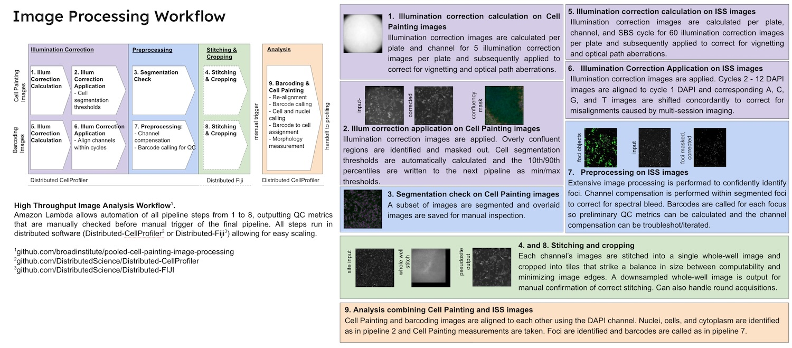
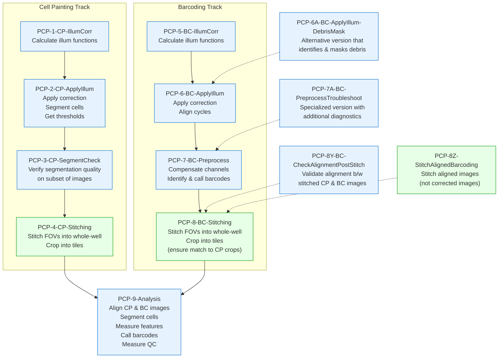
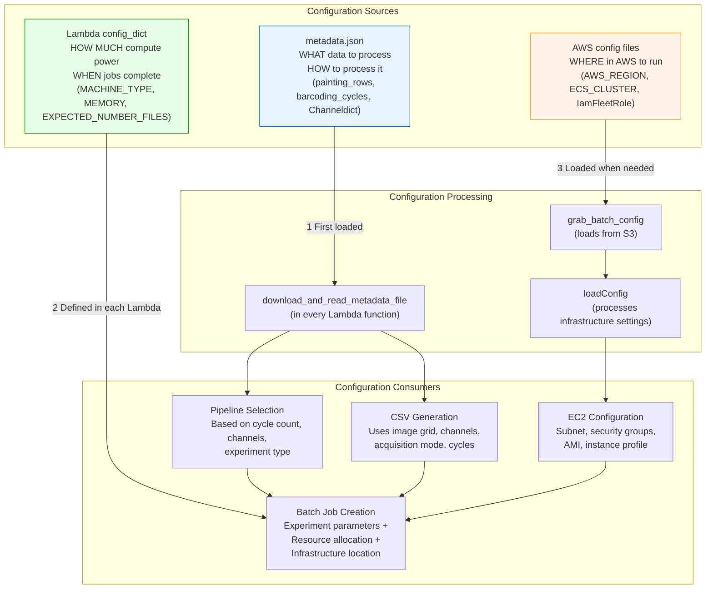

# PCPIP: CellProfiler Pipelines and AWS Lambda Orchestration for Pooled Cell Painting

PCPIP (Pooled Cell Painting Image Processing) is a specialized image processing system that automates the analysis of large-scale optical pooled screening experiments. The system integrates CellProfiler's image analysis capabilities with AWS Lambda-based orchestration to process thousands of microscopy images through a series of coordinated pipelines. PCPIP handles two parallel processing tracks - one for Cell Painting images that capture cellular morphology and another for barcoding images that identify genetic perturbations - before combining them for comprehensive phenotypic analysis. This document details the complete implementation of this workflow, including pipeline specifications, cloud infrastructure configuration, and execution patterns that enable reproducible, scalable image processing for high-content screening.

See [Requirements](requirements.md) for a specification of the new system we want to build, based on PCPIP.


## Overview

The image processing workflow consists of two parallel tracks followed by a combined analysis:

1. **Cell Painting Processing** (Pipelines 1-4)
2. **Barcoding Processing** (Pipelines 5-8)
3. **Combined Analysis** (Pipeline 9)

Each pipeline is launched by a corresponding AWS Lambda function that configures input/output paths, prepares metadata, and creates CSV files to drive the CellProfiler analysis.



The diagram above illustrates the complete workflow with both Cell Painting (top row) and Barcoding (middle row) image processing tracks, followed by the combined analysis step. The pipeline numbers correspond to the CellProfiler pipelines described in this document.

The workflow is orchestrated by AWS Lambda functions, with each function responsible for a specific pipeline stage. These Lambda functions serve as the automation backbone that coordinates pipeline execution, handles configuration, and manages the processing of thousands of images across AWS resources.

## Lambda Function Architecture and Implementation

### Pipeline Flow and Triggers



Each pipeline in the workflow is orchestrated by a corresponding AWS Lambda function (PCP-1 through PCP-9). These Lambda functions automate the pipeline execution and handle the transition of data between stages in a sequential workflow:

1. The workflow begins with two parallel tracks: Cell Painting processing (PCP-1 through PCP-4) and barcoding processing (PCP-5 through PCP-8)
2. Each Lambda function is triggered by the output of the previous step (typically a file upload to S3)
3. For example, PCP-1-CP-IllumCorr is triggered by the upload of the 1_CP_Illum.cppipe file, and produces illumination function files that then trigger PCP-2-CP-ApplyIllum
4. The final Lambda function (PCP-9-Analysis) integrates the outputs from both tracks for comprehensive analysis

### Lambda Function Implementation Pattern

All Lambda functions in the workflow follow a common implementation pattern:

1. **Trigger Processing**: Responds to S3 event or manual invocation
      - Lambda's `lambda_handler` function is the entry point
      - For S3 triggers: `event["Records"][0]["s3"]["object"]["key"]` extracts the triggering file path
      - For manual triggers (like PCP-9-Analysis): Empty event object is passed with hardcoded parameters
2. **Configuration Loading**:
      - Loads experiment configuration from metadata.json using `download_and_read_metadata_file()`
      - Contains pipeline-specific AWS resource requirements in `config_dict`
      - May check if previous step's completion using `check_if_run_done()`
3. **Pipeline Selection and Plate Filtering**:
      - Selects appropriate pipeline variant based on experiment configuration
      - Applies optional plate inclusion/exclusion filters
4. **Input Discovery and CSV Generation**:
      - Uses `paginate_a_folder()` to list all input files efficiently
      - Parses image names using `parse_image_names()` to extract metadata (wells, sites, channels)
      - Creates pipeline-specific CSV file using the appropriate `create_CSV_pipeline*()` function
      - Uploads the generated CSV to S3 for the CellProfiler pipeline to consume
5. **AWS EC2 Job Configuration and Execution**:
      - Sets up AWS environment with `run_setup()`
      - Configures batch jobs with the pipeline-specific `create_batch_jobs_*()` function
      - Launches EC2 instances with Docker containers via `run_cluster()`
      - Sets up job completion monitoring with `run_monitor()`

### Key Utility Functions

Each Lambda function relies on a common set of utility modules:

#### From helpful_functions.py:
- **download_and_read_metadata_file()**: Retrieves and parses experiment configuration
- **paginate_a_folder()**: Lists S3 objects with pagination for large image sets
- **parse_image_names()**: Extracts metadata from image filenames
- **write_metadata_file()**: Updates metadata with processing results
- **check_if_run_done()**: Validates job completion status

#### From create_CSVs.py:
- **create_CSV_pipelineN()**: Pipeline-specific CSV generators
- Each translates experiment parameters into CellProfiler-compatible format
- Handles different acquisition modes (fast/slow, one/many files)

#### From run_DCP.py and create_batch_jobs.py:
- Functions for creating and monitoring AWS EC2 jobs
- Configures EC2 instances based on pipeline requirements
- Handles container setup and execution

## Pipeline Configuration System

This section details the configuration parameters and settings needed to set up the CellProfiler pipelines for Pooled Cell Painting experiments.

### Multi-layered Configuration Architecture

The system employs a three-tiered configuration approach that separates experimental, computational, and infrastructure concerns. This separation allows independent modification of experimental parameters, resource allocation, and AWS infrastructure.



#### Configuration Layer Relationships

Each layer serves a distinct purpose in the overall system:

- **Experiment Configuration** (metadata.json): Controls WHAT data is processed and HOW it's processed
- **Computing Resource Configuration** (Lambda config_dict): Specifies HOW MUCH computing power is allocated and WHEN jobs are considered complete
- **Infrastructure Configuration** (AWS config files): Determines WHERE in AWS the processing happens

### Detailed Configuration Parameters

#### 1. Experiment Configuration (metadata.json)

The `metadata.json` file (based on `configs/metadatatemplate.json`) defines all experiment-specific parameters:

##### Image Grid Configuration
- `painting_rows`, `painting_columns`: Define Cell Painting image layout for square acquisitions
- `painting_imperwell`: Defines total images per well for circular acquisitions (overrides rows/columns)
- `barcoding_rows`, `barcoding_columns`: Define barcoding image layout for square acquisitions
- `barcoding_imperwell`: Defines total images per well for circular acquisitions (overrides rows/columns)
- Note: Use rows/columns for square acquisition patterns; use imperwell for circular acquisition patterns

##### Channel Dictionary Configuration
```json
"Channeldict":"{'round0':{'DAPI':['DNA_round0',0], 'GFP':['Phalloidin',1]}, 'round1':{'DAPI':['DNA_round1',0],'GFP':['GM130',1], ...}}"
```
- Maps microscope channel names to biological stains and frame indices
- For multiple rounds (SABER) experiments:
    - Keys are the folder names of the rounds (e.g., '20X_c0-SABER-0', '20X_c1-SABER-1')
    - Common stains between rounds should include round identifiers (e.g., 'DNA_round0', 'DNA_round1')
    - Example:
      ```
      "Channeldict":"{'20X_c0-SABER-0':{'DAPI':['DNA_round0',0], 'GFP':['Phalloidin',1]}, '20X_c1-SABER-1':{'DAPI':['DNA_round1',0],'GFP':['GM130',1], 'A594':['Tubulin',2], 'Cy5':['Calnexin', 3]}, '20X_c2-SABER-2':{'DAPI':['DNA_round2',0],'GFP':['COX-IV',1], 'A594':['TDP-43',2], 'Cy5':['G3BP1',3], '750':['LAMP1',4]}}"
      ```
- For single-round experiments:
    - Single key matching the Cell Painting folder name (typically '20X_CP')
    - Example:
      ```
      "Channeldict":"{'20X_CP':{'DAPI':['DNA', 0], 'GFP':['Phalloidin',1], 'A594':['Mito',2], 'Cy5':['ER',3], '750':['WGA',4]}}"
      ```
- First value in each array is the stain name, second is the frame index (0-based)
- Used to determine the pipeline variant (SABER vs. standard)

##### Processing Configuration
- `one_or_many_files`: Controls if each well is stored as a single file (`"one"`) or multiple files (`"many"`)
    - Should be locked to `"many"` for production runs
- `fast_or_slow_mode`: Determines CSV generation strategy and processing path
    - Should be locked to `"slow"` for production runs
- `barcoding_cycles`: Sets the number of barcoding cycles to process
- `range_skip`: Sets sampling frequency for Pipeline 3 (SegmentCheck), to process subset of images for validation
    - Typically doesn't need to be changed from default

##### Stitching Configuration
- `overlap_pct`: Controls image overlap percentage between adjacent fields
- `stitchorder`: Specifies tile arrangement
    - For square acquisitions: "Grid: snake by rows" or "Grid: row-by-row"
    - For round acquisitions: "Filename defined position"
- `tileperside`: Number of tiles along each side of the stitched image grid
    - Typically doesn't need to be changed from default
- `final_tile_size`: Pixel dimensions of each output tile after cropping
    - Typically doesn't need to be changed from default
- `round_or_square`: Shape of the well for cropping calculations (`"round"` or `"square"`)
- `quarter_if_round`: Whether to divide round wells into quarters for processing (`"True"` or `"False"`)
- `*_xoffset_tiles`, `*_yoffset_tiles`: Optional offsets for troubleshooting stitching misalignments
    - Should be 0 unless troubleshooting gross stitching misalignments
- `compress`: Whether to compress output files (`"True"` or `"False"`)
    - Should be set to `"True"` to save out compressed files from stitch-crop pipelines

#### 2. Computing Resource Configuration (Lambda config_dict)

Each Lambda function contains a specific `config_dict` with pipeline-appropriate settings:

```python
config_dict = {
    "APP_NAME": "2018_11_20_Periscope_X_IllumPainting",
    "DOCKERHUB_TAG": "cellprofiler/distributed-cellprofiler:2.0.0_4.2.1",
    "TASKS_PER_MACHINE": "1",
    "MACHINE_TYPE": ["c5.xlarge"],
    "MEMORY": "7500",
    "DOCKER_CORES": "4",
    "CHECK_IF_DONE_BOOL": "True",
    "EXPECTED_NUMBER_FILES": "5",  # Varies by pipeline
    # Additional parameters...
}
```

The key parameters that need configuration for each pipeline are:

- **APP_NAME**: Unique identifier for the specific experiment
- **MACHINE_TYPE**: EC2 instance type appropriate for the pipeline's computational needs
- **MEMORY**: RAM allocation for the Docker container
- **EXPECTED_NUMBER_FILES**: Number of output files to expect
- **CHECK_IF_DONE_BOOL**: Controls validation of job completion

#### 3. Pipeline-Specific CSV Configuration

Each pipeline is driven by a CSV file with a specific structure generated by functions in `create_CSVs.py`:


| Pipeline                      | CSV Generator Function    |
| ----------------------------- | ------------------------- |
| 1:  CP-Illum                  | `create_CSV_pipeline1()`  |
| 2:  CP-ApplyIllum             | `create_CSV_pipeline1()`  |
| 3:  SegmentCheck              | `create_CSV_pipeline3()`  |
| 4:  CP-Stitching              | (external FIJI script)    |
| 5:  BC-Illum                  | `create_CSV_pipeline5()`  |
| 6:  BC-ApplyIllum             | `create_CSV_pipeline6()`  |
| 7:  BC-Preprocess             | `create_CSV_pipeline7()`  |
| 7A: BC-PreprocessTroubleshoot | `create_CSV_pipeline7()`  |
| 8:  BC-Stitching              | (external FIJI script)    |
| 8Y: BC-CheckAlignment         | `create_CSV_pipeline8Y()` |
| 9:  Analysis                  | `create_CSV_pipeline9()`  |


The CSV files translate configuration parameters into CellProfiler-compatible format using:

- **FileName_X** and **PathName_X** columns for each channel (essential for LoadData module)
- **Metadata_X** columns for grouping and organization (Plate, Well, Site)
- **Frame_X** and **Series_X** columns for multi-channel files in fast mode
- **Cycle**-prefixed columns for barcoding data (Cycle01, Cycle02, etc.)
- **_Orig** suffix for raw images and **_Illum** suffix for illumination files
- **_Corr** suffix for corrected images that have had illumination applied

## Pipeline Specifications

This section provides detailed specifications for all nine primary CellProfiler and Fiji pipelines and their specialized variants, including their purposes, Lambda function triggers, key operations, inputs/outputs, and configuration requirements for implementing the complete Pooled Cell Painting workflow.

### Cell Painting

#### Pipeline 1: Cell Painting Illumination Correction (1_CP_Illum.cppipe)

**Purpose**: Calculate per-plate illumination correction functions for each Cell Painting channel

**Lambda Function**: `PCP-1-CP-IllumCorr`

- **Trigger**: S3 upload of 1_CP_Illum.cppipe
- **CSV Generator**: `create_CSV_pipeline1()`
- **Output**: Illumination function files (.npy)

**Key Operations**:

1. Loads raw images via CSV configuration
2. For each channel (DNA, ER, Phalloidin, Mito, WGA):
    - Downsample images to 25% size for faster processing
    - Calculate illumination function across all images using median filtering
    - Upsample correction back to original size
3. Save correction functions as .npy files with naming convention: `{Plate}_Illum{Channel}.npy`

#### Pipeline 2: Cell Painting Illumination Application (2_CP_Apply_Illum.cppipe)

**Purpose**: Apply illumination correction and segment cells for quality control

**Lambda Function**: `PCP-2-CP-ApplyIllum`

- **Trigger**: S3 upload of IllumMito.npy (output from Pipeline 1)
- **CSV Generator**: Created by `create_CSV_pipeline1()` (generates two CSVs at once)
- **Output**: Corrected cell images (.tiff) and segmentation parameters

**Key Operations**:

1. Apply illumination correction to all channels via division method
2. Identify confluent regions to mask out problem areas
3. Segment nuclei in DNA channel (10-80 pixel diameter)
4. Identify cell boundaries from nuclei using watershed segmentation
5. Export segmentation thresholds for quality control
6. Save corrected images as TIFF files

**Configuration Details**:

- Segmentation thresholds are automatically calculated and stored for Pipeline 3

#### Pipeline 3: Cell Painting Segmentation Check (3_CP_SegmentationCheck.cppipe)

**Purpose**: Verify segmentation quality on a subset of images

**Lambda Function**: `PCP-3-CP-SegmentCheck`

- **Trigger**: S3 upload of PaintingIllumApplication_Image.csv (from Pipeline 2)
- **CSV Generator**: `create_CSV_pipeline3()`
- **Output**: Quality control overlay images showing segmentation

**Key Operations**:

1. Load a subset of corrected images (skipping some sites per Lambda configuration)
2. Apply segmentation using min/max thresholds from Pipeline 2
3. Create color overlay images showing segmentation results
4. Export metrics to validate segmentation quality

**Configuration Details**:

- Uses `range_skip` parameter to process only a subset of images
- Lambda reads segmentation thresholds from Pipeline 2 output

#### Pipeline 4: Cell Painting Stitching and Cropping

**Purpose**: Stitch field-of-view images into whole-well montages and create manageable tiles

**Lambda Function**: `PCP-4-CP-Stitching`

- **Trigger**: S3 upload of SegmentationCheck_Experiment.csv (from Pipeline 3)
- **Implementation**: Uses FIJI scripts rather than CellProfiler
- **Output**: Stitched and cropped Cell Painting images

**Key Operations**:

1. Stitch multiple fields of view into single whole-well image
2. Generate a smaller (10x) version for preview
3. Crop stitched image into standardized tiles
4. Save output in tiered directory structure by batch and well

### Barcoding

#### Pipeline 5: Barcoding Illumination Correction (5_BC_Illum.cppipe)

**Purpose**: Calculate illumination correction for barcoding images in each cycle

**Lambda Function**: `PCP-5-BC-IllumCorr`

- **Trigger**: S3 upload of 5_BC_Illum.cppipe
- **CSV Generator**: `create_CSV_pipeline5()`
- **Output**: Cycle-specific illumination function files (.npy)

**Key Operations**:

1. Load barcoding images from all cycles
2. For each channel (DNA, A, C, G, T) in each cycle and plate:
     - Downsample for faster processing
     - Calculate illumination function with cycle-specific and plate-specific correction
     - Upsample back to original size
3. Save per-cycle, per-channel, per-plate correction functions

#### Pipeline 6: Barcoding Illumination Application (6_BC_Apply_Illum.cppipe)

**Purpose**: Apply illumination correction and align images across channels and cycles

**Lambda Function**: `PCP-6-BC-ApplyIllum`

- **Trigger**: S3 upload of Cycle1_IllumA.npy (from Pipeline 5)
- **CSV Generator**: `create_CSV_pipeline6()`
- **Output**: Aligned barcoding images

**Key Operations**:

1. Apply illumination correction by channel, cycle, and plate
2. No alignment of A, C, G, T channels to DAPI within each cycle (fast mode is no longer supported)
3. Align all cycle DAPI images to Cycle 1 DAPI
4. Shift A, C, G, T channels by same amount as their DAPI image
5. Save corrected and aligned images

#### Pipeline 7: Barcoding Preprocessing (7_BC_Preprocess.cppipe)

**Purpose**: Process aligned barcoding images to identify and characterize barcode foci

**Lambda Function**: `PCP-7-BC-Preprocess`

- **Trigger**: S3 upload of BarcodingApplication_Experiment.csv (from Pipeline 6)
- **CSV Generator**: `create_CSV_pipeline7()`
- **Output**: Processed barcoding images with foci identification

**Key Operations**:

1. Perform per-image illumination correction grouped by cycle
2. Calculate average and standard deviation images across cycles for quality control
3. Identify nuclei using the DAPI channel and cells using propagation from nuclei. Note: `IdentifySecondaryObjects` module remains in the pipeline but cell segmentations are not used for meaningful analysis because:
    - Cells identified without phenotypic stains are unreliable and have poor boundaries
    - Getting accurate cell segmentations would require significant per-experiment tuning
    - Barcode-only QC metrics provide sufficient data quality indicators that correlate well with downstream cell-based metrics
    - Proper cell segmentation is performed in Pipeline 9 with full phenotypic stains
4. Identify potential barcode foci in each channel
5. The CompensateColors module includes many configurable parameters including:
    - Histogram matching options (pre/post-masking, template selection)
    - Channel compensation to correct for spectral bleed-through
    - Filter-based processing (Laplacian of Gaussian, Tophat, Difference of Gaussians)
    - Channel-specific background subtraction
    - Processing sequence controls (pre/post masking rescaling)
    - Within-object vs. whole-image processing options
    - Percentile-based intensity normalization
    - Spot size and intensity thresholding
6. Analyze foci intensities and call barcodes
7. Relate barcode foci to cell objects for spatial organization
8. Create composite images for QC visualization

#### Pipeline 8: Barcoding Stitching and Cropping

**Purpose**: Stitch and crop barcoding images similar to Cell Painting images

**Lambda Function**: `PCP-8-BC-Stitching`

- **Trigger**: S3 upload of BarcodePreprocessing_Experiment.csv (from Pipeline 7)
- **Implementation**: Uses FIJI scripts rather than CellProfiler
- **Output**: Stitched barcoding images

**Key Operations**:

1. Similar to Pipeline 4, but operates on barcoding images
2. Stitches according to same grid layout as Cell Painting
3. Produces consistent tile naming for alignment with Cell Painting tiles

### Final Analysis Pipeline

#### Pipeline 9: Analysis (9_Analysis.cppipe)

**Purpose**: Integrate Cell Painting and barcoding data for downstream analysis

**Lambda Function**: `PCP-9-Analysis`

- **Trigger**: Manual trigger (triggered after both tracks complete)
- **CSV Generator**: `create_CSV_pipeline9()`
- **Output**: Integrated analysis results and segmentation masks

**Key Operations**:

1. Align Cell Painting images to barcoding images using DAPI channels
2. Identify and mask overly-confluent regions
3. Segment nuclei, cells, cytoplasm in Cell Painting images
4. Locate barcode foci in aligned images
5. Measure Cell Painting features across all compartments
6. Call barcodes and annotate quality metrics
7. Export segmentation masks and merged, annotated images for visualization

### Special-Purpose Pipelines

In addition to the main pipeline sequence, there are specialized pipelines for troubleshooting:

#### 7A_BC_Preprocess_Troubleshooting.cppipe

**Purpose**: Specialized version of Pipeline 7 with additional diagnostics

**Lambda Function**: `PCP-7A-BC-PreprocessTroubleshoot`

- **Trigger**: Manual trigger for troubleshooting
- **Output**: Diagnostic images and measurements

**Key Differences**:

- Includes additional QC measurements
- Outputs more diagnostic images
- May use alternative image processing parameters
- Used when standard pipeline produces unexpected results

#### 6_BC_Apply_Illum_DebrisMask.cppipe

**Purpose**: Alternative version of Pipeline 6 that identifies and masks debris

**Key Differences**:

- Adds debris identification and masking
- Prevents debris from interfering with alignment
- Used for samples with high debris content

#### 8Y_CheckAlignmentPostStitching

**Purpose**: Validate alignment between stitched Cell Painting and Barcoding images

**Lambda Function**: `PCP-8Y-BC-CheckAlignmentPostStitch`

- **Trigger**: Manual trigger or after completion of Pipelines 4 and 8
- **CSV Generator**: `create_CSV_pipeline8Y()`
- **Implementation**: Uses CellProfiler pipeline for alignment validation
- **Output**: Alignment validation images and metrics

**Key Operations**:

1. Takes the stitched Cell Painting DNA images and Cycle01 DAPI images from Barcoding
2. Cross-references these images to validate their alignment
3. Produces diagnostic images showing alignment quality
4. Identifies any systematic misalignments that may need adjustment in the metadata

**Configuration Details**:

- Uses the `Cycle01_DAPI` channel from barcoding as the reference
- Compares with `CorrDNA` from Cell Painting track
- Creates a CSV that links corresponding tiles from both imaging modalities
- Runs on a site-by-site basis for detailed validation

#### 8Z_StitchAlignedBarcoding

**Purpose**: Stitch and crop barcoding images from the aligned images directory instead of the corrected images directory

**Lambda Function**: `PCP-8Z-StitchAlignedBarcoding`

- **Trigger**: Manual trigger, typically after alignment issues are discovered
- **Implementation**: Uses the same FIJI script as Pipeline 8 but on different inputs
- **Output**: Stitched and cropped barcoding images from aligned sources

**Key Operations**:

1. Similar to Pipeline 8, but takes input from the `images_aligned` directory instead of `images_corrected`
2. Uses the FIJI stitching script to create stitched whole-well images
3. Also creates a smaller (10x) version for preview and visualization
4. Crops stitched images into standardized tiles for downstream analysis
5. Handles both square and round wells using the same configurable parameters as Pipeline 8

**Configuration Details**:

- Uses identical configuration parameters to Pipeline 8
- Allows separate adjustment of x/y offset tiles through metadata
- Supports compression of output images when configured
- Can divide round wells into quarters for more manageable processing

## Pipeline Configuration

This section explains how CellProfiler pipelines interact with the configuration system and detailed implementation considerations for each pipeline step.

### Pipeline Variant Selection

Lambda functions select specific pipeline variants based on experimental configuration:

```python
# Sample code from PCP-1-CP-IllumCorr
if len(Channeldict.keys()) == 1:  # Standard experiment
    pipeline_name = "1_CP_Illum.cppipe"
if len(Channeldict.keys()) > 1:   # SABER experiment
    pipeline_name = "1_SABER_CP_Illum.cppipe"
```

This dynamic selection allows the same Lambda function to handle different experimental designs without code changes.

### CSV Generation Implementation

Each pipeline stage has a specialized CSV generator function that translates metadata parameters into CellProfiler-compatible input:

**Channel Dictionary Parsing**:

```python
# From create_CSV_pipeline1()
Channeldict = ast.literal_eval(Channeldict)
rounddict = {}
Channelrounds = list(Channeldict.keys())
for eachround in Channelrounds:
    templist = []
    templist += Channeldict[eachround].values()
    channels += list(i[0] for i in templist)
```

**Acquisition Mode Handling**:

```python
# From create_CSV_pipeline6()
if one_or_many == "one" and fast_or_slow == "fast":
    # One file structure
elif one_or_many == "many" and fast_or_slow == "slow":
    # Many file structure
```

**Cycle-Aware Configuration**:

```python
# From create_CSV_pipeline7()
for cycle in range(1, (expected_cycles + 1)):
    this_cycle = "Cycle%02d_" % cycle
    # Configure cycle-specific columns
```

### CellProfiler Pipeline Parameterization

CellProfiler pipelines are parameterized through CSV columns that control their behavior:

1. **Metadata Grouping**: Controls how images are processed together
   ```
   Group images by metadata?:Yes
   Select metadata tags for grouping:Plate
   ```

2. **Channel Selection**: Driven by metadata-derived CSV columns
   ```
   Select the input image:OrigDNA  # Comes from CSV FileName_OrigDNA column
   ```

3. **Output Naming**: Uses metadata variables from the CSV
   ```
   Enter single file name:\g<Plate>_IllumDNA  # \g<> syntax references metadata
   ```

This parameterization approach enables the same pipeline code to process different experimental designs based on the configuration-derived CSV input.

## Pipeline Input Output Specifications

Note:

- The input / outputs are also in parseable form [`pcpip-io.json`](assets/pcpip-io.json). Note that it uses `Tile` instead of `Site` when referring to the outputs of Pipelines 4 and 8.
- In the jsons, `{1_CP_Illum|2_CP_Apply_Illum|5_BC_Illum|6_BC_Apply_Illum}.input.images.pattern` are mockups
- Sample outputs of paths and LoadData CSVs generated using [`pcpip-io.json`](assets/pcpip-io.json) are [here](../tester/assets/pcpip-generate-dummy-structures/sample_outputs/generated_csvs.json).
- FIXME: We also need to specify as input, the channels that (1) will be used for nuclear segmentation (2) cell segmentation (3) mitochondria (for some filtering that happens in Pipeline 9)

### Cell Painting

#### Pipeline 1: Cell Painting Illumination Correction

- **Input Images**: Raw Cell Painting images
- **LoadData CSV Fields**:
    - `FileName_Orig{Channel}`, `PathName_Orig{Channel}` (raw Cell Painting images, where Channel = DNA, Phalloidin, etc.)
    - `Metadata_Plate`, `Metadata_Well`, `Metadata_Site`
- **Output Files**:
    1. Per-plate illumination correction functions for each channel
- **Output Directory**:
    - `{Batch}/illum/{Plate}/`
- **NPY Naming Pattern**:
    - `{Plate}_Illum{Channel}.npy`: Illumination function

#### Pipeline 2: Cell Painting Illumination Application

- **Input Images**:
    - Raw Cell Painting images
    - Illumination correction files (`.npy`) from Pipeline 1
- **LoadData CSV Fields**:
    - `FileName_Orig{Channel}`, `PathName_Orig{Channel}` (raw Cell Painting images, where Channel = DNA, Phalloidin, etc.)
    - `FileName_Illum{Channel}`, `PathName_Illum{Channel}` (corresponding illumination correction files)
    - `Metadata_Plate`, `Metadata_Well`, `Metadata_Site`
- **Output Files**:
    1. Illumination-corrected images for each channel and site
    2. CSV files with measurements
- **Output Directory**:
    - `{Batch}/images_corrected/painting/{Plate}-{Well}/`
- **Image Naming Pattern**:
    - `Plate_{Plate}_Well_{Well}_Site_{Site}_Corr{Channel}.tiff`: Illumination corrected image
- **CSV Naming Pattern**:
    - `PaintingIllumApplication_Image.csv`
    - `PaintingIllumApplication_Cells.csv`
    - `PaintingIllumApplication_Nuclei.csv`
    - `PaintingIllumApplication_ConfluentRegions.csv`
    - `PaintingIllumApplication_Experiment.csv`

#### Pipeline 3: Cell Painting Segmentation Check

- **Input Images**: Corrected Cell Painting images from Pipeline 2
- **LoadData CSV Fields**:
    - `FileName_{Channel}`, `PathName_{Channel}` (corrected Cell Painting images, where Channel = DNA, Phalloidin, etc.)
    - `Metadata_Plate`, `Metadata_Well`, `Metadata_Site`
- **Output Files**:
    1. Quality control overlay images showing segmentation results
    2. CSV files with measurements
- **Output Directory**:
    - `{Batch}/images_segmentation/{Plate}-{Well}/`
- **Image Naming Pattern**:
    - `Plate_{Plate}_Well_{Well}_Site_{Site}_Corr{Channel}_SegmentCheck.png`: Overlay image
- **CSV Naming Pattern**:
    - `SegmentationCheck_Cells.csv`
    - `SegmentationCheck_ConfluentRegions.csv`
    - `SegmentationCheck_Experiment.csv`
    - `SegmentationCheck_Image.csv`
    - `SegmentationCheck_Nuclei.csv`
    - `SegmentationCheck_PreCells.csv`

#### Pipeline 4: Cell Painting Stitching and Cropping

- **Input Images**: Corrected Cell Painting images from Pipeline 2
- **FIJI Script Parameters** (instead of LoadData CSV):
    - `input_file_location`: Path to corrected images directory
    - `subdir`: Specific subfolder containing images to process (e.g., `{batch}/images_corrected/painting/{Plate}-{Well}`)
    - `filterstring`: Pattern to match image files (typically contains well identifier)
    - `channame`: Channel name for processing (e.g., "DNA")
    - `rows`, `columns` or `imperwell`: Image grid layout
    - `stitchorder`: Tile arrangement method
    - `overlap_pct`: Image overlap percentage
    - `size`: Size of individual tiles
    - `round_or_square`: Well shape for processing
    - `tileperside`: Number of tiles to create along each axis
    - `final_tile_size`: Pixel dimensions for output tiles
- **Output Files**:
    1. Stitched whole-well images for each channel
    2. Cropped tiles from stitched images
    3. Downsampled (10x) previews of stitched images
- **Output Directories**:
    - `{Batch}/images_corrected_stitched/cellpainting/{Plate}/{Plate}_{Well}/`: Stitched whole-well images
    - `{Batch}/images_corrected_cropped/cellpainting/{Plate}/{Plate}_{Well}/{Channel}/`: Cropped tile images
    - `{Batch}/images_corrected_stitched_10X/cellpainting/{Plate}/{Plate}_{Well}/Corr_{Channel}/`: Downsampled previews
- **Image Naming Pattern**:
    - `Stitched{Channel}.tiff`: Stitched whole-well image (for square wells)
    - `Stitched[TopLeft|TopRight|BottomLeft|BottomRight]{Channel}.tiff`: Stitched quadrant images (for round wells)
    - `Corr_{Channel}_Site_{TileNumber}.tiff`: Cropped tile image

### Barcoding

#### Pipeline 5: Barcoding Illumination Correction

- **Input Images**: Raw Barcoding images
- **LoadData CSV Fields**:
    - `FileName_Orig{Channel}`, `PathName_Orig{Channel}` (raw barcoding images, where Channel = DNA, A, C, G, T)
    - `Metadata_Plate`, `Metadata_Well`, `Metadata_Site`, `Metadata_SBSCycle`
- **Output Files**: Per-plate, per-cycle illumination correction functions for each channel
- **Output Directory**:
    - `{Batch}/illum/{Plate}/`
- **NPY Naming Pattern**:
    - `{Plate}_Cycle{K}_Illum{Channel}.npy`: Illumination function

#### Pipeline 6: Barcoding Illumination Application and Alignment

- **Input Images**:
    - Raw Barcoding images
    - Illumination correction files from Pipeline 5
- **LoadData CSV Fields**:
    - `FileName_Cycle{K}_{Channel}`, `PathName_Cycle{K}_{Channel}` (raw barcoding images, where Channel = DNA, A, C, G, T; and K = 1...N)
    - `FileName_Illum_Cycle{K}_{Channel}`, `PathName_Illum_Cycle{K}_{Channel}` (corresponding illumination correction files)
    - `Metadata_Plate`, `Metadata_Well`, `Metadata_Site`
    - Note: Pipeline 5 uses `Metadata_SBSCycle` while Pipelines 6 and 7 drop that and instead encode the cycle in the `FileName` and `PathName` column names. This reflects a deliberate pivot transformation of the data structure between pipelines. Pipeline 5 uses a narrow format CSV where each row represents one image from one cycle (with cycle as a row value). Pipeline 6 pivots this into a wide format where each row contains all cycle data for a site (with cycle embedded in column names). This transformation is necessary because Pipeline 6 needs all cycle data simultaneously to perform cross-cycle alignment.
- **Output Files**:
    1. Illumination-corrected and aligned images for each cycle, channel, and site
    2. CSV files with measurements
- **Output Directory**:
    - `{Batch}/images_aligned/barcoding/{Plate}-{Well}-{Site}/`
- **Image Naming Pattern**:
    - `Plate_{Plate}_Well_{Well}_Site_{Site}_Cycle{K}_{Channel}.tiff`: Illumination corrected and aligned image
- **CSV Naming Pattern**:
    - `BarcodingApplication_Image.csv`
    - `BarcodingApplication_Experiment.csv`

#### Pipeline 7: Barcoding Preprocessing

- **Input Images**: Aligned Barcoding images from Pipeline 6
- **LoadData CSV Fields**:
    - `FileName_Cycle{K}_{Channel}`, `PathName_Cycle{K}_{Channel}` (aligned barcoding images; where Channel = DAPI, A, C, G, T; and K = 1...N, except for DAPI where K = 1).
    - `Metadata_Plate`, `Metadata_Well`, `Metadata_Site`
    - Note: `DNA` channel is called `DAPI` here to avoid name clash later when Cell Painting channels are brought it.
- **Output Files**:
    1. Processed barcoding images with color compensation, background correction, etc.
    2. CSV files with barcode calling results
    3. Overlay images showing identified foci
- **Output Directory**:
    - `{Batch}/images_corrected/barcoding/{Plate}-{Well}-{Site}/overlay/`: Overlay image
    - `{Batch}/images_corrected/barcoding/{Plate}-{Well}-{Site}/`: Everything else
- **Image Naming Pattern**:
    - `Plate_{Plate}_Well_{Well}_Site_{Site}_Cycle{K}_{Channel}.tiff`: Processed image
    - `Plate_{Plate}_Well_{Well}_Site_{Site}_StDev_Overlay.png`: Overlay image
- **CSV Naming Pattern**:
    - `BarcodePreprocessing_BarcodeFoci.csv`
    - `BarcodePreprocessing_Image.csv`
    - `BarcodePreprocessing_Experiment.csv`
    - `BarcodePreprocessing_Nuclei.csv`

#### Pipeline 8: Barcoding Stitching and Cropping

- **Input Images**: Processed Barcoding images from Pipeline 7
- **FIJI Script Parameters**: Same as Pipeline 4, with these key differences:
    - `subdir`: Points to barcoding images (e.g., `{batch}/images_corrected/barcoding`)
    - `channame`: Uses "DAPI" instead of "DNA"
    - `rows`, `columns`, `imperwell`: Uses barcoding grid layout parameters
    - `scalingstring`: Set to "1.99" (vs. "1" for Cell Painting)
- **Output Files**:
    1. Stitched whole-well images for each channel and cycle
    2. Cropped tiles from stitched images
    3. Downsampled (10x) previews of stitched images
- **Output Directories**:
    - `{Batch}/images_corrected_stitched/barcoding/{Plate}/{Plate}_{Well}/`: Stitched whole-well images
    - `{Batch}/images_corrected_cropped/barcoding/{Plate}/{Plate}_{Well}/{Channel}/`: Cropped tile images
    - `{Batch}/images_corrected_stitched_10X/barcoding/{Plate}/{Plate}_{Well}/Cycle{Cycle}_{bc_channel}/`: Downsampled previews
- **Image Naming Pattern**:
    - `Stitched_Cycle{K}_{Channel}.tiff`: Stitched whole-well image (for square wells)
    - `StitchedTopLeft_Cycle{K}_{Channel}.tiff`, etc.: Stitched quadrant images (for round wells)
    - `Cycle{K}_{Channel}_Site_{TileNumber}.tiff`: Cropped tile image (includes cycle information)

### Final Analysis Pipeline

#### Pipeline 9: Combined Analysis

- **Input Images**:
    - Cropped Cell Painting tiles from Pipeline 4
    - Cropped Barcoding tiles from Pipeline 8
- **LoadData CSV Fields**:
    - `FileName_{Channel}`, `PathName_{Channel}` (cropped Cell Painting images, where Channel = DNA, Phalloidin, etc.)
    - `FileName_Cycle{K}_{Channel}`, `PathName_Cycle{K}_{Channel}` (cropped barcoding images; where Channel = DAPI, A, C, G, T; and K = 1...N, except for DAPI where K = 1).
    - `Metadata_Plate`, `Metadata_Well`, `Metadata_Site`
- **Additional Input**:
    - `Barcodes.csv`: Contains reference barcode sequences for calling. Must include two case-sensitive columns: `sgRNA` (barcode sequences) and `gene_symbol` (gene names)
    - **Output Files**:
        1. CSV files with measurements
        2. Segmentation mask images
        3. Overlay images showing segmentation and barcode foci
- **Output Directories**:
    - `{Batch}/workspace/analysis/{Plate}-{Well}-{Site}/`: CSV and overlay
    - `{Batch}/workspace/analysis/{Plate}-{Well}-{Site}/segmentation_masks/`: segmentation mask
- **CSV Naming Pattern**:
    - `BarcodeFoci.csv`
    - `Cells.csv`
    - `ConfluentRegions.csv`
    - `Cytoplasm.csv`
    - `Experiment.csv`
    - `Foci.csv`
    - `Foci_NonCellEdge.csv`
    - `Foci_PreMask.csv`
    - `Image.csv`
    - `Nuclei.csv`
    - `PreCells.csv`
    - `RelateObjects.csv`
    - `Resize_Foci.csv`
- **Image Naming Pattern**:
    - `Plate_{Plate}_Well_{Well}_Site_{Site}_{ObjectType}_Objects.tiff`: Segmentation mask
    - `Plate_{Plate}_Well_{Well}_Site_{Site}_CorrCh{ChannelNumber}_Overlay.png`: Overlay image
    - `Plate_{Plate}_Well_{Well}_Site_{Site}_CorrCh{ChannelNumber}_SpotOverlay.png`: Overlay image

### Special-Purpose Pipeline Outputs

#### Pipeline 7A: Barcoding Preprocessing Troubleshooting

- Similar to Pipeline 7 but with additional diagnostic outputs:
  - `BarcodePreprocessingTroubleshoot_Foci.csv`: Enhanced foci metrics
  - Additional overlay images with more detailed visualization
  - Histogram plots of intensity distributions

#### Pipeline 8Y: Barcoding Alignment Check

- **Output Files**:
  - Alignment verification images showing overlay of Cell Painting and Barcoding channels
  - CSV files with cross-modality alignment metrics
- **Example**: `AlignmentCheck_Plate1_A01_Site_1.png`

#### Pipeline 8Z: Stitching of Aligned Images

- Similar to Pipeline 8 but operating on aligned images directory rather than corrected images
- Output naming follows the same pattern as Pipeline 8

## Quality Control Steps and Scripts

Each pipeline stage includes specific quality control measures to ensure data quality and processing accuracy. The following scripts provide visualization and analysis tools for QC:

Location: [`pcpip-notebooks`](https://github.com/broadinstitute/starrynight/tree/main/docs/developer/assets/pcpip-notebooks)

> **NOTE:** These notebooks are temporarily located in `/docs/developer/assets/pcpip-notebooks/` but should be moved to `/examples/notebooks/` in the future.

### QC Scripts and Their Applications

1. **`illum_montage.py`** (Not currently implemented)
    - Purpose: Visualizes illumination correction functions across plates
    - Functionality:
        - Creates montages of illumination correction functions (.npy files)
        - Shows correction patterns for each channel
        - Compares correction functions across plates
        - Highlights potential issues in illumination correction
    - Used in:
        - Pipeline 1 (Cell Painting Illumination Correction): Validates illumination correction functions for Cell Painting channels
        - Pipeline 5 (Barcoding Illumination Correction): Validates illumination correction functions for barcoding channels
    - QC Focus: Ensures consistent and appropriate illumination correction
    - QC Metrics implemented:
        - None
    - QC performed by expert:
        - Compare correction patterns across channels
        - Check for uniform illumination patterns
        - Verify no extreme variations in correction functions
        - Identify potential plate-specific issues
2. **`make_fiji_montages_std.py`**
    - Purpose: Creates visual montages of segmentation check results
    - Functionality:
        - Organizes PNG images by plate
        - Creates a grid montage
        - Uses FIJI's montage tool with appropriate scaling and borders
        - Saves output as TIFF files named after each plate
    - Used in:
        - Pipeline 3 (Segmentation Check): Visual assessment of segmentation quality across wells
    - QC Focus: Visual assessment of segmentation quality across wells
    - QC Metrics implemented:
        - None
    - QC performed by expert:
        - Visual inspection of segmentation across wells
        - Check for consistent segmentation patterns
        - Verify no systematic failures
3. **`Visualize_stitched_images.py`**
    - Purpose: Validates stitching quality for both Cell Painting and barcoding images
    - Functionality:
        - Creates 2x2 grid visualization of stitched quadrants
        - Shows TopLeft, TopRight, BottomLeft, BottomRight sections
        - Uses square root transformation for better contrast
        - Works with 10X downsampled images for efficient QC
        - Removes axis ticks for cleaner visualization
    - Used in:
        - Pipeline 4 (Cell Painting Stitching): Validates stitching quality for Cell Painting images, specifically examining 10X downscaled whole-well stitches of the DAPI channel only
        - Pipeline 8 (Barcoding Stitching): Validates stitching quality for barcoding images, specifically examining 10X downscaled whole-well stitches of the DAPI channel across all cycles
    - QC Focus: Verifies proper stitching and alignment of image quadrants
    - QC Metrics implemented:
        - None
    - QC performed by expert:
        - Verify quadrant alignment
        - Check for stitching artifacts
        - Validate image continuity
4. **`6_Barcode_Align.py`**
    - Purpose: Validates alignment between barcoding cycles
    - Functionality:
        - Analyzes pixel shifts between cycles
        - Calculates correlation scores between cycles
        - Creates visualizations of:
            - Pixel shifts (with -200 to 200 pixel limits)
            - Correlation scores (with 0.9 threshold line)
        - Provides statistical analysis:
            - Counts of sites with large shifts (>50 pixels)
            - Sites with poor correlations (<0.9, <0.8)
            - Spatial distribution of alignment issues
    - Used in:
         - Pipeline 6 (Barcoding Alignment): Ensures proper alignment between barcoding cycles
    - QC Focus: Ensures proper alignment between barcoding cycles
    - QC Metrics implemented:
        - See detailed specifications in QC Input Output Specifications section
    - QC performed by expert:
        - Monitor spatial distribution of alignment issues
5. **`7_BarcodePreprocessing.py`**
    - Purpose: Analyzes barcode preprocessing quality
    - Functionality:
        - Analyzes barcode library composition:
            - Nucleotide frequency by cycle
            - Repeat sequence analysis (5-7 nucleotide repeats)
        - Evaluates barcode calling quality:
            - Perfect match percentages
            - Score distributions
            - Per-well performance visualization
        - Creates spatial visualizations:
            - Per-plate heatmaps of barcode quality
            - Nucleotide frequency plots across cycles
    - Used in:
        - Pipeline 7 (Barcoding Preprocessing): Validates barcode detection and calling accuracy
    - QC Focus: Validates barcode detection and calling accuracy
    - QC Metrics implemented:
        - See detailed specifications in QC Input Output Specifications section
    - QC performed by expert:
        - Inspect the metrics

### QC Input Output Specifications

#### `6_Barcode_Align.py`

- **Input CSV Files**: CSV output files from Pipeline 6 (Barcoding Illumination Application and Alignment)
- **Input Directory**:
    - `{Batch}/images_aligned/barcoding/`
- **Input CSV Names**:
    - `BarcodingApplication_Image.csv`
- **Required CSV Fields**:
    - `Metadata_Plate`, `Metadata_Well`, `Metadata_Site`: Image identifiers
    - `Align_Xshift_Cycle{N}_DAPI`, `Align_Yshift_Cycle{N}_DAPI`: Pixel shift values for DAPI alignment (where N = 2...M for all cycles)
    - `Correlation_Correlation_Cycle{N}_DAPI_Cycle{M}_DAPI`: Correlation scores between cycle pairs (where N, M = 1...total cycles)
- **Configuration Parameters**:
    - `numcycles`: Number of barcoding cycles in the experiment
    - `imperwell`: Number of images per well
    - `row_widths`: Array defining the circular acquisition pattern layout
- **Analysis Outputs**: (displayed interactively, not saved as files)
    1. Catplots of pixel shifts between cycles
    2. Catplots of correlation scores between cycles
    3. Statistics on sites with large shifts (>50 pixels)
    4. Spatial visualization of alignment issues
    5. Lists of problematic sites (poor correlation or extreme shifts)
- **QC Thresholds**:
    - Pixel shifts: Should be within ±200 pixels range
    - Correlation scores: Should be >0.9 (0.8 minimum threshold)

#### `7_BarcodePreprocessing.py`

- **Input CSV Files**:
     1. CSV output files from Pipeline 7 (Barcoding Preprocessing)
     2. Reference barcode library file
- **Input Directories**:
     - `{Batch}/images_corrected/barcoding/`: For Pipeline 7 outputs
     - Reference directory for barcode library (configurable)
- **Input CSV Names**:
     - `BarcodePreprocessing_Foci.csv`: Contains barcode calling results
     - `Barcodes.csv`: Reference file containing expected barcode sequences and gene annotations
- **Required CSV Fields**:
     - From BarcodePreprocessing_Foci.csv:
          - `ImageNumber`, `ObjectNumber`: Object identifiers
          - `Metadata_Plate`, `Metadata_Well`, `Metadata_Site`, `Metadata_Well_Value`: Image identifiers
          - `Barcode_BarcodeCalled`: Raw called barcode sequence
          - `Barcode_MatchedTo_Barcode`: Best matched reference barcode
          - `Barcode_MatchedTo_GeneCode`: Gene name for matched barcode
          - `Barcode_MatchedTo_ID`: Barcode identifier
          - `Barcode_MatchedTo_Score`: Match quality score (0-1)
     - From Barcodes.csv:
          - `sgRNA`: Barcode sequence
          - `Gene`: Gene name/symbol
- **Configuration Parameters**:
     - `BATCH_ID`: Batch identifier
     - `numcycles`: Number of barcoding cycles in the experiment
     - `imperwell`: Number of images per well
     - `row_widths`: Array defining the circular acquisition pattern layout
- **Analysis Outputs**: (displayed interactively, not saved as files)
     1. Barcode library analysis:
           - Nucleotide frequency by position plots
           - Statistics on repeat sequences (5-7 nucleotide repeats)
     2. Barcode calling quality:
           - Perfect match percentage overall and by well
           - Score distribution histograms (overall and per-well)
           - Per-cycle nucleotide frequency analysis
           - Mismatch cycle identification for near-matches
     3. Spatial analysis:
           - Heatmaps showing percent perfect barcodes by well and site
           - Spatial distribution of quality metrics
     4. Gene/barcode coverage:
           - Statistics on gene and barcode detection coverage
           - Lists of most frequently detected genes and barcodes
- **QC Metrics Evaluated**:
     - Percentage of perfect barcode matches (Score = 1)
     - Distribution and patterns of barcode calling quality
     - Nucleotide frequency comparison between expected and observed
     - Cycle-specific error patterns
     - Gene and barcode coverage metrics

#### `make_fiji_montages_std.py`

- **Input Image Files**: PNG overlay images from Pipeline 3 (Segmentation Check)
- **Input Directory**:
     - `{Batch}/images_segmentation/`: Root directory containing segmentation check results
     - Subdirectories follow pattern `{Plate}-{Well}/`
- **Input Image Naming Pattern**:
     - `Plate_{Plate}_Well_Well{Well}_Site_{Site}_Corr{Channel}_SegmentCheck.png`: Segmentation overlay images
- **Script Parameters**:
     - `topdir`: Root directory for processing (e.g., C:\\Users\\Administrator\\Desktop\\assaydev)
     - `ncols`: Number of columns in the montage grid (10 for 96-well plates, 24 for 384-well plates)
     - `nrows`: Number of rows in the montage grid (6 for 96-well plates, 16 for 384-well plates)
     - `scale`: Scaling factor for images in the montage (default: 0.75)
     - `border`: Border width between images in pixels (default: 1)
- **Processing Steps**:
     1. Reorganizes images by plate (moves images from well folders to plate folders)
     2. For each plate folder:
           - Loads all PNG images in sequence
           - Creates a montage grid with configured dimensions
           - Saves as a single TIFF file
- **Output Files**:
     - Single TIFF montage per plate showing segmentation results across wells
- **Output Directory**:
     - Same as input root directory
- **Output Naming Pattern**:
     - `{Plate}.tif`: Montage file named after the plate
- **QC Purpose**:
     - Enables visual assessment of segmentation quality across entire plates
     - Allows quick identification of problematic wells or patterns in segmentation
     - Provides overview of experiment quality for expert review
