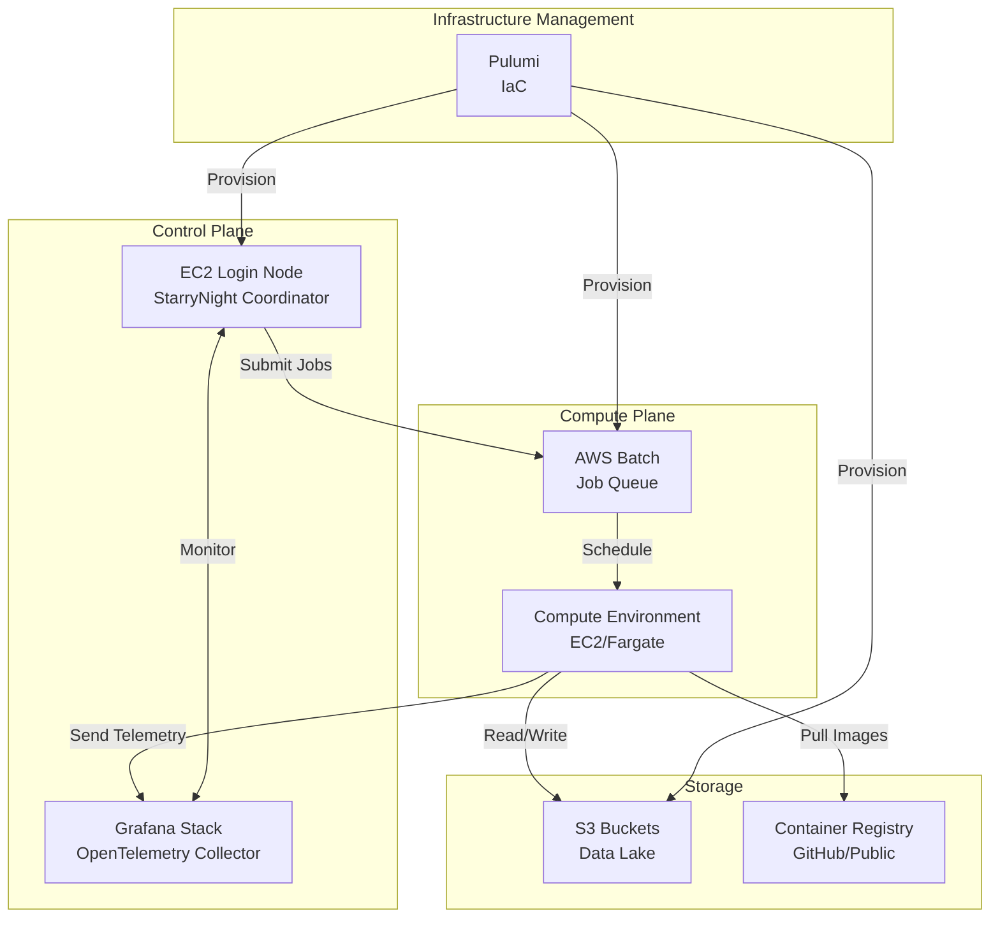

# AWS Deployment Roadmap

This roadmap outlines our 8-week plan to deploy StarryNight on AWS, transitioning from local servers to cloud infrastructure.

## AWS Deployment Architecture

### Core Services

- **AWS Batch**: Orchestrates containerized compute jobs
- **EC2**: Hosts login node for job coordination
- **S3**: Stores data and results
- **Container Registry**: Public registry (GitHub or similar) for images
- **Supporting**: CloudWatch (logs), IAM (access), VPC (networking)

### System Topology

The AWS deployment follows a hub-and-spoke architecture:

### Monthly Costs (excluding compute/storage)

| Service        | Cost        | Notes                       |
| -------------- | ----------- | --------------------------- |
| EC2 Login Node | $30-40      | t3.medium, always-on        |
| CloudWatch     | $10-50      | Varies with job volume      |
| Pulumi         | $0-75       | Free tier likely sufficient |
| **Total**      | **$40-165** | Plus data transfer costs    |

## 8-Week Deployment Plan

### Phase 1: Infrastructure Foundation (Weeks 1-2)

1. Configure Pulumi project structure (team has experience from CytoSkel)
2. Define AWS Batch compute environments
3. Create S3 bucket hierarchy
4. Deploy EC2 login node (24/7 coordinator)

**Key Unknown**: Team has no AWS Batch experience; configuration requirements unclear

### Phase 2: Container Pipeline (Weeks 3-4)

1. Select public container registry
2. Adapt existing CI/CD pipeline for AWS containers
3. Set up builds triggered by CellProfiler releases
4. Test custom CellProfiler wrappers

**Note**: Must maintain custom StarryNight+CellProfiler containers (can't use official)

### Phase 3: Integration Testing (Weeks 5-6)

1. Test job submission pipeline
2. Validate Snakemake → AWS Batch translation
3. Verify OpenTelemetry/Grafana integration
4. Test Snakemake's job recovery features

**Key Risk**: CellProfiler error handling requires custom hooks

### Phase 4: Production Ready (Weeks 7-8)

1. Finalize documentation and runbooks
2. Configure monitoring and alerts
3. Complete VPC/security setup
4. Optimize costs

**Note**: Security hardening deferred (internal users only)

## Configuration Requirements

### User Infrastructure Configuration

Based on planning discussions, users configure infrastructure through the UI:

1. **Module Parameter Exposure**
   - Module authors expose parameters like memory and compute requirements
   - Example from discussion: inventory module exposes `dataset_path` parameter
   - **Proposed**: Modules could expose `memory` or similar resource parameters
   - Backend implementation decides how to handle these parameters
   - **Note**: Specific parameter names and UI interface details TBD

2. **Configuration Flow**
   - UI → Module → Pipeline → AWS Batch job definitions
   - Users cannot directly configure AWS Batch settings
   - Backend determines infrastructure choices (e.g., AWS Batch vs alternatives)

### Job Failure and Restart Procedures

From the planning discussions:

1. **Snakemake Intelligence**
   - Snakemake automatically tracks successful jobs and won't re-run them
   - Only failed or not-yet-run jobs execute on retry
   - Target-based execution model checks for output files

2. **QC Review Points**
   - QC steps implemented as modules that fail by default
   - Human review required before marking as passed
   - After review, job can be manually marked to proceed
   - **Note**: Specific UI for QC approval TBD

3. **Individual Module Re-execution**
   - Each module can be run independently with different parameters
   - Users can modify parameters and re-run specific modules
   - Logs available for each run attempt

### Partial Failure Recovery

Based on the discussion about 90% success / 10% failure scenarios:

1. **Automatic Detection**
   - Snakemake identifies which jobs succeeded vs failed
   - Re-running a pipeline only executes failed jobs
   - **Note**: Specific mechanism for failure detection not fully detailed

2. **Telemetry and Monitoring**
   - OpenTelemetry integration sends logs to central Grafana stack
   - All stdout/stderr piped through telemetry system
   - **Challenge**: CellProfiler containers need custom wrappers for proper error reporting

3. **Resource Adjustment**
   - Failed jobs can be retried with adjusted resources
   - **Note**: UI mechanism for resource adjustment per retry TBD

### Infrastructure Configuration Notes

**Note**: Many specifics remain TBD during implementation.

Potential areas requiring configuration:

- Network setup (VPC, security groups)
- S3 access policies
- IAM permissions
- Compute preferences (spot vs on-demand)

StarryNight manages job execution; IT retains security/cost control.

## Validation Checklist

- [ ] 100-job pipeline test
- [ ] Partial failure recovery
- [ ] Container version switching
- [ ] Telemetry completeness
- [ ] Internal user testing

## Key Risks

| Risk                     | Mitigation             |
| ------------------------ | ---------------------- |
| AWS Batch complexity     | Early proof-of-concept |
| Container maintenance    | Automated builds       |
| Cost overruns            | Monitoring and alerts  |
| CellProfiler integration | Extensive testing      |

## Stakeholder Approval Process

**Note**: This section requires stakeholder input to define the approval process.

### Proposed Review Structure (TBD)

- [ ] Technical review by engineering team
- [ ] Cost review by finance/IT
- [ ] Security review by IT/compliance
- [ ] Final approval by project sponsors

### Open Questions for Stakeholders

1. Who are the key stakeholders for approval?
2. What are the approval criteria?
3. What documentation is required for each review?
4. What is the timeline for reviews?

!!! info "Context from Planning Discussions"

    **IT Team Constraints**: IT team will likely lack bandwidth to implement custom infrastructure solutions. StarryNight must provide a predefined AWS configuration that IT teams can approve with a simple "yes/no" decision, rather than requiring custom backend development.

    **AWS Batch Experience Gap**: The team has no hands-on experience with AWS Batch for scientific workloads. The 8-week timeline is based on theoretical assumptions rather than practical knowledge, creating significant unknown risks.

    **Pulumi Cost Scaling Uncertainty**: Unclear how Pulumi pricing scales with infrastructure complexity (10 vs 1000 compute instances). Monthly costs could exceed projections if Pulumi charges per AWS resource rather than per managed service.

    **Always-On Coordinator Requirements**: StarryNight needs a persistent coordinator node for job submission and state management. Requires dedicated EC2 instance running 24/7; this may introduce infrastructure complexity.

    **Custom Container Maintenance**: Cannot use official CellProfiler containers due to need for custom telemetry and error handling wrappers. StarryNight must maintain its own CellProfiler builds, requiring automated CI/CD pipeline and coordination with CellProfiler releases.

    **CellProfiler Integration Complexity**: CellProfiler doesn't behave like standard command-line tools - unreliable exit codes and inconsistent error reporting in containers. Standard containerization approaches may fail; requires custom error detection and handling mechanisms.

    **Bottom Line**: While the roadmap provides a structured 8-week plan, several critical unknowns could significantly impact timeline and complexity. Early proof-of-concept testing is essential before committing to full deployment.
