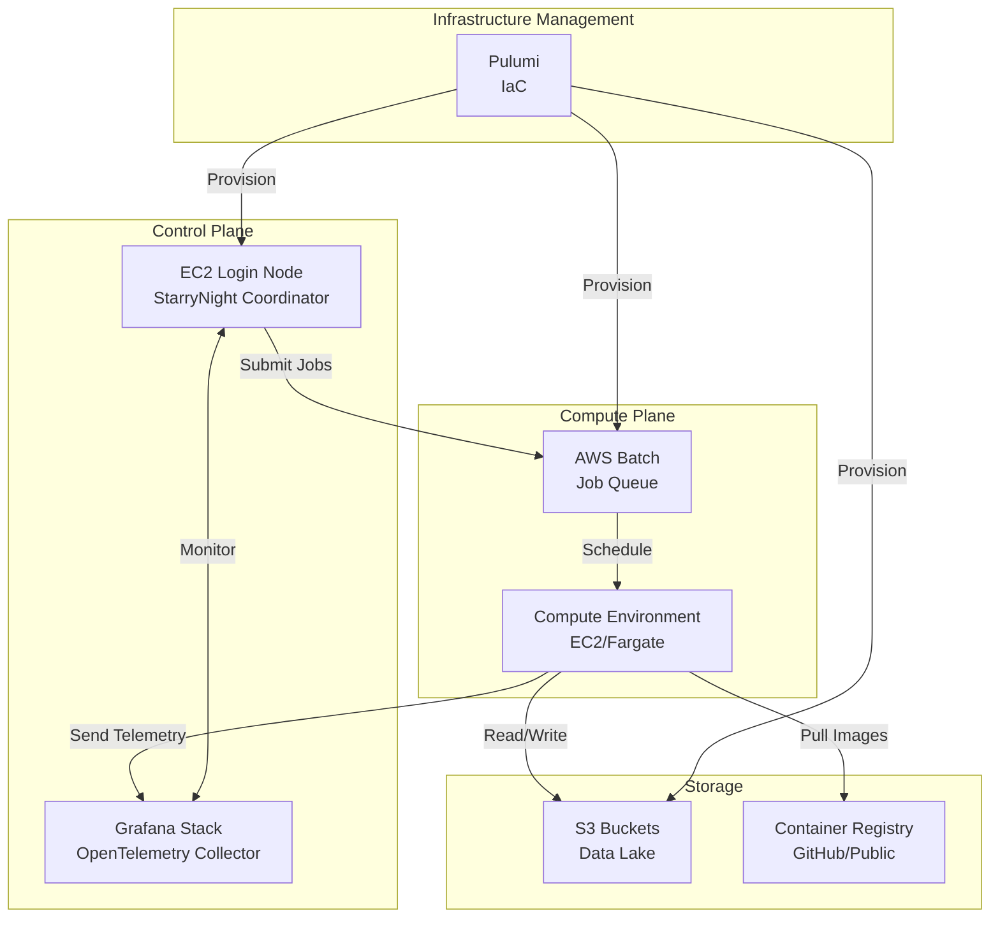

# AWS Deployment Roadmap

This roadmap outlines our 8-week plan to deploy StarryNight on AWS, transitioning from local servers to cloud infrastructure.

## AWS Deployment Architecture

### Core Services

- **AWS Batch**: Orchestrates containerized compute jobs
- **EC2**: Hosts login node for job coordination
- **S3**: Stores data and results
- **Container Registry**: Public registry (GitHub or similar) for images
- **Supporting**: CloudWatch (logs), IAM (access), VPC (networking)

### System Topology

The AWS deployment follows a hub-and-spoke architecture:

### Monthly Costs (excluding compute/storage)

| Service        | Cost        | Notes                       |
| -------------- | ----------- | --------------------------- |
| EC2 Login Node | $30-40      | t3.medium, always-on        |
| CloudWatch     | $10-50      | Varies with job volume      |
| Pulumi         | $0-75       | Free tier likely sufficient |
| **Total**      | **$40-165** | Plus data transfer costs    |

## 8-Week Deployment Plan

### Phase 1: Infrastructure Foundation (Weeks 1-2)

1. Configure Pulumi project structure
2. Define AWS Batch compute environments (targeting Fargate)
3. Create S3 bucket hierarchy
4. Deploy EC2 login node

**Key Unknown**: Optimal AWS Batch configuration for image processing workloads

### Phase 2: Container Pipeline (Weeks 3-4)

1. Select public container registry
2. Set up automated builds triggered by CellProfiler releases
3. Implement independent StarryNight versioning
4. Test build pipeline

**Note**: Automated builds minimize maintenance burden

### Phase 3: Integration Testing (Weeks 5-6)

1. Test job submission pipeline
2. Validate Snakemake → AWS Batch translation
3. Verify telemetry (using StarryNight's built-in system)
4. Run end-to-end workflows

**Key Risk**: CellProfiler error handling in containerized environment

### Phase 4: Production Ready (Weeks 7-8)

1. Finalize documentation and runbooks
2. Configure monitoring and alerts
3. Complete VPC/security setup
4. Optimize costs

**Note**: Security hardening deferred (internal users only)

## Configuration

### Job Resource Configuration

Users set compute resources via the UI, which flows through the system:

UI → Module → Pipeline → AWS Batch job definitions

### Infrastructure Configuration

**Note**: Specific requirements TBD during implementation.

Potential areas:

- Network setup (VPC, security groups)
- S3 access policies
- IAM permissions
- Compute preferences (spot vs on-demand)

StarryNight manages job execution; IT retains security/cost control.

### Failure Handling

Snakemake provides intelligent recovery:

- Successful jobs are never re-run
- Failed jobs can be retried with adjusted resources
- QC steps pause for manual review via dummy modules

## Validation Checklist

- [ ] 100-job pipeline test
- [ ] Partial failure recovery
- [ ] Container version switching
- [ ] Telemetry completeness
- [ ] Internal user testing

## Key Risks

| Risk                     | Mitigation             |
| ------------------------ | ---------------------- |
| AWS Batch complexity     | Early proof-of-concept |
| Container maintenance    | Automated builds       |
| Cost overruns            | Monitoring and alerts  |
| CellProfiler integration | Extensive testing      |
