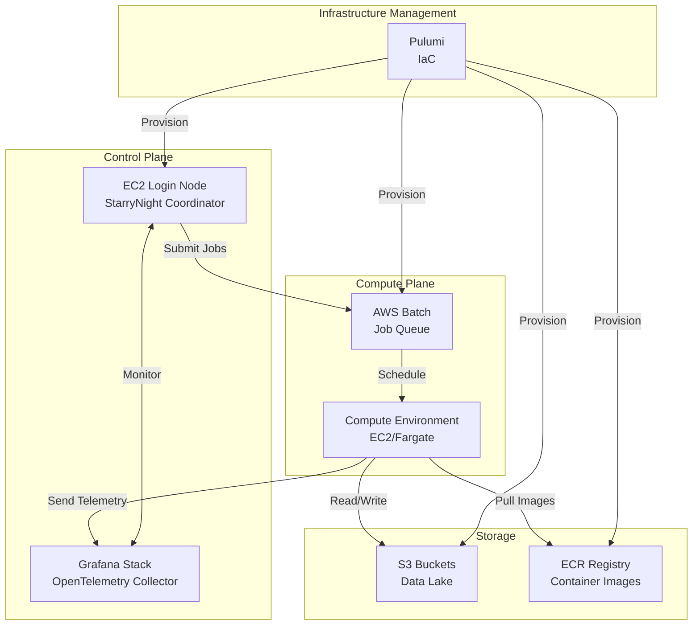

# AWS Deployment Strategic Roadmap

This document outlines the strategic vision and roadmap for deploying StarryNight on AWS. The current MVP operates on local servers, but this roadmap provides confidence in our future cloud deployment plans.

## Document Navigation

This roadmap is structured to address the key concerns of different stakeholders:

| If you are a...         | Start here                                | Then explore               |
| ----------------------- | ----------------------------------------- | -------------------------- |
| Infrastructure engineer | Architecture → Deployment Strategy        | Configuration Requirements |
| IT security team        | Architecture → Configuration Requirements | Cost Analysis              |
| Project manager         | Deployment Strategy → Cost Analysis       | Review Framework           |
| Developer               | Architecture → Configuration Requirements | Deployment Strategy        |

## AWS Deployment Architecture

### Required Services

StarryNight's AWS deployment leverages the following core services:

- **AWS Batch**: Primary compute orchestration service for running containerized workloads
- **EC2**: Login/coordinator node for job submission and state management
- **S3**: Object storage for input data, intermediate results, and final outputs
- **CloudWatch**: Centralized logging and monitoring
- **IAM**: Identity and access management for secure resource access
- **VPC**: Network isolation and security
- **ECR**: Container registry for StarryNight-specific images

### System Topology

The AWS deployment follows a hub-and-spoke architecture:



### Expected Ongoing Costs

Cost breakdown excluding compute and storage:

| Service          | Usage Pattern             | Estimated Monthly Cost | Notes                                  |
| ---------------- | ------------------------- | ---------------------- | -------------------------------------- |
| EC2 (Login Node) | t3.medium, always-on      | $30-40                 | Minimal compute requirements           |
| AWS Batch        | Service fees              | $0                     | No additional charges beyond compute   |
| CloudWatch       | Logs & metrics            | $10-50                 | Depends on job volume                  |
| Data Transfer    | Cross-AZ traffic          | Variable               | Minimize by proper S3 bucket placement |
| Pulumi           | Infrastructure management | $0-75                  | Free tier covers most use cases        |

**Note**: Actual costs will vary based on:

- Number of resources managed by Pulumi (free tier limitations)
- Log retention policies
- Data transfer patterns
- NAT Gateway usage if required

## Deployment Strategy

### Phase 1: Infrastructure Foundation (Weeks 1-2)

**Objectives**: Establish core AWS infrastructure

**Key Activities**:
1. Configure Pulumi project structure
2. Define AWS Batch compute environments
3. Set up VPC and security groups
4. Create S3 bucket hierarchy
5. Deploy EC2 login node

**Pain Points & Decisions**:
- **Unknown**: Optimal AWS Batch configuration for scientific workloads
- **Decision**: EC2 vs Fargate for compute environment
- **Risk**: Limited team experience with AWS Batch at scale

### Phase 2: Container Ecosystem (Weeks 3-4)

**Objectives**: Build and deploy StarryNight container images

**Key Activities**:
1. Set up ECR repositories
2. Build StarryNight + CellProfiler containers
3. Implement automated build pipeline
4. Version tagging strategy

**Pain Points & Decisions**:
- **Maintenance Burden**: Custom containers vs official CellProfiler images
- **Decision**: Nightly build strategy for CellProfiler updates
- **Complexity**: OpenTelemetry integration within containers

### Phase 3: Integration & Telemetry (Weeks 5-6)

**Objectives**: Connect all components and validate telemetry

**Key Activities**:
1. Deploy Grafana stack on EC2
2. Configure OpenTelemetry collectors
3. Test job submission pipeline
4. Validate Snakemake → AWS Batch translation

**Pain Points & Decisions**:
- **Unknown**: OpenTelemetry reliability in distributed environment
- **Challenge**: Log aggregation from ephemeral containers
- **Risk**: CellProfiler error handling and exit codes

### Phase 4: Production Readiness (Weeks 7-8)

**Objectives**: Harden system for production use

**Key Activities**:
1. Security audit and IAM policy refinement
2. Backup and disaster recovery procedures
3. Cost optimization review
4. Documentation and runbooks

**Pain Points & Decisions**:
- **Integration**: Compatibility with institutional security policies
- **Decision**: Multi-region strategy
- **Requirement**: SLA definitions

## Configuration Requirements

### User-Level Configuration

Users configure job resources through module parameters:

```python
# In module definition
class AnalysisModule:
    memory_gb: int = Field(default=8, description="Memory allocation")
    vcpus: int = Field(default=2, description="CPU allocation")
```

These parameters flow through the system:
1. User sets values in UI/CLI
2. Module passes to Pipeline layer
3. Pipeline layer passes to Execution backend
4. Backend maps to AWS Batch job definitions

### Infrastructure Configuration

IT teams must configure:

**Required Settings**:
- VPC CIDR ranges
- Security group rules
- S3 bucket policies
- IAM role permissions

**Optional Overrides**:
- Custom AMIs for compute nodes
- Spot vs on-demand instance mix
- CloudWatch log retention

**Automation Boundary**:
- StarryNight manages: Job definitions, queue management, autoscaling
- IT team manages: Network topology, security policies, cost controls

### Job Failure Handling

StarryNight leverages Snakemake's built-in failure handling:

**Full Pipeline Failure**:
- Snakemake tracks successful outputs
- Re-running automatically skips completed steps
- Failed steps are retried with same parameters

**Partial Failures (e.g., 10% of jobs fail)**:
- Individual job failures tracked via AWS Batch
- Snakemake identifies missing outputs
- User can increase memory/CPU and re-run specific steps

**Manual Intervention Points**:
- QC steps intentionally "fail" to pause pipeline
- User reviews outputs and manually triggers continuation
- State preserved between manual checkpoints

**Example Workflow**:
```bash
# Initial run - 90% succeed, 10% fail due to memory
starrynight run experiment.yaml

# Review failures in Grafana dashboard
# Increase memory for failed jobs
starrynight run experiment.yaml --memory 16

# Only failed jobs re-execute
```

## Research Gaps & Validation Requirements

### Critical Unknowns

1. **AWS Batch Performance**:
   - No production testing completed
   - Unknown: Optimal job size vs overhead tradeoff
   - Required: Benchmark with representative workloads

2. **Container Versioning**:
   - Challenge: Maintaining StarryNight wrappers for multiple CellProfiler versions
   - Unknown: Storage requirements for image registry
   - Required: Automated testing pipeline for new builds

3. **Telemetry at Scale**:
   - Unknown: Grafana performance with 1000+ concurrent jobs
   - Risk: Log loss from short-lived containers
   - Required: Stress testing and fallback strategies

### Validation Milestones

Before production deployment:
- [ ] Run 100-job test pipeline successfully
- [ ] Validate partial failure recovery
- [ ] Test container version switching
- [ ] Confirm telemetry data completeness
- [ ] Security audit by IT team

## Review and Approval Framework

### Stakeholder Review Process

1. **Technical Review** (Week 1):
   - Engineering team validates architecture
   - DevOps confirms infrastructure approach
   - Security team reviews IAM policies

2. **Operational Review** (Week 2):
   - IT evaluates against institutional policies
   - Finance reviews cost projections
   - Legal confirms data governance compliance

3. **User Acceptance** (Week 3):
   - Key users test workflow
   - Documentation review
   - Training plan approval

### Go/No-Go Decision Criteria

**Technical Criteria**:
- [ ] All validation milestones passed
- [ ] Security audit findings addressed
- [ ] Disaster recovery plan tested

**Operational Criteria**:
- [ ] Cost within 20% of projections
- [ ] IT team trained on maintenance
- [ ] Monitoring dashboards operational

**User Criteria**:
- [ ] Performance meets or exceeds local deployment
- [ ] Documentation complete and accurate
- [ ] Support procedures established

### Decision Timeline

- **Week 8**: Technical review complete
- **Week 9**: Operational review complete
- **Week 10**: Final go/no-go decision
- **Week 11-12**: Production deployment (if approved)

## Appendix: Key Risks and Mitigations

| Risk                                      | Impact | Likelihood | Mitigation                     |
| ----------------------------------------- | ------ | ---------- | ------------------------------ |
| AWS Batch complexity higher than expected | High   | Medium     | Early proof-of-concept testing |
| Container maintenance burden              | Medium | High       | Automated build pipeline       |
| Institutional security rejection          | High   | Low        | Early IT engagement            |
| Cost overruns                             | Medium | Medium     | Detailed monitoring and alerts |
| CellProfiler integration issues           | High   | Medium     | Extensive testing framework    |
