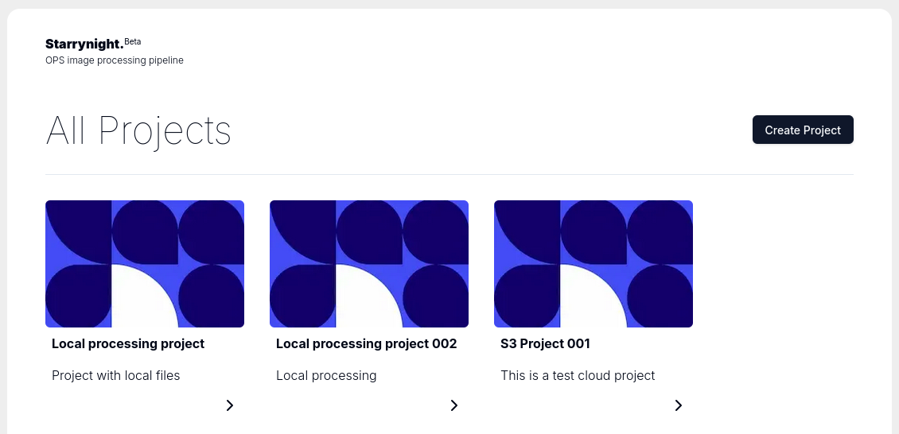
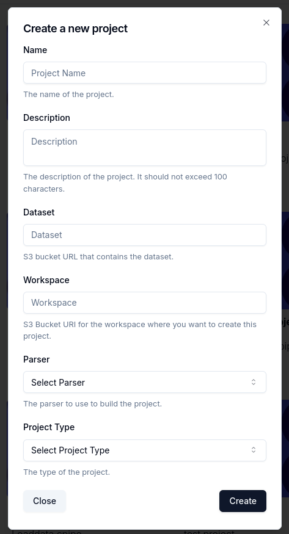

# Creating a Project in starrynight

Go to the starrynight home page and click on the `Create Project` button.

Then fill the details of your project.

- Name: The name of your project.
- Description: A short description of your project.
- Dataset: S3 URL of the dataset. It can also be a local path if you are running starrynight locally.
- Workspace: S3 URL where you want to save intermediate files. It can also be a local path if you are running starrynight locally.
- Parser: Select the appropriate parser according to your dataset file naming convention. More information on individual parsers can be found here.
- Project Type: Select a project template. This will help you setup a default workflow for your project. You can also change this later after project creation.

Click on create project.
