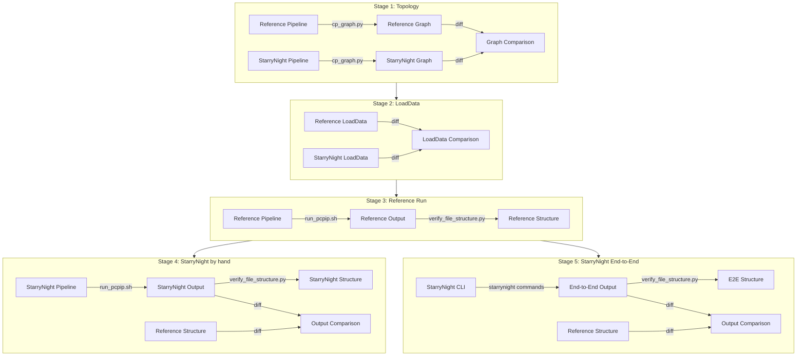

# StarryNight Testing Framework

Welcome to the StarryNight testing framework! This is your comprehensive guide for validating, testing, and creating test fixtures for PCPIP (Pooled Cell Painting Image Processing) workflows.

## Introduction: Why Validation Matters

StarryNight reimagines the Pooled Cell Painting Image Processing (PCPIP) pipeline with a more maintainable architecture, but we must ensure scientific equivalence with the original implementation. The testing framework outlined here provides a systematic approach to verify that StarryNight produces functionally equivalent results to the reference PCPIP pipeline, giving users confidence in the transition.

**What is validation?** In this context, validation means comparing StarryNight outputs against the original PCPIP implementation at multiple levels:

- Pipeline structure comparison
- Output file verification
- Content similarity analysis
- End-to-end workflow execution

Our validation employs progressive testing of individual components before integration, multiple levels of comparison from pipeline structure to final outputs, tolerance for non-critical numerical differences while ensuring functional equivalence, and documentation-driven development with clear, reproducible testing procedures.

> **Core Principle**: The goal is not byte-for-byte identical outputs, but functionally equivalent results that ensure StarryNight delivers the same scientific value as the original PCPIP implementation.

## Getting Started

This guide serves different types of testers. Find your path based on your role:

### I'm new to StarryNight testing

If you're new to the testing framework and want to understand the process:

1. **Start here**: Read the introduction and [Validation Process Overview](#validation-process-overview) sections to understand the big picture
2. Review the [Validation Documents](#validation-documents) section below to see all the pipelines that need validation
3. Look at the [Pipeline 1 (illum_calc) Validation](pipeline-validations/pipeline-1-validation-illum-calc.md) as a concrete example with detailed commands
4. See the [Testing Tools Summary](#testing-tools-summary) for an overview of the available tools

### I need to validate a specific pipeline module

If you need to validate a specific StarryNight module:

1. Check the [Validation Documents](#validation-documents) section below to find the corresponding pipeline
2. Follow the 5-stage validation process outlined in the [Validation Stages](#validation-stages) section
3. Use [Pipeline 1 (illum_calc) Validation](pipeline-validations/pipeline-1-validation-illum-calc.md) as a template

## Reference Materials

The testing framework includes these key resources:

- [**pcpip-pipelines**](assets/pcpip-pipelines/README.md): Reference CellProfiler pipeline files
- [**pcpip-create-fixture**](assets/pcpip-create-fixture/README.md): Tools for creating test fixtures
- [**pcpip-test**](assets/pcpip-test/README.md): Scripts for pipeline execution and comparison

## Testing Environment Setup

Beyond the [standard StarryNight installation](../user/getting-started.md), validation requires additional setup:

### Prerequisites

- **Nix**: For setting up the complete development environment
    - Follow the [standard StarryNight installation](../user/getting-started.md)
- **Additional Tools**:
    - **Graphviz**: For pipeline visualization (`apt install graphviz` or `brew install graphviz`)
    - **cp_graph.py**: For CellProfiler pipeline graph analysis (clone from `https://github.com/shntnu/cp_graph`)
- **AWS Access** (optional): For downloading reference datasets
    - AWS CLI configured with access to `s3://imaging-platform/projects/2024_03_12_starrynight/`
-  **Test Data Alternatives** (if no AWS access):
    - Use the minimal test fixtures in `/docs/tester/assets/pcpip-test/minimal/`

### Test Dataset

Set up the validation dataset:

```sh
# Set up environment
export STARRYNIGHT_REPO="$(git rev-parse --show-toplevel)"
mkdir -p ${STARRYNIGHT_REPO}/scratch

# Download test fixture (if you have AWS access)
aws s3 sync s3://imaging-platform/projects/2024_03_12_starrynight/starrynight_example_input ${STARRYNIGHT_REPO}/scratch/starrynight_example_input

# Create validation workspace
mkdir -p ${STARRYNIGHT_REPO}/scratch/starrynight_example_output/workspace/validation
```

### Common Environment Variables

Use these in all validation scripts:

```sh
# Base directories
export STARRYNIGHT_REPO="$(git rev-parse --show-toplevel)"
export WKDIR="${STARRYNIGHT_REPO}/scratch/starrynight_example_output/workspace"
export VALIDATION_DIR="${WKDIR}/validation"

# Reference locations (common across validations)
export REF_PIPELINES="${STARRYNIGHT_REPO}/docs/tester/assets/pcpip-pipelines"
```

See individual validation documents for pipeline-specific variables.

## Validation Process Overview

The following diagram illustrates the 5-stage validation process and the key tools used at each stage:




## Validation Stages

### Stage 1: Pipeline Graph Topology Validation
- **Objective**: Verify that StarryNight pipelines have identical module dependency graphs compared to PCPIP
- **Approach**:
    - Use `cp_graph.py` to convert CellProfiler pipeline JSONs to DOT graph files
    - Compare generated DOT files against reference graphs in `_ref_graph_format/dot`
    - Validate module connections, data flow, and overall structure
- **Success Criteria**: Graph structural equivalence without requiring identical module settings

### Stage 2: LoadData CSV Generation Validation
- **Objective**: Ensure StarryNight generates compatible LoadData CSV files
- **Approach**:
    - Generate LoadData CSVs using StarryNight
    - Compare against reference LoadData CSVs using `compare_structures.py`
    - Validate CSV structure, headers, and key metadata fields
- **Success Criteria**: Functionally equivalent CSV files (allowing for formatting differences)

### Stage 3: Reference Pipeline Execution
- **Objective**: Run reference pipelines with reference LoadData and capture outputs
- **Approach**:
    - Execute reference CellProfiler pipelines using command-line invocation
    - Use `run_pcpip.sh` script to orchestrate multi-stage pipeline execution
    - Capture all outputs and file structures
- **Success Criteria**: Successful execution of all pipeline stages with expected outputs

### Stage 4: StarryNight Pipeline Execution
- **Objective**: Run StarryNight-generated pipelines with reference LoadData
- **Approach**:
    - Execute StarryNight-generated CellProfiler pipelines with identical inputs
    - Compare outputs against reference using `verify_file_structure.py` and `compare_structures.py`
    - Iterate on pipelines until outputs match
- **Success Criteria**: Outputs that match reference results (allowing for numerical differences)

### Stage 5: StarryNight End-to-End Testing
- **Objective**: Validate complete StarryNight workflow including orchestration
- **Approach**:
    - Execute StarryNight's CellProfiler invocation with StarryNight-generated LoadData
    - Compare against reference outputs
    - Iterate on orchestration system until outputs match
- **Success Criteria**: End-to-end process produces equivalent results to reference

## Validation Documents

Currently, a validation document has been created only for [Pipeline 1: illum_calc](pipeline-validations/pipeline-1-validation-illum-calc.md). To create validation documents for other pipelines, use this as a template and adjust the pipeline-specific details accordingly.

Here are the reference CellProfiler pipelines and their StarryNight module counterparts:

- `ref_1_CP_Illum.cppipe` → `illum_calc`
- `ref_2_CP_Apply_Illum.cppipe` → `illum_apply`
- `ref_3_CP_SegmentationCheck.cppipe` → `segcheck`
- `ref_5_BC_Illum.cppipe` → REFACTORING
- `ref_6_BC_Apply_Illum.cppipe` → REFACTORING
- `ref_7_BC_Preprocess.cppipe` → `preprocess`
- `ref_9_Analysis.cppipe` → `analysis`

## Validation Strategy and Success Criteria

To ensure StarryNight can confidently replace the original PCPIP implementation, our validation approach:

- **Tracks progress** through GitHub issues (one per pipeline) linked to detailed documentation, where issues serve as discussion forums while validation documents contain the actual technical details and results
- **Uses a balanced test fixture** from `/docs/tester/assets/pcpip-create-fixture` that's small yet representative
- **Defines success** through:
    - Structural equivalence: Identical data flow between modules
    - Functional equivalence: Comparable outputs (with acceptable numerical differences)
    - Reproducibility: Consistent results across executions
    - Traceability: Clear documentation of validation results

The goal isn't byte-for-byte identical outputs, but functionally equivalent results that deliver the same scientific value with improved maintainability and extensibility.

> **Testing Framework Roadmap**: `compare_structures.py` should be modified to allow direct comparison of LoadData CSVs and specify exact files to compare, `run_pcpip.sh` should be updated to accept the output base path as a parameter and pipeline paths as parameters or standardize locations of StarryNight pipelines for symmetry.

## Testing Tools Summary

The validation process uses these key tools:

| Tool                         | Purpose                                            | Source                                                   | Used In    |
| ---------------------------- | -------------------------------------------------- | -------------------------------------------------------- | ---------- |
| **cp_graph.py**              | Creates graph visualizations of pipeline structure | [External repo](https://github.com/shntnu/cp_graph)      | Stage 1    |
| **verify_file_structure.py** | Validates output file existence and structure      | [pcpip-test](assets/pcpip-test/verify_file_structure.py) | Stages 3-5 |
| **compare_structures.py**    | Compares output structures for differences         | [pcpip-test](assets/pcpip-test/compare_structures.py)    | Stages 4-5 |
| **run_pcpip.sh**             | Executes CellProfiler pipeline workflows           | [pcpip-test](assets/pcpip-test/run_pcpip.sh)             | Stage 3-4  |
