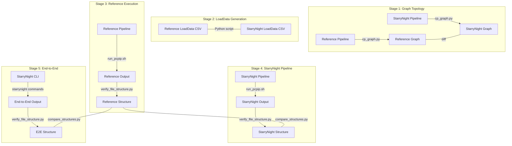

# StarryNight Testing Framework

Welcome to the StarryNight testing framework! This is your comprehensive guide for validating, testing, and creating test fixtures for PCPIP (Pooled Cell Painting Image Processing) workflows.

## Introduction: Why Validation Matters

StarryNight reimagines the Pooled Cell Painting Image Processing (PCPIP) pipeline with a more maintainable architecture, but we must ensure scientific equivalence with the original implementation. The testing framework outlined here provides a systematic approach to verify that StarryNight produces functionally equivalent results to the reference PCPIP pipeline, giving users confidence in the transition.

**What is validation?** In this context, validation means comparing StarryNight outputs against the original PCPIP implementation at multiple levels:
- Pipeline structure comparison
- Output file verification
- Content similarity analysis
- End-to-end workflow execution

Our validation follows these key principles:

1. **Progressive Testing**: We validate each component individually before testing them together
2. **Multiple Levels of Comparison**: From pipeline structure to final outputs
3. **Tolerance for Non-Critical Differences**: Accept numerical differences while ensuring functional equivalence
4. **Documentation-Driven Development**: Clear testing procedures that can be reproduced by anyone

> **Core Principle**: The goal is not byte-for-byte identical outputs, but functionally equivalent results that ensure StarryNight delivers the same scientific value as the original PCPIP implementation.

## Getting Started

This guide serves different types of testers. Find your path based on your role:

### I'm new to StarryNight testing

If you're new to the testing framework and want to understand the process:

1. **Start here**: Read the introduction and "Validation Process Overview" sections to understand the big picture
2. Look at the [Pipeline Validation Overview](pipeline-validations/pipeline-validation-overview.md) to see all the pipelines that need validation
3. Review [Pipeline 1 (illum_calc) Validation](pipeline-validations/pipeline-1-validation-illum-calc.md) as a concrete example with detailed commands
4. See the "Testing Tools Summary" for an overview of the available tools

### I need to validate a specific pipeline module

If you need to validate a specific StarryNight module:

1. Check the [Pipeline Validation Overview](pipeline-validations/pipeline-validation-overview.md) to find the corresponding pipeline
2. Follow the 5-stage validation process outlined in the "Validation Stages" section below
3. Use [Pipeline 1 (illum_calc) Validation](pipeline-validations/pipeline-1-validation-illum-calc.md) as a template
4. Create a new validation document for your module following the same structure

### I'm developing new validation tools

If you're developing tools for the testing framework:

1. Understand the existing tools in the "Testing Tools Summary" at the end of this document
2. Review the "Reference Assets" section to understand available test fixtures
3. Follow the modular structure of existing tools for compatibility

## Reference Materials

The testing framework includes these key resources:

- [**Pipeline Validations**](pipeline-validations/pipeline-validation-overview.md): Detailed procedures for each pipeline
- [**pcpip-pipelines**](assets/pcpip-pipelines/README.md): Reference CellProfiler pipeline files
- [**pcpip-create-fixture**](assets/pcpip-create-fixture/README.md): Tools for creating test fixtures
- [**pcpip-test**](assets/pcpip-test/README.md): Scripts for pipeline execution and comparison

> **How We Track Validation Progress**: Each pipeline validation has a corresponding GitHub issue that links to the detailed documentation. The issue tracks high-level progress with checkboxes, while the documentation contains all technical details, results, and discrepancies. This approach separates discussion (in issues) from reference documentation (in markdown files).

## Testing Environment Setup

Beyond the [standard StarryNight installation](../getting-started/installation.md), validation requires additional setup:

### Testing Prerequisites

- **Standard Dependencies**: Complete the [StarryNight installation](../getting-started/installation.md)
- **Testing Tools**:
    - Graphviz (`sudo apt install graphviz` or `brew install graphviz`)
    - [cp_graph.py](https://github.com/shntnu/cp_graph) (used for pipeline structure comparison)
    - Python libraries: `matplotlib`, `networkx` (for visualization)

### Test Dataset

Set up the validation dataset:

```bash
# Set up environment
export STARRYNIGHT_REPO="$(git rev-parse --show-toplevel)"
mkdir -p ${STARRYNIGHT_REPO}/scratch

# Download test fixture (if you have AWS access)
aws s3 sync s3://imaging-platform/projects/2024_03_12_starrynight/starrynight_example_input ${STARRYNIGHT_REPO}/scratch/starrynight_example_input

# Create validation workspace
mkdir -p ${STARRYNIGHT_REPO}/scratch/starrynight_example_output/workspace/validation
```

### Common Environment Variables

Use these in all validation scripts:

```bash
# Base directories
export STARRYNIGHT_REPO="$(git rev-parse --show-toplevel)"
export WKDIR="${STARRYNIGHT_REPO}/scratch/starrynight_example_output/workspace"
export VALIDATION_DIR="${WKDIR}/validation"

# Reference locations (common across validations)
export REF_PIPELINES="${STARRYNIGHT_REPO}/docs/tester/assets/pcpip-pipelines"
```

See individual validation documents for pipeline-specific variables.

## Validation Process Overview

The following diagram illustrates the 5-stage validation process and the key tools used at each stage:



## Validation Stages

### Stage 1: Pipeline Graph Topology Validation
- **Objective**: Verify that StarryNight pipelines have identical module dependency graphs compared to PCPIP
- **Approach**:
    - Use `cp_graph.py` to convert CellProfiler pipeline JSONs to DOT graph files
    - Compare generated DOT files against reference graphs in `_ref_graph_format/dot`
    - Validate module connections, data flow, and overall structure
- **Success Criteria**: Graph structural equivalence without requiring identical module settings

### Stage 2: LoadData CSV Generation Validation
- **Objective**: Ensure StarryNight generates compatible LoadData CSV files
- **Approach**:
    - Generate LoadData CSVs using StarryNight
    - Compare against reference LoadData CSVs using `compare_structures.py`
    - Validate CSV structure, headers, and key metadata fields
- **Success Criteria**: Functionally equivalent CSV files (allowing for formatting differences)

### Stage 3: Reference Pipeline Execution
- **Objective**: Run reference pipelines with reference LoadData and capture outputs
- **Approach**:
    - Execute reference CellProfiler pipelines using command-line invocation
    - Use `run_pcpip.sh` script to orchestrate multi-stage pipeline execution
    - Capture all outputs and file structures
- **Success Criteria**: Successful execution of all pipeline stages with expected outputs

### Stage 4: StarryNight Pipeline Execution
- **Objective**: Run StarryNight-generated pipelines with reference LoadData
- **Approach**:
    - Execute StarryNight-generated CellProfiler pipelines with identical inputs
    - Compare outputs against reference using `verify_file_structure.py` and `compare_structures.py`
    - Iterate on pipelines until outputs match
- **Success Criteria**: Outputs that match reference results (allowing for numerical differences)

### Stage 5: StarryNight End-to-End Testing
- **Objective**: Validate complete StarryNight workflow including orchestration
- **Approach**:
    - Execute StarryNight's CellProfiler invocation with StarryNight-generated LoadData
    - Compare against reference outputs
    - Iterate on orchestration system until outputs match
- **Success Criteria**: End-to-end process produces equivalent results to reference


## Issue Tracking

- One GitHub issue will be created for each of the 7 CellProfiler pipelines
- Issues will link to the documentation and track high-level progress
- Issues provide a place for discussions while documentation provides detailed procedures
- Each issue will use a simple template that refers to the detailed documentation

## Test Dataset

We'll use the test fixture created in `/docs/tester/assets/pcpip-create-fixture` as our reference dataset. This provides a balance between:

- Being small enough for efficient testing
- Being representative enough to validate all features
- Having clear expected outputs for validation

## Success Factors

- **Structural Equivalence**: Maintaining identical data flow between modules
- **Functional Equivalence**: Producing comparable outputs (allowing for numerical differences)
- **Reproducibility**: Consistent results across executions
- **Traceability**: Clear documentation of validation results and issues

The goal is not byte-for-byte identical outputs, but functionally equivalent results that ensure StarryNight delivers the same scientific value as the original PCPIP implementation while providing a more maintainable and extensible architecture.

## Conclusion

Thorough validation is essential to ensure StarryNight can confidently replace the original PCPIP implementation. By following this structured approach, we build trust in the new architecture while preserving the scientific integrity of the pipeline.

For questions or suggestions about the testing framework, please create a GitHub issue or reach out to the team directly.

> **Documentation Roadmap**: Future documentation improvements should include alternative test data sources for users without AWS access, environment verification commands to ensure proper setup, troubleshooting guidance for common issues, time and resource estimates for validation stages, standardized reporting templates for results, examples for all seven pipeline validations, and instructions for integrating validation into CI/CD workflows.

## Testing Tools Summary

The validation process uses these key tools:

| Tool                         | Purpose                                            | Source                                                   | Used In    |
| ---------------------------- | -------------------------------------------------- | -------------------------------------------------------- | ---------- |
| **cp_graph.py**              | Creates graph visualizations of pipeline structure | [External repo](https://github.com/shntnu/cp_graph)      | Stage 1    |
| **verify_file_structure.py** | Validates output file existence and structure      | [pcpip-test](assets/pcpip-test/verify_file_structure.py) | Stages 3-5 |
| **compare_structures.py**    | Compares output structures for differences         | [pcpip-test](assets/pcpip-test/compare_structures.py)    | Stages 4-5 |
| **run_pcpip.sh**             | Executes CellProfiler pipeline workflows           | [pcpip-test](assets/pcpip-test/run_pcpip.sh)             | Stage 3-4  |

> **Note**: For detailed usage instructions and examples, see the [Pipeline 1 Validation](pipeline-validations/pipeline-1-validation-illum-calc.md) document, which contains concrete examples of each tool in action.
