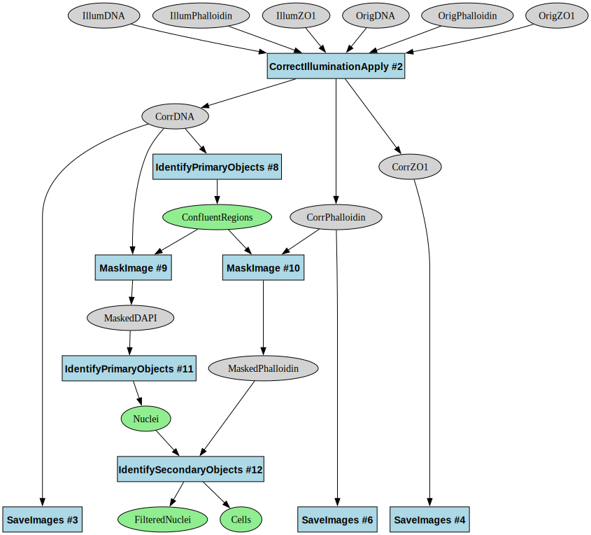

# PCPIP Pipeline Automation Analysis

This document explores the value and limitations of automating CellProfiler pipeline generation for the next generation of Pooled Cell Painting Image Processing (PCPIP). It explains different module types, their customization requirements, and the overall importance of programmatic pipeline creation.

## Pipeline Structure Overview

The PCPIP workflow consists of two parallel tracks followed by integrated analysis:

1. **Cell Painting Track** (Pipelines 1-4): Processes morphological channels (e.g., DNA, Phalloidin, ZO1)
2. **Barcoding Track** (Pipelines 5-8): Processes genetic barcode channels (DAPI, A, C, G, T)
3. **Combined Analysis** (Pipeline 9): Integrates phenotype and genotype data

## Module Customization Categories

Pipeline modules can be categorized into five distinct types based on their customization requirements (see diagrams below for reference):

### 1. Base-Times-Cycle Barcoding Modules

**Description:**

> Related to barcoding - one module in the pipeline per base-times-cycle (like saving out each channel)

- Modules that repeat once per base per cycle
- Highly repetitive with minor variations in channel references
- Most tedious to manually configure

**Specific Examples:**

- Pipeline 6 (BC_Apply_Illum): `SaveImages` modules. Module count = A,T,G,C,DAPI x # cycles

**Automation Value:** High for initial creation, but moderate overall since there are finite cycle counts (3-12)

### 2. All-Cycles-In-One Barcoding Modules

> Related to barcoding - module occurs once (or once per channel) in the pipeline, but needs to have all cycles listed (like when we take a standard-deviation-projection-across-cycles) in the module settings

**Description:**

- Modules that appear once but list all cycles in their settings
- Need updates to all cycle references when cycle count changes

**Specific Examples:**

- Pipeline 6 (BC_Apply_Illum): `CorrectIlluminationApply` modules. Module count = A,T,G,C,DAPI. Setting count/module = # cycles
- Pipeline 7 (BC_Preprocess): `CompensateColors` module. Module count = 1. Setting count/module = A,T,G,C,DAPI x # cycles.

**Automation Value:** High for maintenance, but again limited by finite cycle count range

### 3. Cycle-Count-Parameter Barcoding Modules

> Related to barcoding - module occurs only once in the pipeline and is generally unconcerned with the number of cycles (like barcode spot detection or actual barcode calling, where "number of cycles" is just a single setting you give an int value for)

**Description:**

- Modules with a single cycle count parameter
- Simple to update manually (just changing a number)

**Specific Examples:**

- Pipeline 9 (Analysis): `CallBarcodes` module. Module count = 1. Setting count/module = 1.

**Automation Value:** Low - these are trivial to update manually

### 4. Phenotype Measurement Modules

> Related to phenotype image measurement - need to adjust for number and name of channels each experiment, but otherwise more-or-less-invariant (all measurements, phenotype illum correction)

**Description:**

- Need adjustment for channel names but follow standard patterns
- Consistent structure across experiments
- CellProfiler often catches configuration errors

**Specific Examples:**

- Pipeline 2 (CP_Apply_Illum): `CorrectIlluminationApply` modules. Module count = # channels.
- Pipeline 9 (Analysis): `MeasureObjectIntensity` modules. Module count = 1. Setting count/module = # channels.

**Automation Value:** Moderate - useful templates but easy to manually adjust

### 5. Phenotype Segmentation Modules

> Related to phenotype segmentation - need to adjust for name of channels but also highly likely to need individual tuning each time

**Description:**

- Require expert tuning for each experiment
- Highly variable based on cell types and imaging conditions
- Need human review and adjustment

**Specific Examples:**

- Pipeline 2 (CP_Apply_Illum): `IdentifyPrimaryObjects` module with manually tuned diameter ranges and thresholding methods
- Pipeline 9 (Analysis): `IdentifySecondaryObjects` module for cell segmentation that uses nuclei as seeds

**Automation Value:** Low - human expertise required regardless of automation

## Conclusion on Automation Priority

While automating pipeline generation would be beneficial, particularly for repetitive cycle-specific configurations, it's not a critical priority given:

1. **Bounded Problem Space:** The finite range of cycle counts (3-12) means templates for common configurations can cover most use cases.
2. **Existing Resources:** Pipelines for most common cycle counts already exist and can be adapted.
3. **Human Expertise Requirement:** The most complex pipeline elements require expert tuning regardless of automation.
4. **Reasonable Manual Effort:** Modifying pipelines for a new experiment typically takes only a couple of hours of work.
5. **Higher-Value Automation Targets:** Other areas offer greater automation benefits:
      - File-to-LoadData parsing
      - Workflow step chaining
      - QC report generation
      - Computing resource orchestration

## Addendum: Pipeline Diagrams

Pipeline 2 (CP_Apply_Illum)

Pipeline 6 (BC_Apply_Illum)

Pipeline 7 (BC_Preprocess)

Pipeline 9 (Analysis)

