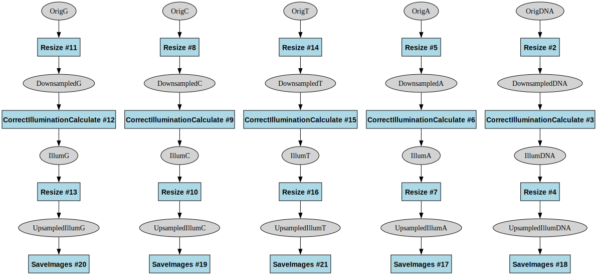
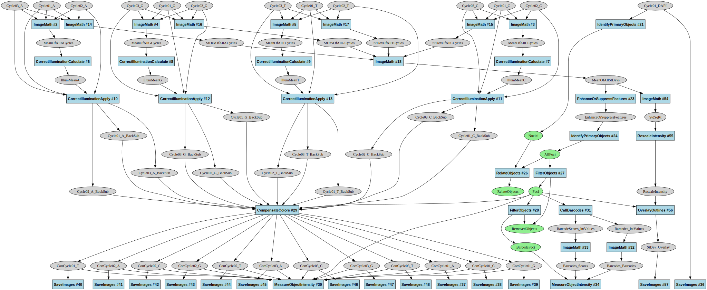

# PCPIP Pipeline Automation Analysis

This document explores the value and limitations of automating CellProfiler pipeline generation for the next generation of Pooled Cell Painting Image Processing (PCPIP). It explains different module types, their customization requirements, and the overall importance of programmatic pipeline creation.

## Pipeline Structure Overview

The PCPIP workflow consists of two parallel tracks followed by integrated analysis:

1. **Cell Painting Track** (Pipelines 1-4): Processes morphological channels (e.g., DNA, Phalloidin, ZO1)
2. **Barcoding Track** (Pipelines 5-8): Processes genetic barcode channels (DAPI, A, C, G, T)
3. **Combined Analysis** (Pipeline 9): Integrates phenotype and genotype data

## Module Customization Categories

Pipeline modules can be categorized into five distinct types based on their customization requirements (see diagrams below for reference):

### 1. Base-Times-Cycle Barcoding Modules

**Description:**

- Modules that repeat once per base per cycle (e.g., SaveImages for each A, C, G, T, DAPI channel in every cycle)
- Highly repetitive with minor variations in channel references
- Most tedious to manually configure

**Specific Examples:**

- Pipeline 5 (BC_Illum): SaveImages modules #17, #18, #19, #20, #21 (for each cycle's illumination functions)
- Pipeline 6 (BC_Apply_Illum): CorrectIlluminationApply modules #1, #6, #11, #16, #21 (one for each cycle's DAPI)
- Pipeline 6 (BC_Apply_Illum): SaveImages modules #3, #8, #13, #18, #23 (saving corrected images for cycle-specific channels)

**Automation Value:** High for initial creation, but moderate overall since there are finite cycle counts (3-12)

### 2. All-Cycles-In-One Barcoding Modules

**Description:**

- Modules that appear once but list all cycles in their settings
- Need updates to all cycle references when cycle count changes
- Examples include standard deviation projection or color compensation modules

**Specific Examples:**

- Pipeline 7 (BC_Preprocess): CompensateColors module #25 takes multiple cycle inputs (Cycle01_T_BackSub, Cycle02_T_BackSub, etc.)
- Pipeline 7 (BC_Preprocess): ImageMath modules #2, #5, #6, #18 that perform operations across cycles
- Pipeline 7 (BC_Preprocess): RelateObjects module #26 that relates nuclei to barcode spots across cycles

**Automation Value:** High for maintenance, but again limited by finite cycle count range

### 3. Cycle-Count-Parameter Barcoding Modules

**Description:**

- Modules with a single cycle count parameter
- Simple to update manually (just changing a number)
- Examples include barcode calling modules

**Specific Examples:**

- Pipeline 7 (BC_Preprocess): FilterObjects module #27 with filtering based on cycle count
- Pipeline 9 (Analysis): CallBarcodes module #51 with a "Number of cycles" parameter that needs a single integer value
- Pipeline 9 (Analysis): MeasureObjectIntensity modules that process data from a specified cycle count

**Automation Value:** Low - these are trivial to update manually

### 4. Phenotype Measurement Modules

**Description:**

- Need adjustment for channel names but follow standard patterns
- Consistent structure across experiments
- CellProfiler often catches configuration errors

**Specific Examples:**

- Pipeline 9 (Analysis): MeasureObjectIntensity modules #40, #50, #55, #58 that measure intensity in phenotype channels
- Pipeline 9 (Analysis): MeasureTexture module #63 that needs channel-specific references
- Pipeline 9 (Analysis): MeasureObjectSizeShape module #46 that works consistently regardless of channel configuration

**Automation Value:** Moderate - useful templates but easy to manually adjust

### 5. Phenotype Segmentation Modules

**Description:**

- Require expert tuning for each experiment
- Highly variable based on cell types and imaging conditions
- Need human review and adjustment

**Specific Examples:**

- Pipeline 2 (CP_Apply_Illum): IdentifyPrimaryObjects module with manually tuned diameter ranges and thresholding methods
- Pipeline 9 (Analysis): IdentifyPrimaryObjects module #17 for nuclei segmentation with threshold settings
- Pipeline 9 (Analysis): IdentifySecondaryObjects module #20 for cell segmentation that uses nuclei as seeds

**Automation Value:** Low - human expertise required regardless of automation

## Pipeline Diagrams

*Pipeline 2 (CP_Apply_Illum) demonstrates Type 5 phenotype segmentation modules that require expert tuning. It applies illumination correction to Cell Painting images, then performs nuclei and cell segmentation with carefully adjusted size and threshold parameters that are experiment-specific and cannot be easily templated.*

*Pipeline 5 (BC_Illum) demonstrates Type 1 repetitive modules, with parallel processing chains for each barcoding channel (A, C, G, T, DAPI). Each channel follows an identical pattern of Resize → CorrectIlluminationCalculate → Resize → SaveImages, differing only in channel references.*

*Pipeline 6 (BC_Apply_Illum) exemplifies Type 1 modules with numerous cycle-specific CorrectIlluminationApply modules (#1, #6, #11, #16, #21). The repetitive pattern requires a separate correction module and SaveImages module for each channel in each cycle, resulting in a highly repetitive structure that would benefit from templating.*

*Pipeline 7 (BC_Preprocess) illustrates Type 2 modules through its central CompensateColors module (#25), which requires inputs from all cycles (all Cycle01_*, Cycle02_*, Cycle03_* BackSub images). The module takes these multiple inputs and processes them together, requiring updates to all references when cycle count changes.*

*Pipeline 9 (Analysis) showcases multiple module types: Type 3 modules like CallBarcodes (#51) with simple cycle count parameters, Type 4 measurement modules like MeasureObjectIntensity (#40, #50, #55, #58) that need channel name updates, and Type 5 segmentation modules like IdentifyPrimaryObjects (#17) that require expert tuning for each experiment.*

## Assessment of Automation Value

### For Type 1 & 2 (Repetitive cycle-specific modules):

- **Challenge:** Most tedious to manually configure
- **Mitigating Factor:** Finite set of cycle counts (3-12)
- **Solution:** Create templates once for each possible cycle count (10 options)
- **Practical Impact:** With templates for common cycle counts, this becomes manageable

### For Type 3 (Simple cycle count parameters):

- **Challenge:** Minimal - just updating a single number
- **Practical Impact:** Takes seconds to manually adjust, automation provides little benefit

### For Type 4 (Phenotype measurement modules):

- **Challenge:** Moderate - need channel name updates
- **Mitigating Factor:** CellProfiler provides error checking
- **Solution:** Simple templates with channel name placeholders
- **Practical Impact:** Low to moderate effort to manually customize

### For Type 5 (Phenotype segmentation modules):

- **Challenge:** High - requires expertise and experimentation
- **Mitigating Factor:** Automation cannot replace human expertise
- **Practical Impact:** Automation offers limited value as human tuning is essential

## Conclusion on Automation Priority

While automating pipeline generation would be beneficial, particularly for repetitive cycle-specific configurations, it's not a critical priority given:

1. **Bounded Problem Space:** The finite range of cycle counts (3-12) means templates for common configurations can cover most use cases.
2. **Existing Resources:** Pipelines for most common cycle counts already exist and can be adapted.
3. **Human Expertise Requirement:** The most complex pipeline elements require expert tuning regardless of automation.
4. **Reasonable Manual Effort:** Modifying pipelines for a new experiment typically takes only a couple of hours of work.
5. **Higher-Value Automation Targets:** Other areas offer greater automation benefits:
   - File-to-LoadData parsing
   - Workflow step chaining
   - QC report generation
   - Computing resource orchestration

This analysis provides a balanced view of where automation efforts would be most valuable in the PCPIP pipeline ecosystem, prioritizing workflow orchestration and QC over pipeline generation.
