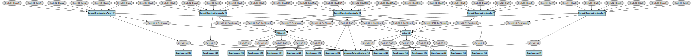
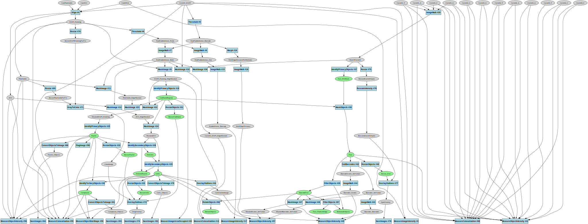

# PCPIP Pipeline Automation Analysis

This document explores the value and limitations of automating CellProfiler pipeline generation for the next generation of Pooled Cell Painting Image Processing (PCPIP). It explains the expert assessment of different module types, their customization requirements, and the overall importance of programmatic pipeline creation.

## Pipeline Structure Overview

The PCPIP workflow consists of two parallel tracks followed by integrated analysis:

1. **Cell Painting Track** (Pipelines 1-4): Processes morphological channels (e.g., DNA, Phalloidin, ZO1)
2. **Barcoding Track** (Pipelines 5-8): Processes genetic barcode channels (DAPI, A, C, G, T)
3. **Combined Analysis** (Pipeline 9): Integrates phenotype and genotype data

## Module Customization Categories

The expert categorizes pipeline modules into five distinct types based on their customization requirements:

### 1. Base-Times-Cycle Barcoding Modules

**Description:**
- Modules that repeat once per base per cycle (e.g., SaveImages for each A, C, G, T, DAPI channel in every cycle)
- Highly repetitive with minor variations in channel references
- Most tedious to manually configure

**Example Pipeline:**
- Pipeline 6 (BC_Apply_Illum) contains multiple CorrectIlluminationApply modules - one for each base in each cycle

**Automation Value:** High for initial creation, but moderate overall since there are finite cycle counts (3-12)

### 2. All-Cycles-In-One Barcoding Modules

**Description:**
- Modules that appear once but list all cycles in their settings
- Need updates to all cycle references when cycle count changes
- Examples include standard deviation projection or color compensation modules

**Example Pipeline:**
- Pipeline 7 (BC_Preprocess) includes CompensateColors module (#25) that needs references to all cycle images

**Automation Value:** High for maintenance, but again limited by finite cycle count range

### 3. Cycle-Count-Parameter Barcoding Modules

**Description:**
- Modules with a single cycle count parameter
- Simple to update manually (just changing a number)
- Examples include barcode calling modules

**Example Pipeline:**
- Pipeline 9 (Analysis) includes CallBarcodes module with simple cycle count parameter

**Automation Value:** Low - these are trivial to update manually

### 4. Phenotype Measurement Modules

**Description:**
- Need adjustment for channel names but follow standard patterns
- Consistent structure across experiments
- CellProfiler often catches configuration errors

**Example Pipeline:**
- Pipeline 9 (Analysis) includes MeasureObjectIntensity modules for phenotype channels

**Automation Value:** Moderate - useful templates but easy to manually adjust

### 5. Phenotype Segmentation Modules

**Description:**
- Require expert tuning for each experiment
- Highly variable based on cell types and imaging conditions
- Need human review and adjustment

**Example Pipeline:**
- Pipeline 9 (Analysis) includes IdentifyPrimaryObjects modules with experiment-specific threshold settings

**Automation Value:** Low - human expertise required regardless of automation

## Pipeline diagrams

*Pipeline 6 shows the repetitive nature of cycle-specific modules. Each channel in each cycle needs its own processing modules.*

*Pipeline 7 shows the complex CompensateColors module (#25) that requires inputs from all cycles.*

*Pipeline 9 integrates both tracks with measurement modules for phenotype channels.*

## Expert Assessment of Automation Value

### For Type 1 & 2 (Repetitive cycle-specific modules):
- **Challenge:** Most tedious to manually configure
- **Mitigating Factor:** Finite set of cycle counts (3-12)
- **Solution:** Create templates once for each possible cycle count (10 options)
- **Practical Impact:** With templates for common cycle counts, this becomes manageable

### For Type 3 (Simple cycle count parameters):
- **Challenge:** Minimal - just updating a single number
- **Practical Impact:** Takes seconds to manually adjust, automation provides little benefit

### For Type 4 (Phenotype measurement modules):
- **Challenge:** Moderate - need channel name updates
- **Mitigating Factor:** CellProfiler provides error checking
- **Solution:** Simple templates with channel name placeholders
- **Practical Impact:** Low to moderate effort to manually customize

### For Type 5 (Phenotype segmentation modules):
- **Challenge:** High - requires expertise and experimentation
- **Mitigating Factor:** Automation cannot replace human expertise
- **Practical Impact:** Automation offers limited value as human tuning is essential

## Conclusion on Automation Priority

The expert's assessment suggests that while automating pipeline generation would be beneficial, particularly for repetitive cycle-specific configurations, it's not a critical priority given:

1. **Bounded Problem Space:** The finite range of cycle counts (3-12) means templates for common configurations can cover most use cases.

2. **Existing Resources:** Pipelines for most common cycle counts already exist and can be adapted.

3. **Human Expertise Requirement:** The most complex pipeline elements require expert tuning regardless of automation.

4. **Reasonable Manual Effort:** Modifying pipelines for a new experiment typically takes only a couple of hours of work.

5. **Higher-Value Automation Targets:** Other areas offer greater automation benefits:
   - File-to-LoadData parsing
   - Workflow step chaining
   - QC report generation
   - Computing resource orchestration

This analysis provides a balanced view of where automation efforts would be most valuable in the PCPIP pipeline ecosystem, prioritizing workflow orchestration and QC over pipeline generation.
