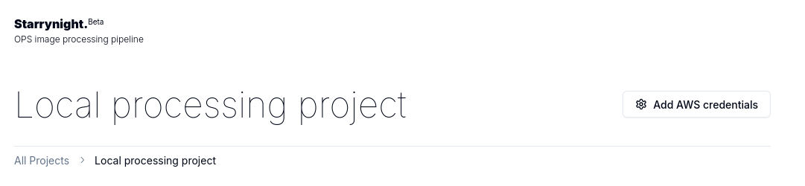
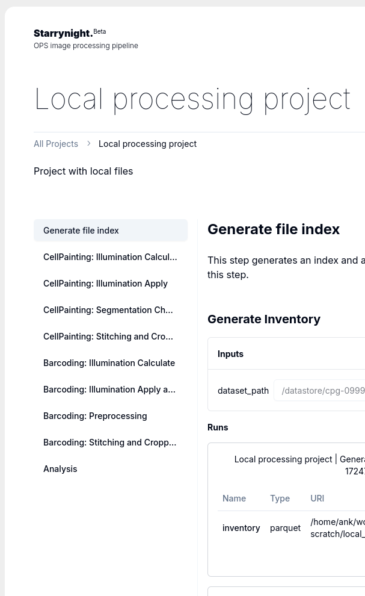
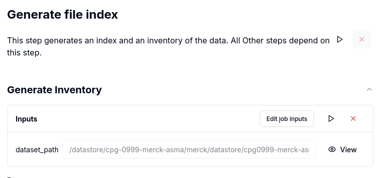
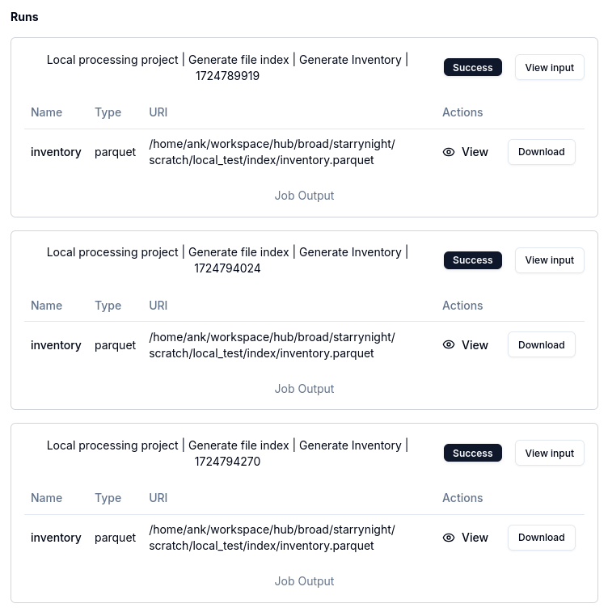

# User guide

## Add your aws credentials to view project outputs

Click on the gear icon (Add AWS credentials) on the top right corner of the page.
These credentials are stored locally in your browser and are not shared with the backend server.

## Run a step in your project

Strarrynight project group processing jobs into `steps`.
You can see all the steps in a project in the sidebar on the Projects page.

This logical grouping is for user convenience. The unit of execution is still `jobs`.
When you click on a step, the main content area of the project page will show all the available jobs in that step.
To execute a job, click on the `play` button. It is also possible to change job inputs with the `Edit job inputs` button.

Each execution of a job will create a `run` object. The `run` object captures job inputs and corresponding outputs.
Mutiple run objects can be created for the same job with different input resulting in different outputs.

## View or download job outputs

Inside each `run` object, Press the `view` or `download` button to view or download the job outputs for that run.
