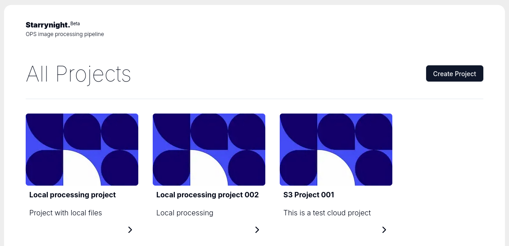

# User guide

## Create a new project

Go to the starrynight home page and click on the `Create Project` button.

Then fill the details of your project.

Name: The name of your project.
Description: A short description of your project.
Dataset: S3 URL of the dataset. It can also be a local path if you are running starrynight locally.
Workspace: S3 URL where you want to save intermediate files. It can also be a local path if you are running starrynight locally.
Parser: Select the appropriate parser according to your dataset file naming convention. More information on individual parsers can be found here.
Project Type: Select a project template. This will help you setup a default workflow for your project. You can also change this later after project creation.

Click on create project.

## Run a step in your project

Strarrynight project group processing jobs into `steps`.
You can see all the steps in a project in the sidebar on the Projects page.

This logical grouping is for user convenience. The unit of execution is still `jobs`.
When you click on a step, the main content area of the project page will show all the available jobs in that step.
To execute a job, click on the `play` button. It is also possible to change job inputs with the `Edit job inputs` button.

Each execution of a job will create a `run` object. The `run` object captures job inputs and corresponding outputs.
Mutiple run objects can be created for the same job with different input resulting in different outputs.

## View or download job outputs

Inside each `run` object, Press the `view` or `download` button to view or download the job outputs for that run.
