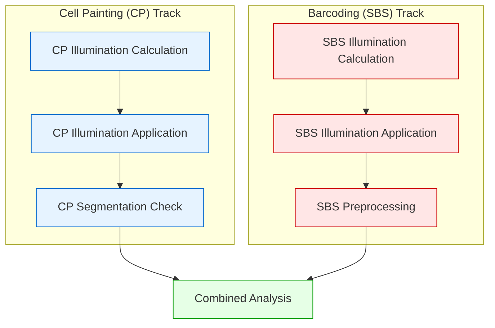

# Complete Workflow Example (CLI Approach)

This guide walks through a complete example of processing microscopy images using StarryNight's key modules and CLI commands. It builds on the foundation established in the [Getting Started](getting-started.md) guide, extending those concepts into a full image processing workflow.

## Prerequisites

Before starting this workflow, you need:

- To complete the workflow from [Getting Started](getting-started.md), including:
    - Setting up your environment
    - Downloading sample data
    - Creating experiment configuration
    - Generating inventory and index
    - Creating `experiment.json`
    - Running illumination correction calculation
- Sufficient disk space for intermediate and output files (at least 50GB)

!!! info "Implementation Note"
    This guide continues to use the CLI Approach introduced in [Getting Started](getting-started.md) to demonstrate the complete workflow step by step. For details on executing this workflow via the Python/Module Approach used in production, see [Practical Integration](../architecture/08_practical_integration.md), which shows the same workflow implemented with the Python API in `starrynight/notebooks/pypct/exec_pcp_generic_pipe.py`.

## Workflow Overview

This guide demonstrates a comprehensive workflow for processing optical pooled screening (OPS) data. The workflow consists of two parallel tracks - Cell Painting (CP) and Barcoding (Sequencing by Synthesis, SBS) - followed by a combined analysis step:



The workflow includes these key steps:

- **Setup and Preparation**: Generate inventory/index and create experiment configuration (completed in Getting Started)
- **CP Illumination Calculation**: Generate correction functions for CP images (completed in Getting Started)
- **CP Illumination Application**: Apply illumination corrections to CP images and segment cells
- **CP Segmentation Check**: Verify cell segmentation quality in CP images
- **SBS Illumination Calculation**: Generate correction functions for SBS images
- **SBS Illumination Application**: Apply illumination corrections and align DAPI images across cycles
- **SBS Preprocessing**: Process SBS images, compensate channels, and call barcodes
- **Analysis**: Integrate CP and SBS data and extract measurements

All CellProfiler-based modules in this workflow follow a consistent three-step pattern:

1. **Generate LoadData files**: Create CSV files that tell CellProfiler which images to process
2. **Generate CellProfiler pipelines**: Create customized CellProfiler pipeline files (cppipe files)
3. **Execute CellProfiler**: Run CellProfiler with the generated files

!!! note "Beyond CellProfiler"
    While this workflow focuses on CellProfiler-based modules, StarryNight also includes other algorithm types that don't follow this three-step pattern. See [Algorithm Layer](../architecture/01_algorithm_layer.md) for details.

## Starting Point

This guide assumes you have completed the [Getting Started](getting-started.md) guide through the step "Running Illumination Correction Calculation". Before continuing, make sure you have the following environment variables set:

```sh
# Set environment variables for convenience
export DATADIR='./scratch/fix_s1_input'
export WKDIR='./scratch/fix_s1_output/workspace'
# Add new environment variable needed for the complete workflow
export INPUT_WKDIR='./scratch/fix_s1_input/Source1/workspace'
```

You should already have:

- Inventory and index generated
- Experiment configuration `(experiment.json`) created
- Illumination correction calculation completed

We'll now expand from there to the full pipeline.

## CP Illumination Application

Since we've already completed the CP Illumination Calculation, we'll continue with applying those corrections:

```sh
# Create necessary directories
mkdir -p ${WKDIR}/cellprofiler/loaddata/cp/illum/illum_apply/
mkdir -p ${WKDIR}/cellprofiler/cppipe/cp/illum/illum_apply/
mkdir -p ${WKDIR}/illum/cp/illum_apply/

# Generate LoadData files
starrynight illum apply loaddata \
    -i ${WKDIR}/index/index.parquet \
    -o ${WKDIR}/cellprofiler/loaddata/cp/illum/illum_apply \
    --exp_config ${WKDIR}/experiment.json \
    --use_legacy

# Generate CellProfiler pipelines
starrynight illum apply cppipe \
    -l ${WKDIR}/cellprofiler/loaddata/cp/illum/illum_apply \
    -o ${WKDIR}/cellprofiler/cppipe/cp/illum/illum_apply \
    -w ${WKDIR} \
    --use_legacy

# Execute pipelines
starrynight cp \
    -p ${WKDIR}/cellprofiler/cppipe/cp/illum/illum_apply/illum_apply_painting.cppipe \
    -l ${WKDIR}/cellprofiler/loaddata/cp/illum/illum_apply \
    -o ${WKDIR}/illum/cp/illum_apply
```

## CP Segmentation Check

Evaluate cell segmentation quality in CP images:

```sh
# Create necessary directories
mkdir -p ${WKDIR}/cellprofiler/loaddata/cp/segcheck/
mkdir -p ${WKDIR}/cellprofiler/cppipe/cp/segcheck/
mkdir -p ${WKDIR}/segcheck/cp/

# Generate LoadData files
starrynight segcheck loaddata \
    -i ${WKDIR}/index/index.parquet \
    -o ${WKDIR}/cellprofiler/loaddata/cp/segcheck \
    -c ${WKDIR}/illum/cp/illum_apply \
    --exp_config ${WKDIR}/experiment.json \
    --use_legacy

# Generate CellProfiler pipelines
starrynight segcheck cppipe \
    -l ${WKDIR}/cellprofiler/loaddata/cp/segcheck/ \
    -o ${WKDIR}/cellprofiler/cppipe/cp/segcheck \
    -w ${WKDIR} \
    --use_legacy

# Execute pipelines
starrynight cp \
    -p ${WKDIR}/cellprofiler/cppipe/cp/segcheck/segcheck_painting.cppipe \
    -l ${WKDIR}/cellprofiler/loaddata/cp/segcheck \
    -o ${WKDIR}/segcheck/cp/
```

## SBS Illumination Calculation

Calculate illumination correction functions for SBS images:

```sh
# Create necessary directories
mkdir -p ${WKDIR}/cellprofiler/loaddata/sbs/illum/illum_calc/
mkdir -p ${WKDIR}/cellprofiler/cppipe/sbs/illum/illum_calc/
mkdir -p ${WKDIR}/illum/sbs/illum_calc/

# Generate LoadData files
starrynight illum calc loaddata \
    -i ${WKDIR}/index/index.parquet \
    -o ${WKDIR}/cellprofiler/loaddata/sbs/illum/illum_calc \
    --exp_config ${WKDIR}/experiment.json \
    --sbs \
    --use_legacy

# Generate CellProfiler pipelines
starrynight illum calc cppipe \
    -l ${WKDIR}/cellprofiler/loaddata/sbs/illum/illum_calc/ \
    -o ${WKDIR}/cellprofiler/cppipe/sbs/illum/illum_calc \
    -w ${WKDIR} \
    --sbs \
    --use_legacy

# Execute pipelines
starrynight cp \
    -p ${WKDIR}/cellprofiler/cppipe/sbs/illum/illum_calc/illum_calc_sbs.cppipe \
    -l ${WKDIR}/cellprofiler/loaddata/sbs/illum/illum_calc \
    -o ${WKDIR}/illum/sbs/illum_calc \
    --sbs
```

## SBS Illumination Application

Apply illumination correction to SBS images:

```sh
# Create necessary directories
mkdir -p ${WKDIR}/cellprofiler/loaddata/sbs/illum/illum_apply/
mkdir -p ${WKDIR}/cellprofiler/cppipe/sbs/illum/illum_apply/
mkdir -p ${WKDIR}/illum/sbs/illum_apply/

# Generate LoadData files
starrynight illum apply loaddata \
    -i ${WKDIR}/index/index.parquet \
    -o ${WKDIR}/cellprofiler/loaddata/sbs/illum/illum_apply \
    --exp_config ${WKDIR}/experiment.json \
    --sbs \
    --use_legacy

# Generate CellProfiler pipelines
starrynight illum apply cppipe \
    -l ${WKDIR}/cellprofiler/loaddata/sbs/illum/illum_apply \
    -o ${WKDIR}/cellprofiler/cppipe/sbs/illum/illum_apply \
    -w ${WKDIR} \
    --sbs \
    --use_legacy

# Execute pipelines
starrynight cp \
    -p ${WKDIR}/cellprofiler/cppipe/sbs/illum/illum_apply/illum_apply_sbs.cppipe \
    -l ${WKDIR}/cellprofiler/loaddata/sbs/illum/illum_apply \
    -o ${WKDIR}/illum/sbs/illum_apply \
    --sbs
```

## SBS Preprocessing

Prepare SBS images for analysis, including barcode calling:

```sh
# Create necessary directories
mkdir -p ${WKDIR}/cellprofiler/loaddata/sbs/preprocess/
mkdir -p ${WKDIR}/cellprofiler/cppipe/sbs/preprocess/
mkdir -p ${WKDIR}/preprocess/sbs/

# Generate LoadData files
starrynight preprocess loaddata \
    -i ${WKDIR}/index/index.parquet \
    -o ${WKDIR}/cellprofiler/loaddata/sbs/preprocess/ \
    -c ${WKDIR}/illum/sbs/illum_apply/ \
    --exp_config ${WKDIR}/experiment.json \
    --use_legacy

# Generate CellProfiler pipelines
starrynight preprocess cppipe \
    -l ${WKDIR}/cellprofiler/loaddata/sbs/preprocess/ \
    -o ${WKDIR}/cellprofiler/cppipe/sbs/preprocess/ \
    -w ${WKDIR}/preprocess/sbs/ \
    -b ${INPUT_WKDIR}/metadata/Barcodes.csv \
    --use_legacy

# Execute preprocessing pipelines
starrynight cp \
    -p ${WKDIR}/cellprofiler/cppipe/sbs/preprocess/preprocess_sbs.cppipe \
    -l ${WKDIR}/cellprofiler/loaddata/sbs/preprocess \
    -o ${WKDIR}/preprocess/sbs/ \
    -d ${CP_PLUGINS} \
    --sbs
```

## Analysis

Extract cellular measurements and generate the final dataset by combining CP and SBS data:

```sh
# Create necessary directories
mkdir -p ${WKDIR}/cellprofiler/loaddata/analysis/
mkdir -p ${WKDIR}/cellprofiler/cppipe/analysis/
mkdir -p ${WKDIR}/analysis/

# Generate LoadData files
starrynight analysis loaddata \
    -i ${WKDIR}/index/index.parquet \
    -o ${WKDIR}/cellprofiler/loaddata/analysis/ \
    -c ${WKDIR}/illum/cp/illum_apply/ \
    -p ${WKDIR}/preprocess/sbs/ \
    --exp_config ${WKDIR}/experiment.json \
    --use_legacy

# Generate CellProfiler pipelines
starrynight analysis cppipe \
    -l ${WKDIR}/cellprofiler/loaddata/analysis/ \
    -o ${WKDIR}/cellprofiler/cppipe/analysis/ \
    -w ${WKDIR}/analysis/ \
    -b ${INPUT_WKDIR}/metadata/Barcodes.csv \
    --use_legacy

# Execute analysis pipelines
starrynight cp \
    -p ${WKDIR}/cellprofiler/cppipe/analysis/analysis.cppipe \
    -l ${WKDIR}/cellprofiler/loaddata/analysis \
    -o ${WKDIR}/analysis/ \
    -d ${CP_PLUGINS}
```

## Common Parameters

Throughout the pipeline, you'll use these common parameters:

- `--exp_config`: Path to the experiment configuration file
- `--use_legacy`: Use pre-fabricated CellProfiler pipelines (recommended for stability)
- `-i, --index`: Path to the index.parquet file
- `-o, --output`: Output directory for generated files
- `-w, --workspace`: Path to the workspace directory
- `-l, --loaddata`: Path to LoadData CSV files
- `-p, --pipeline`: Path to CellProfiler pipeline file or directory
- `-c, --corr_images`: Path to illumination-corrected images
- `-b, --barcode`: Path to barcode CSV file for sequencing data
- `--sbs`: Flag to process SBS images only

## Next Steps

- Perform statistical analysis on the extracted features
- Visualize results using tools like Python/Matplotlib
- Export data for integration with other analysis platforms

## Conclusion

You've now learned how to set up and execute a complete StarryNight workflow for optical pooled screening data analysis. The modular structure of StarryNight allows for efficient processing of both CP and SBS images in parallel tracks, producing quality-controlled, normalized outputs suitable for downstream analysis. With these techniques, you can build robust image processing workflows for your own high-content screening experiments.

For more detailed information on the concepts used throughout this workflow:

- See [Architecture Overview](../architecture/00_architecture_overview.md) for details on StarryNight's modular design
- See [Parser Configuration](parser-configuration.md) for customizing path parsing for different data structures

---

!!! info "For Document Contributors"
    This section contains editorial guidelines for maintaining this document. These guidelines are intended for contributors and maintainers, not end users.

    **Document Purpose and Audience**

    This document serves as a bridge between the introductory Getting Started guide and complete workflow implementation. It targets users who:

    - Are familiar with basic StarryNight concepts
    - Need to implement a complete processing pipeline
    - Prefer using the CLI interface rather than Python API
    - Need to understand both CP and SBS processing tracks

    **Guiding Structure Principles**

    1. **Progressive disclosure approach** - Start with a clear overview before diving into implementation details
    2. **Parallel tracks visualization** - Keep the CP and SBS tracks visually distinct in diagrams and structure
    3. **Complete CLI commands** - Provide fully copyable command blocks with all necessary parameters
    4. **Directory creation consistency** - Always include `mkdir` commands before operations that require directories
    5. **Three-step pattern emphasis** - Maintain the loaddata → cppipe → execute pattern for each CellProfiler-based module

    **Content Style Principles**

    6. **Command formatting consistency** - Format all CLI commands with consistent indentation and backslash line continuations
    7. **Abbreviation usage** - Define abbreviations (CP, SBS) once, then use consistently throughout
    8. **Parameter explanation** - Keep parameter explanations concise and grouped in the Common Parameters section
    9. **Lightweight diagrams** - Keep mermaid diagrams focused on structure without duplicating descriptions
    10. **CLI vs Python differentiation** - Clearly distinguish CLI-based approaches from Python API approaches

    **Future Documentation Enhancements**

    Consider expanding this document with:

    - Troubleshooting guide for common errors and failure recovery
    - Output verification checkpoints for each processing step
    - Resource requirements and sizing guidelines
    - Configuration customization examples for different experimental setups
    - Intermediate results visualization techniques
    - Pipeline variations for specialized use cases

    **Document Relationships**

    - **Getting Started dependency** - This document builds directly on `getting-started.md` and should stay aligned with it
    - **Practical Integration complement** - Serves as the CLI alternative to `architecture/08_practical_integration.md`'s Python API approach
    - **Module reference complementarity** - Complements module-specific documentation without duplicating it

    **Terminology Consistency**

    - **[Cell Painting](https://www.nature.com/articles/s41592-024-02528-8) (CP)** - Refers to the morphological imaging workflow track
    - **Barcoding / [Sequencing by Synthesis](https://data-science-sequencing.github.io/Win2018/lectures/lecture2/) (SBS)** - Refers to the barcoding workflow track
    - **[LoadData](https://cellprofiler-manual.s3.amazonaws.com/CPmanual/LoadData.html) files** - CSV files that configure CellProfiler input images
    - **Experiment configuration** - The `experiment.json` file that defines processing parameters
