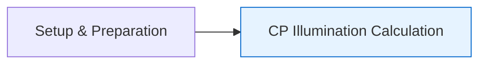

# Getting Started with StarryNight

This guide will help you install StarryNight and run your first workflow using the CLI (Command Line Interface) approach. You'll set up the environment and calculate illumination correction functions for Cell Painting images.

!!! info "Implementation Approaches"
    **CLI Approach** (shown in this guide): Uses direct command-line commands for learning and exploration. It's a simpler way to understand workflow operations step-by-step.

    **Python/Module Approach** (used in production): Most users will execute these operations through Python code (as shown in `starrynight/notebooks/pypct/exec_pcp_generic_pipe.py`). This approach provides standardized components, containerized execution, and integration with the Canvas UI.

    This guide focuses on the CLI approach as a foundation. See [Practical Integration](../architecture/08_practical_integration.md) for the Python implementation and [Architecture Overview](../architecture/00_architecture_overview.md) for system design details.

## Installation

StarryNight uses the Nix package manager to provide a consistent and reproducible environment:

**Install Nix**:

```sh
# Install Nix
sh <(curl -L https://nixos.org/nix/install) --daemon
```

**Clone the Repository**:

```sh
# Clone the repository and navigate to it
git clone https://github.com/broadinstitute/starrynight.git
cd starrynight
```

**Set Up the Environment**:

```sh
# Set up the Nix development environment
nix develop --extra-experimental-features nix-command --extra-experimental-features flakes .
```

**Install Dependencies and Project**:

```sh
# Install basic dependencies
uv sync

# Install the project in editable mode with development tools
uv pip install -e ".[dev]"
```

**Verify Installation**:

```sh
# Verify the installation
starrynight --help
pipecraft --help
conductor --help
```

**For Developers**:

If you're developing for StarryNight, the setup process is the same as above. For detailed information on the project architecture and how to extend components, see the [Architecture Overview](../architecture/00_architecture_overview.md).

## Workflow Steps

The following sections guide you through running a basic illumination correction calculation workflow for Cell Painting (CP) images. This process involves downloading sample data, setting up an experiment configuration, generating inventory and index files, and calculating illumination correction functions.

!!! info "Focus of This Guide"
    This guide focuses only on the Cell Painting (CP) track and specifically on the illumination correction calculation step. The [Complete Workflow Example](example-pipeline-cli.md) will add the Sequencing by Synthesis (SBS) (commonly referred to as barcoding) track and show the full analysis workflow.



## Download Sample Data

StarryNight includes curated test data (FIX-S1) that provides a complete, small-scale dataset for learning the workflow:

```sh
# Create a directory for the sample data
mkdir -p scratch

# Download the FIX-S1 test dataset (36MB)
cd scratch
wget https://github.com/shntnu/starrynight/releases/download/v0.0.1/fix_s1_input.tar.gz

# Verify the download integrity
echo "ddba28e1593986013d10880678d2d7715af8d2ee1cfa11ae7bcea4d50c30f9e0  fix_s1_input.tar.gz" | sha256sum -c

# Extract the data
tar -xzf fix_s1_input.tar.gz

# Clean up macOS metadata files
find scratch/fix_s1_input -name '._*' -delete
find scratch/fix_s1_input -name '.DS_Store' -delete

# Return to project root
cd ..
```

This creates a `fix_s1_input/` directory containing Cell Painting and SBS imaging data from 2 wells with multiple sites and channels.

Before running any commands, set up your data and workspace directories as environment variables:

```sh
export DATADIR='./scratch/fix_s1_input'
export WKDIR='./scratch/fix_s1_output/workspace'
```

## Create Experiment Configuration

The experiment configuration file defines parameters for your processing workflow:

```sh
# Create necessary directories for the workflow
mkdir -p scratch/fix_s1_output/workspace/

# Generate a default experiment configuration template
starrynight exp init -e "Pooled CellPainting [Generic]" -o ${WKDIR}
```

This creates an `experiment_init.json` file in your workspace that you can edit to match your dataset's characteristics:

FIXME: `sbs_cell_channel` and `sbs_mito_channel` should not need to be specified in the `experiment_init.json` file.

```json
{
    "barcode_csv_path": ".",
    "use_legacy": false,
    "cp_img_overlap_pct": 10,
    "cp_img_frame_type": "round",
    "cp_acquisition_order": "snake",
    "sbs_img_overlap_pct": 10,
    "sbs_img_frame_type": "round",
    "sbs_acquisition_order": "snake",
    "cp_nuclei_channel": "DAPI",
    "cp_cell_channel": "PhalloAF750",
    "cp_mito_channel": "ZO1AF488",
    "sbs_nuclei_channel": "DAPI",
    "sbs_cell_channel": "PhalloAF750",
    "sbs_mito_channel": "ZO1AF488"
}
```

Adjust the values to match your experiment setup.

## Generate Inventory

Create a catalog of all image files in your dataset:

```sh
# Generate the inventory
starrynight inventory gen \
    -d ${DATADIR} \
    -o ${WKDIR}/inventory
```

The inventory is a comprehensive catalog of all files in your dataset that contains:

- Basic file information: path, name, extension
- Created by scanning the data directory recursively
- Stored as a Parquet file for efficient querying

This command will create an inventory file:

```
${WKDIR}/inventory/
├── inv/                # Shard directory with temporary files
└── inventory.parquet   # Main inventory file
```

## Generate Index

Parse the inventory to create a structured index with metadata:

```sh
starrynight index gen \
    -i ${WKDIR}/inventory/inventory.parquet \
    -o ${WKDIR}/index/
```

The index is a structured database of metadata extracted from file paths that:

- Contains rich, queryable information: dataset, batch, plate, well, site, channel info
- Is created by parsing file paths using a grammar-based parser
- Enables sophisticated filtering and selection of images
- Is stored as a structured Parquet file

The result will be an `index.parquet` file containing structured metadata for each image. This index will be used in all subsequent processing steps through the `-i` parameter.

!!! info "Path Parsing System"
    StarryNight automatically extracts metadata from file paths using a grammar-based parsing system. This is how it identifies images by well, channel, and site without requiring separate metadata files. If your data follows a different organization, you can customize the parser as described in the [Parser Configuration](parser-configuration.md) guide.

## Create Experiment File

Initialize an experiment using your index and configuration:

```sh
starrynight exp new \
    -i ${WKDIR}/index/index.parquet \
    -e "Pooled CellPainting [Generic]" \
    -c ${WKDIR}/experiment_init.json \
    -o ${WKDIR}
```

This creates an `experiment.json` file with dataset-specific parameters derived from your index.

## Run Illumination Correction Calculation

Let's run the illumination correction calculation, which follows the standard CellProfiler module pattern of generating LoadData files, creating pipeline files, and executing CellProfiler:

First, ensure the directories exist:

```sh
mkdir -p ${WKDIR}/cellprofiler/loaddata/cp/illum/illum_calc/
mkdir -p ${WKDIR}/cellprofiler/cppipe/cp/illum/illum_calc/
mkdir -p ${WKDIR}/illum/cp/illum_calc/
```

!!! info "Pipeline Generation Approaches"
    StarryNight offers two ways to generate CellProfiler pipelines:

    - **Pre-fabricated Pipelines**: Uses established, tested pipeline templates (add `--use_legacy` flag)
    - **Dynamic Generation**: Automatically generates pipelines based on configuration (omit the `--use_legacy` flag)

    This guide uses the pre-fabricated approach for stability.

!!! info "Directory Structure"
    Throughout this guide, we're creating a workspace with this directory structure:

    ```
    ${WKDIR}/
    ├── cellprofiler/                # CellProfiler-related files
    │   ├── loaddata/                # Generated LoadData CSV files
    │   └── cppipe/                  # Pipeline files
    ├── index/                       # Structured metadata
    │   └── index.parquet            # Index file with extracted metadata
    ├── illum/                       # Illumination correction files
    │   ├── cp/                      # Cell Painting illumination
    │   └── sbs/                     # SBS illumination
    └── experiment.json              # Experiment configuration
    ```

    This structure separates inputs, intermediate results, and final outputs, maintaining clear data provenance throughout the workflow.

**Generate LoadData Files:**

```sh
# Generate loaddata files using established pipeline templates
starrynight illum calc loaddata \
    -i ${WKDIR}/index/index.parquet \
    -o ${WKDIR}/cellprofiler/loaddata/cp/illum/illum_calc \
    --exp_config ${WKDIR}/experiment.json \
    --use_legacy
```

**Generate CellProfiler Pipelines:**

```sh
# Generate CellProfiler pipeline files using established templates
starrynight illum calc cppipe \
    -l ${WKDIR}/cellprofiler/loaddata/cp/illum/illum_calc/ \
    -o ${WKDIR}/cellprofiler/cppipe/cp/illum/illum_calc \
    -w ${WKDIR} \
    --use_legacy
```

**Execute CellProfiler Pipelines:**

```sh
# The path must point to a specific .cppipe file, not a directory
starrynight cp \
    -p ${WKDIR}/cellprofiler/cppipe/cp/illum/illum_calc/illum_calc_painting.cppipe \
    -l ${WKDIR}/cellprofiler/loaddata/cp/illum/illum_calc \
    -o ${WKDIR}/illum/cp/illum_calc
```

## Verify Results

The illumination correction files will be created in the output directory:

```
${WKDIR}/illum/cp/illum_calc/
├── Plate1_IllumDNA.npy
├── Plate1_IllumPhalloidin.npy
└── Plate1_IllumZO1.npy
```

If you have Python with matplotlib installed, you can visualize the results:

```python
import numpy as np
import matplotlib.pyplot as plt

# Load one of the illumination correction files
import os
wkdir = os.environ.get('WKDIR', './scratch/fix_s1_output/workspace')
data = np.load(f'{wkdir}/illum/cp/illum_calc/Plate1_IllumDNA.npy')

# Create a visualization
plt.figure(figsize=(10,8))
plt.imshow(data, cmap='viridis')
plt.colorbar()
plt.title('DNA Illumination Correction')
plt.show()
```

## Advanced CLI Options

StarryNight commands support additional options to customize processing:

**Path Masking:** Filter files with path masks using the `-m/--path_mask` option:

```sh
starrynight illum calc loaddata -m "Batch1/Plate1" ...
```

**Parallel Processing:** Control the number of parallel jobs with the `-j/--jobs` option:

```sh
# Run with 8 parallel jobs (default is 50)
starrynight cp -j 8 -p /path/to/pipeline.cppipe ...
```

**CellProfiler Plugins:** Specify a directory containing CellProfiler plugins:

```sh
starrynight cp -d /path/to/plugins -p /path/to/pipeline.cppipe ...
```

## Next Steps

- Continue to the [Complete Workflow Example](example-pipeline-cli.md)
- Check the architecture docs to understand the [system structure](../architecture/00_architecture_overview.md)
- For the Python/Module approach used in production, see [Practical Integration](../architecture/08_practical_integration.md)


!!! info "For Document Contributors"
    This section contains editorial guidelines for maintaining this document. These guidelines are intended for contributors and maintainers, not end users.

    **Purpose and Audience**

    - **Introductory Focus** - This document is a user's first hands-on experience with StarryNight
    - **CLI Emphasis** - Prioritize the CLI approach as an accessible entry point
    - **Single Path with Options** - Present one primary workflow while noting alternatives
    - **Assumed Knowledge** - Users understand basic command line but not StarryNight architecture

    **Structure Principles**

    1. **Clear section headings** - Use H2 headings for main workflow steps without numbers
    2. **Notes for alternatives** - Use MkDocs admonitions to present alternatives without disrupting flow
    3. **Quick start spirit** - Keep explanations brief and focused on practical execution
    4. **Progressive detail** - Start with setup, then basic workflow, then advanced options
    5. **Clear prerequisites** - Ensure directory creation and dependencies are explicitly mentioned

    **Content Style Guidelines**

    6. **Command formatting** - Include descriptive comments in code blocks
    7. **Bold subheadings** - Use bold text rather than deeper heading levels for substeps
    8. **Copy-pastable commands** - Ensure commands work as written without modification
    9. **Environment variables** - Use consistent variables (DATADIR, WKDIR)
    10. **Expected outputs** - Show example outputs and file structures where appropriate

    **Terminology Consistency**

    - "CLI approach" vs "Module-based approach" - Different ways to use StarryNight
    - "Pre-fabricated pipelines" vs "Dynamic pipeline generation" - Two pipeline generation methods
    - "Workflow" - The end-to-end image processing sequence
    - "Pipeline" - The CellProfiler processing definition
    - "LoadData files" - CSV files that tell CellProfiler which images to process
