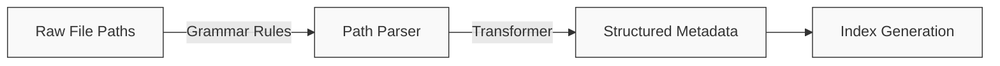

# Parser Configuration

This guide explains how to configure and customize path parsers in StarryNight to work with your own data organization.

## Understanding Path Parsers

StarryNight uses a grammar-based path parsing system to extract structured metadata from file paths. This allows it to work with a variety of file organization schemes.



### How Path Parsing Works

1. **Grammar Definition**: A grammar file (`.lark`) defines the rules for interpreting file paths
2. **Transformer**: A transformer class converts the parsed structure into usable metadata
3. **Index Generation**: The parsed metadata is stored in a structured index

## The Default Parser

StarryNight includes a default parser ("vincent") that expects paths matching this pattern:

```
[dataset]/Source[source_id]/Batch[batch_id]/images/[plate_id]/[experiment_id]/Well[well_id]_Point[site_id]_[index]_Channel[channels]_Seq[sequence].ome.tiff
```

For example:
```
MyDataset/Source1/Batch1/images/Plate1/20X_CP_Plate1/WellA01_PointA01_0_ChannelDAPI,AF488,AF647_Seq0.ome.tiff
```

### Understanding the Grammar File

The default grammar file (`path_parser_vincent.lark`) defines rules for parsing file paths:

```
start: sep? dataset_id sep source_id sep _root_dir

_root_dir: batch_id sep (_images_root_dir | _illum_root_dir | _images_aligned_root_dir | _workspace_root_dir)

_images_root_dir: "images"i sep plate_id sep _plate_root_dir
...
```

Each rule identifies specific components of the path, such as dataset ID, batch ID, plate ID, etc. The underscore prefix (e.g., `_root_dir`) indicates internal rules that don't directly map to output metadata fields.

## Customizing the Parser

### Specifying a Custom Parser

When generating an index, you can specify a custom parser path using the CLI:

```sh
starrynight index gen \
    -i ./workspace/inventory/inventory.parquet \
    -o ./workspace/index/ \
    --parser /path/to/custom/parser.lark
```

This allows you to use a different grammar file without modifying the source code.

### Creating a Custom Grammar File

To create a custom parser for your own file organization:

1. **Create a grammar file** based on your file organization pattern
2. **Test your grammar** with sample file paths
3. **Use it when generating the index** with the `--parser` parameter

### Example: Custom Grammar File

Here's an example grammar file for a different file organization pattern:

```
// Custom grammar for example_lab file organization
start: sep? project_name sep experiment_name sep plate_id sep _image_file

_image_file: well_id "_" site_id "_" channel "_" cycle_id "." extension

project_name: stringwithdashcommaspace
experiment_name: stringwithdashcommaspace
plate_id: string
well_id: (LETTER | DIGIT)~2
site_id: DIGIT~1..4
channel: stringwithdash
cycle_id: DIGIT~1..2
extension: stringwithdots

string: (LETTER | DIGIT)+
stringwithdash: (string | "-")+
stringwithdashcommaspace: ( string | "-" | "_" | "," | " " )+
stringwithdots: ( string | "." )+
DIGIT: "0".."9"

%import common.LETTER
```

This would parse paths like:
```
MyProject/Experiment-2023-05/Plate1/A1_01_DAPI_01.tiff
```

!!! note "Parser Testing"
    Test your grammar at [Lark Parser IDE](https://www.lark-parser.org/ide/) - a web tool similar to regex101.com that visualizes parse trees for your grammar and test paths.

!!! info "Advanced Developer Topic: Custom Transformers"
    The StarryNight codebase includes an extensible transformer system, but currently only provides the default `VincentAstToIR` transformer that works with the default grammar file.

    Creating completely custom transformers would require modifying the source code, as there's no CLI parameter to specify alternative transformers (unlike grammar files which can be specified with `--parser`). This level of customization would primarily be relevant for developers contributing to the StarryNight codebase itself.

    For most users, a custom grammar file alone provides sufficient flexibility to handle different file organization patterns without needing custom transformer logic.

## Best Practices

When configuring parsers:

1. **Start Simple**: Begin with basic grammar rules and refine them
2. **Test Thoroughly**: Validate your parser with representative file paths
3. **Handle Edge Cases**: Consider special file naming conventions
4. **Document Your Schema**: Document your file organization for reference

## Troubleshooting

Common issues with parsers:

- **Parsing Errors**: Check if your file paths match your grammar rules
- **Missing Metadata**: Ensure your grammar extracts all needed metadata fields
- **Performance Issues**: Very complex grammars might be slower to parse

!!! info "Implementation Note"
    When working with large datasets, consider the performance implications of your parser design. Overly complex parsers may slow down the index generation process significantly.

## Using Your Custom Parser

After creating your custom parser, use it in the index generation step of your workflow:

```sh
starrynight index gen \
    -i ./workspace/inventory/inventory.parquet \
    -o ./workspace/index/ \
    --parser /path/to/your/custom_parser.lark
```

Validate that your index contains the expected metadata by examining the resulting `index.parquet` file.

---

!!! info "For Document Contributors"
    This section contains editorial guidelines for maintaining this document. These guidelines are intended for contributors and maintainers, not end users.

    **Document Purpose and Audience**

    This document serves as a reference guide for users who need to adapt StarryNight to work with their own data organization patterns. It targets users who:

    - Need to process data with non-standard file organization
    - Have completed the basic workflow and need to customize path parsing
    - Have sufficient technical knowledge to work with grammar files
    - May need to extend functionality for specialized use cases

    **Guiding Structure Principles**

    1. **Progressive disclosure approach** - Start with usage basics before advanced customization
    2. **System component visualization** - Use diagrams to illustrate how parsers fit into the workflow
    3. **Clear examples** - Provide concrete examples for common customization patterns
    4. **Implementation abstraction** - Focus on what users need to know rather than implementation details

    **Content Style Principles**

    1. **Command formatting consistency** - Format all CLI commands with consistent indentation
    2. **Technical term definition** - Define technical terms like "grammar" and "transformer" when first used
    3. **Focus on application** - Prioritize how-to guidance over theoretical explanations
    4. **Real-world examples** - Use examples based on actual file organization patterns

    **Document Relationships**

    - **Example Workflow complement** - This document expands on file organization concepts mentioned in the workflow examples
    - **Architecture docs reference** - References more technical details available in architecture documentation
    - **Getting Started prerequisite** - Assumes familiarity with basic concepts from Getting Started
