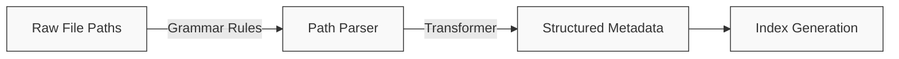

# Parser Configuration

This guide explains how to configure and customize path parsers in StarryNight to work with your own data organization.

## Understanding Path Parsers

StarryNight uses a grammar-based path parsing system to extract structured metadata from file paths.



### How Path Parsing Works

The StarryNight parser consists of three components:

1. **Lexer** - Breaks the file path into tokens using regular expressions
2. **Grammar Rules** - Defines token combinations and organization (in `.lark` file)
3. **Transformer** - Converts the parsed structure into a Python dictionary

This architecture enables flexible, robust parsing without relying on brittle string splitting.

## The Default "Vincent" Parser

StarryNight's default parser handles file paths with this structure:

```
[dataset]/[source_id]/[batch_id]/images/[plate_id]/[experiment_id]/Well[well_id]_Point[site_id]_[index]_Channel[channels]_Seq[sequence].ome.tiff
```

Example:
```
MyDataset/Source1/Batch1/images/Plate1/20X_CP_Plate1/WellA01_PointA01_0_ChannelDAPI,AF488,AF647_Seq0.ome.tiff
```

The parser handles variations like:

- Sequencing-by-synthesis (SBS) folders vs Cell Painting (CP) folders
- Aligned images vs raw images
- Metadata files vs image files
- Illumination files

### Understanding the Grammar File

The default grammar file (`path_parser_vincent.lark`) defines rules for parsing:

```
// Top-level rule - starting point for parsing
start: sep? dataset_id sep source_id sep _root_dir

// Directory structure rules
_root_dir: batch_id sep (_images_root_dir | _illum_root_dir | _images_aligned_root_dir | _workspace_root_dir)

_images_root_dir: "images"i sep plate_id sep _plate_root_dir
...
```

Rules prefixed with underscore (e.g., `_root_dir`) are internal structural rules that don't map to output metadata fields. Rules without underscores become fields in the output.

## Customizing the Parser

### When to Create a Custom Parser

You'll need a custom parser when:

- Your file organization differs from the default pattern
- You need to extract different metadata fields
- You have a unique naming convention

### Specifying a Custom Parser

Specify a custom parser with the CLI:

```sh
starrynight index gen \
    -i ./workspace/inventory/inventory.parquet \
    -o ./workspace/index/ \
    --parser /path/to/custom/parser.lark
```

### Creating a Custom Grammar File

To create a custom parser:

1. **Document your file patterns** and identify metadata components to extract
2. **Write a `.lark` file** that defines the path structure
3. **Test your grammar** against sample paths
4. **Use it in your workflow** with the `--parser` parameter

### Example: Custom Grammar File

Example grammar for a different file organization:

```
// Custom grammar for example_lab file organization
start: sep? project_name sep experiment_name sep plate_id sep _image_file

_image_file: well_id "_" site_id "_" channel "_" cycle_id "." extension

project_name: stringwithdashcommaspace
experiment_name: stringwithdashcommaspace
plate_id: string
well_id: (LETTER | DIGIT)~2
site_id: DIGIT~1..4
channel: stringwithdash
cycle_id: DIGIT~1..2
extension: stringwithdots

sep: "/"
string: (LETTER | DIGIT)+
stringwithdash: (string | "-")+
stringwithdashcommaspace: ( string | "-" | "_" | "," | " " )+
stringwithdots: ( string | "." )+
DIGIT: "0".."9"

%import common.LETTER
```

Parses paths like:
```
MyProject/Experiment-2023-05/Plate1/A1_01_DAPI_01.tiff
```

## Testing Custom Parsers

1. **Use Lark Parser IDE**: Test at [Lark Parser IDE](https://www.lark-parser.org/ide/) to visualize parse trees.

2. **Test with sample paths**:

```python
from lark import Lark

# Load grammar and test paths
parser = Lark.open('/path/to/grammar.lark', parser='lalr')
paths = ['MyProject/Experiment-2023-05/Plate1/A1_01_DAPI_01.tiff']

for path in paths:
    try:
        tree = parser.parse(path)
        print(f"✓ Parsed: {path}")
    except Exception as e:
        print(f"✗ Failed: {path} - {e}")
```

## Parser Architecture

The parser works through three layers:

1. **Lexer**: Tokenizes paths using regexes (uppercase rules like `DIGIT`)
2. **Parser**: Builds a tree using grammar rules (lowercase rules like `well_id`)
3. **Transformer**: Maps parse tree to metadata dictionary (handles special cases)

## Best Practices

When creating parsers:

1. **Start simple** - Begin with basic grammar and add complexity as needed
2. **Test thoroughly** - Validate with diverse file paths
3. **Consider performance** - Complex parsers can slow index generation
4. **Document your schema** - Document your file organization pattern
5. **Separate concerns**:
      - Lexer for basic pattern matching
      - Grammar for structural relationships
      - Transformer for conversion logic

## Troubleshooting

Common issues:

- **Parsing errors**: Check grammar rules, test in Lark IDE, add permissive rules
- **Missing metadata**: Ensure grammar extracts all needed fields with matching names
- **Performance issues**: Simplify complex rules, reduce nesting, move pattern matching to lexer

## Using Your Custom Parser

Use your parser in the index generation step:

```sh
starrynight index gen \
    -i ./workspace/inventory/inventory.parquet \
    -o ./workspace/index/ \
    --parser /path/to/custom/parser.lark
```

Validate results by examining the `index.parquet` file.

!!! note "Custom Transformers"
    Creating custom transformers requires modifying source code. For most users, a custom grammar file provides sufficient flexibility.

---

!!! info "For Document Contributors"
    Guidelines for maintaining this document:

    **Audience**: Users adapting StarryNight to non-standard file organization with sufficient technical knowledge of grammar files, and developers extending functionality.

    **Organization Principles**:

    1. Progressive disclosure (basics → advanced)
    2. Visual explanations with diagrams
    3. Practical, functional examples
    4. Implementation details for extensibility

    **Style Guidelines**:

    1. Consistent command formatting
    2. Define technical terms at first use
    3. Prioritize practical guidance over theory
    4. Use real-world examples

    **Related Docs**: Builds on "Getting Started," complements workflow examples, references architecture docs for advanced details.
