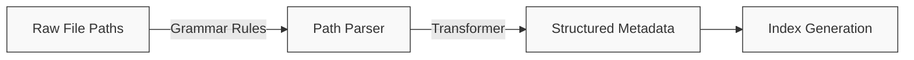

# Parser Configuration

This guide explains how to configure and customize path parsers in StarryNight to work with your own data organization.

## Understanding Path Parsers

StarryNight uses a grammar-based path parsing system to extract structured metadata from file paths. This allows it to work with a variety of file organization schemes.



### How Path Parsing Works

The StarryNight parser consists of three main components:

1. **Lexer (Tokenizer)** - Breaks the file path into tokens using regular expressions
2. **Grammar Rules** - Defines how tokens can be combined and organized (in `.lark` file)
3. **Transformer** - Converts the parsed structure into a Python dictionary with metadata fields

This architecture allows for flexible, yet robust, parsing of complex file paths without relying on brittle string splitting.

## The Default "Vincent" Parser

StarryNight includes a default parser (named "vincent") that handles file paths with the following structure:

```
[dataset]/[source_id]/[batch_id]/images/[plate_id]/[experiment_id]/Well[well_id]_Point[site_id]_[index]_Channel[channels]_Seq[sequence].ome.tiff
```

For example:
```
MyDataset/Source1/Batch1/images/Plate1/20X_CP_Plate1/WellA01_PointA01_0_ChannelDAPI,AF488,AF647_Seq0.ome.tiff
```

The parser can also handle variations like:

- SBS folders vs CP folders
- Aligned images vs raw images
- Metadata files vs image files
- Illumination files

### Understanding the Grammar File

The default grammar file (`path_parser_vincent.lark`) defines the rules for parsing file paths:

```
// Top-level rule - starting point for parsing
start: sep? dataset_id sep source_id sep _root_dir

// Directory structure rules
_root_dir: batch_id sep (_images_root_dir | _illum_root_dir | _images_aligned_root_dir | _workspace_root_dir)

_images_root_dir: "images"i sep plate_id sep _plate_root_dir
...
```

Rules prefixed with an underscore (e.g., `_root_dir`) are internal structural rules that don't directly map to output metadata fields. Rules without underscores (e.g., `dataset_id`, `plate_id`) become fields in the output metadata.

## Customizing the Parser

### When to Create a Custom Parser

You'll need a custom parser when:

- Your file organization differs from the default "vincent" pattern
- You need to extract different metadata fields
- You have a unique naming convention

### Specifying a Custom Parser

When generating an index, you can specify a custom parser path using the CLI:

```sh
starrynight index gen \
    -i ./workspace/inventory/inventory.parquet \
    -o ./workspace/index/ \
    --parser /path/to/custom/parser.lark
```

### Creating a Custom Grammar File

To create a custom parser:

1. **Understand Your File Organization**: Document your file path patterns and identify the metadata components you need to extract
2. **Create a Grammar File**: Write a `.lark` file that defines the structure of your file paths
3. **Test Your Grammar**: Validate it against sample paths before using it in production
4. **Use It in Your Workflow**: Specify your custom grammar with the `--parser` parameter

### Example: Custom Grammar File

Here's an example grammar file for a different file organization pattern:

```
// Custom grammar for example_lab file organization
start: sep? project_name sep experiment_name sep plate_id sep _image_file

_image_file: well_id "_" site_id "_" channel "_" cycle_id "." extension

project_name: stringwithdashcommaspace
experiment_name: stringwithdashcommaspace
plate_id: string
well_id: (LETTER | DIGIT)~2
site_id: DIGIT~1..4
channel: stringwithdash
cycle_id: DIGIT~1..2
extension: stringwithdots

string: (LETTER | DIGIT)+
stringwithdash: (string | "-")+
stringwithdashcommaspace: ( string | "-" | "_" | "," | " " )+
stringwithdots: ( string | "." )+
DIGIT: "0".."9"

%import common.LETTER
```

This would parse paths like:
```
MyProject/Experiment-2023-05/Plate1/A1_01_DAPI_01.tiff
```

## Testing Your Custom Parser

To ensure your parser works correctly:

1. **Use the Lark Parser IDE**: Test your grammar at [Lark Parser IDE](https://www.lark-parser.org/ide/) - a web tool that visualizes parse trees for your grammar and test paths.

2. **Test with Sample Paths**: Create a small test script that uses your grammar to parse representative file paths:

```python
from lark import Lark
from pathlib import Path

# Load your custom grammar
parser = Lark.open('/path/to/your/custom_parser.lark', parser='lalr')

# Test with sample paths
test_paths = [
    'MyProject/Experiment-2023-05/Plate1/A1_01_DAPI_01.tiff',
    # Add more test paths here
]

for path in test_paths:
    try:
        tree = parser.parse(path)
        print(f"✓ Successfully parsed: {path}")
        print(tree.pretty())
    except Exception as e:
        print(f"✗ Failed to parse: {path}")
        print(f"  Error: {e}")
```

## Understanding the Parser Architecture

If you're interested in how the parser works internally:

1. **Lexer (Tokenizer)**: Breaks the path into tokens using regular expressions
      - Implements uppercase rules (like `DIGIT`, `LETTER`)
      - Matches context-free patterns
2. **Parser (Grammar)**: Builds a parse tree using grammar rules
      - Implements lowercase rules (like `well_id`, `plate_id`)
      - Defines hierarchy and relationships between tokens
3. **Transformer**: Converts the parse tree into a structured dictionary
      - Maps rule names to metadata fields
      - Handles special cases (e.g., normalizing channel names)

## Best Practices

When creating custom parsers:

1. **Start Simple**: Begin with the most basic version of your grammar and add complexity as needed
2. **Test Thoroughly**: Validate your parser with a diverse set of file paths
3. **Consider Performance**: For large datasets, overly complex parsers may slow down index generation
4. **Document Your Schema**: Document your file organization pattern for future reference
5. **Separate Concerns**:
      - Use the lexer (uppercase rules) for basic pattern matching
      - Use the grammar (lowercase rules) for structural relationships
      - Keep transformation logic in the transformer, not the grammar

## Troubleshooting

Common issues with parsers:

- **Parsing Errors**: If your parser fails to parse certain paths:
    - Check if your paths match your grammar rules
    - Test the problematic paths in the Lark Parser IDE
    - Add more permissive rules to handle variations
- **Missing Metadata**: If your generated index is missing expected fields:
    - Ensure your grammar extracts all needed metadata
    - Check that the field names in your grammar match what you expect
- **Performance Issues**: If parsing is slow:
    - Simplify complex grammar rules
    - Avoid deep nesting of rules
    - Put as much pattern matching as possible in the lexer (uppercase rules)

## Using Your Custom Parser

After creating your custom parser, use it in the index generation step of your workflow:

```sh
starrynight index gen \
    -i ./workspace/inventory/inventory.parquet \
    -o ./workspace/index/ \
    --parser /path/to/your/custom_parser.lark
```

Validate that your index contains the expected metadata by examining the resulting `index.parquet` file.

!!! note "Advanced Topic: Custom Transformers"
    The current StarryNight implementation only provides the default `VincentAstToIR` transformer. Creating custom transformers would require modifying the source code. For most users, a custom grammar file provides sufficient flexibility.
